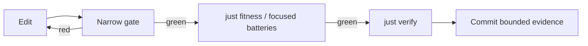

# Contributor onboarding

> **Summary:** Get one executable win, learn BANG’s five load-bearing distinctions, then choose a bounded contributor route. This guide is stable; repository-local `CONTEXT.md` and active `paths/` hold volatile work state.

## 1. Bootstrap the repository

Cold bootstrap time is variable and **not part of the 15-minute language route**. A fresh machine downloads the pinned Lean toolchain and a multi-gigabyte Mathlib olean cache before building BANG.

```bash
git clone https://github.com/phibkro/bang.git
cd bang
nix develop
just setup       # hooks + cache + full verification; run serially on first setup
```

Do not run concurrent first-time Lake commands in one checkout: they can race while populating `.lake/packages`.

When setup is already complete:

```bash
nix develop
just orient      # repository position, active path, proof state, recent commits
```

### Bootstrap troubleshooting

| Symptom | Action |
|---|---|
| `nix develop` is slow once | Let the pinned toolchain download; later entries reuse it |
| Mathlib oleans are absent | On the main checkout, run `lake exe cache get` inside the dev shell |
| A linked worktree lacks oleans | Do **not** cache-get there; use `tools/new-worktree.sh` or the dev-shell `LEAN_PATH` setup |
| A dependency update broke the cache | Restore `lake-manifest.json` and `.lake/packages/mathlib` to the pinned revision; see `docs/notes/dev-env.md` |
| You only need the CLI | Use the prebuilt install path in `README.md` |

## 2. The 15-minute common route

**Precondition:** `./.lake/build/bin/bang` exists. Set one short name:

```bash
BANG=./.lake/build/bin/bang
```

### Step 1 — observe a value

```bash
$BANG eval '1 + 2'
# 3
```

The frontend parses, type-checks, and lowers the expression before the selected engine runs it.

### Step 2 — predict before forcing

Before running this, predict which part is only a description and which token observes it:

```bash
$BANG eval 'let c = {7} in $c'
# 7
```

`{7}` creates the deferred computation; `$c` forces it. Parentheses group but do not force.

### Step 3 — swap representations, preserve meaning

```bash
$BANG run --engine=env      examples/logger-counting/main.bang
$BANG run --engine=oracle   examples/logger-counting/main.bang
$BANG run --engine=compiled examples/logger-counting/main.bang
# each prints 3
```

The program declares `Log`, performs three requests, and installs a counting handler. The engines are different representations of the same source meaning:

| Engine | Meaning |
|---|---|
| `env` | Default environment/closure machine |
| `oracle` | Kernel `Source.eval`; the arbiter when another engine produces no value |
| `compiled` | Calculated `exec ∘ compile` machine |

### Step 4 — inspect the compiler service

```bash
$BANG check --json examples/logger-counting/main.bang
$BANG query symbols examples/logger-counting/main.bang
```

Both commands return JSON. `check` answers whether the whole program elaborates; `query symbols` projects declarations from the same checked fact base.

### Step 5 — check the mental model

You are ready to choose a route when you can answer:

1. What is the difference between a description and forcing with `$`?
2. Why does an effect row track a **label**, while runtime dispatch uses a capability **identity**?
3. Which engine is the oracle, and which is the default?
4. Which proof method establishes source equivalence, and which establishes compilation correctness?
5. Why do dependencies point Frontend → Core ← Backend even though program data flows through all three?

Use [`docs/architecture/core-overview.md`](docs/architecture/core-overview.md) to check answers 3–5. The current architecture is ADR-0016 **as revised by ADR-0059**: Wasm 3.0 is the target. ADR-0035 assigns the binary logical relation to source equivalence and forward simulation to compilation; ADR-0094 fixes the default engine.

## 3. Choose a contributor route

Each route ends in a bounded pull-request-shaped change, not a reading marathon.

| Route | Start here | First bounded change | Narrow gate |
|---|---|---|---|
| Frontend / language | `Bang/Frontend/Surface.lean`, `Bang/Frontend/TypeCheck.lean`, generated language reference | Add or adjust one syntax/checker fixture and every affected traversal | `just check Bang/Frontend/TypeCheck.lean` plus the relevant CLI/corpus script |
| Kernel / proof | `Bang/Spec.lean`, `Bang/Core/`, `docs/notes/spec-proof-discipline.md` | Close or adapt one small lemma without changing a frozen headline statement | `just check <file>` then `just axioms` |
| Machine / backend | `Bang/Backend/AbstractMachine.lean`, `Wasm.lean`, `WasmEmit.lean` | Trace one constructor through source, `evalD`, compile/exec, and its differential fixture | `just check <file>` plus the relevant real-engine differential harness |
| Tooling / docs / examples | `tools/`, `docs/architecture/`, `examples/` | Add one generated fact, checked example, or diagnostic projection without copying its source fact | generator `--check`, `tools/check-refs.py`, then `just fitness` |
| Coding agent | `CLAUDE.md`, repository-local `CONTEXT.md`, `docs/decisions/README.md`, active `paths/` | Identify the authority, isolate a worktree, make one bounded edit, and report the observed gate | smallest relevant gate, then `just verify` |

Read [`CONTRIBUTING.md`](CONTRIBUTING.md) before opening a change. It defines the issue → branch/worktree → PR workflow and one-writer-per-file discipline.

## 4. Reference map — read on demand

| Need | Source |
|---|---|
| Current architecture and evidence boundaries | `docs/architecture/core-overview.md` |
| Language syntax and CLI contracts | `docs/reference/language.md` |
| Why a decision was made | `docs/decisions/README.md`, then the named ADR |
| Current repository position | `CONTEXT.md` — repo-only, every returning session |
| Active in-flight work | `paths/PATH-*.md` |
| Long-term checkpoints | `ROADMAP.md` |
| Proof discipline and axiom rules | `docs/notes/spec-proof-discipline.md` |
| Lean tactics used here | `docs/notes/tactics-survey.md` |
| Development environment | `docs/notes/dev-env.md` |
| Development and increment lifecycle | `docs/notes/development-lifecycle.md`, `docs/notes/increment-lifecycle.md` |
| Papers and citations | `references/README.md` |
| Agent role definitions | `.claude/agents/*.md` |

Historical calculation playbooks and superseded architecture remain available through the ADR/history links; they are not prerequisites for a first change.

## 5. Daily feedback loop



**Reading the diagram:** use the cheapest gate that can falsify the change, then widen before committing.

| Situation | Command |
|---|---|
| Lean file under active editing | `just check Bang/…/File.lean` |
| Remaining proof debt | `just burndown` |
| Axiom set behind headline theorems | `just axioms` |
| Architecture/docs/tooling change | `just fitness` |
| Full pre-commit journey | `just verify` |
| Available recipes | `just` |

The editor LSP is tighter still: VS Code with `leanprover.lean4` provides goals, hover types, and diagnostics per keystroke. `.editorconfig` carries the repository’s Lean indentation convention.

## 6. Put knowledge in one place

| Fact | Authoritative home |
|---|---|
| Reversible architecture/design choice | New ADR under `docs/decisions/` |
| Deferred design question | `docs/notes/OPEN_QUESTIONS.md` |
| Volatile current state | `CONTEXT.md` or the active `paths/PATH-*.md` |
| Stable product behavior | Executable source/test, then generated `docs/reference/` projection |
| Historical outcome | Git history, CHANGELOG, or an explicitly historical note |
| Environment/tool recipe | `docs/notes/dev-env.md` plus a `just` recipe |

Do not maintain two prose copies of a fact. Generate the projection where possible; otherwise add a drift check.

## 7. Before handing off

```bash
git status
just verify
```

Update `CONTEXT.md` only if the project position changed, and update an active path only when its handoff state changed. Record decisions in ADRs, not session narrative. The `wrap-session` skill provides the repository’s structured handoff checklist.
