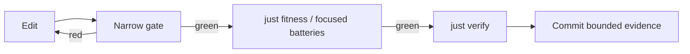

# Contributor onboarding

> **Summary:** Get one executable win, learn BANG’s five load-bearing distinctions, then choose a bounded contributor route. This guide is stable; repository-local `CONTEXT.md` and active `paths/` hold volatile work state.

## 1. Reach a truthful ready state

Cold bootstrap time is variable and **not part of the 15-minute language route**. The preflight only observes; it never installs hooks, changes Git configuration, fetches caches, or builds.

```bash
git clone https://github.com/phibkro/bang.git
cd bang
nix develop
just onboarding-preflight
```

| Result | Meaning | Next action |
|---|---|---|
| `READY` | Dev shell, Mathlib cache, runner, and Git hygiene are present | Start the common route |
| `COLD / NOT READY` | This is a valid checkout, but first-time setup is incomplete | Run `just setup` **serially**, then rerun preflight |
| exit `2` / `state: error` | The path or probe itself is invalid | Fix the reported environment problem |

For an agent-readable report:

```bash
just onboarding-preflight --json
```

Do not run concurrent first-time Lake commands in one checkout: they can race while populating `.lake/packages`. Issue #89 remains explicit: raw `just verify` is not the fresh-clone bootstrap contract; `just setup` establishes its Git-hygiene precondition first.

### Bootstrap troubleshooting

| Symptom | Action |
|---|---|
| `nix develop` is slow once | Let the pinned toolchain download; later entries reuse it |
| Preflight reports a missing cache or runner | Run `just setup` serially in the main clone |
| A linked worktree lacks oleans | Do **not** cache-get there; create it with `tools/new-worktree.sh` |
| A dependency update broke the cache | Restore the pinned dependency state; see `docs/notes/dev-env.md` |
| You only need the CLI | Use the prebuilt install path in `README.md` |

## 2. The 15-minute common route

**Start the clock only after preflight reports `READY`.** Set one short name:

```bash
BANG=./.lake/build/bin/bang
```

### Step 1 — one expression, three representations

```bash
$BANG eval --engine=env      '1 + 2'
$BANG eval --engine=oracle   '1 + 2'
$BANG eval --engine=compiled '1 + 2'
```

The frontend parses, type-checks, and lowers once; the three engines must agree on the observed value.

### Step 2 — predict before forcing

Read the canonical fixture and predict its output before running it:

```bash
cat examples/thunk-force/main.bang
$BANG run --engine=env      examples/thunk-force/main.bang
$BANG run --engine=oracle   examples/thunk-force/main.bang
$BANG run --engine=compiled examples/thunk-force/main.bang
cat examples/thunk-force/expected.txt
```

`{7}` creates a deferred computation; `$c` forces it. Parentheses group but do not force.

### Step 3 — effects still agree across engines

```bash
$BANG run --engine=env      examples/effect-op-arith/main.bang
$BANG run --engine=oracle   examples/effect-op-arith/main.bang
$BANG run --engine=compiled examples/effect-op-arith/main.bang
```

This fixture makes effect operations feed ordinary arithmetic while retaining one committed output oracle.

### Step 4 — swap only the handler

```bash
$BANG run --engine=env      examples/logger-counting/main.bang
$BANG run --engine=oracle   examples/logger-counting/main.bang
$BANG run --engine=compiled examples/logger-counting/main.bang

$BANG run --engine=env      examples/logger-silent/main.bang
$BANG run --engine=oracle   examples/logger-silent/main.bang
$BANG run --engine=compiled examples/logger-silent/main.bang
```

The client program is identical; only `log(msg) => 1` versus `log(msg) => 0` changes. The handler, not a built-in logging feature, decides the effect’s meaning.

| Engine | Meaning |
|---|---|
| `env` | Default environment/closure machine |
| `oracle` | Kernel `Source.eval`; the arbiter when another engine produces no value |
| `compiled` | Calculated `exec ∘ compile` machine |

### Step 5 — inspect validation and compiler facts

```bash
$BANG check --json examples/logger-counting/main.bang
$BANG query dump examples/logger-counting/main.bang
```

`check --json` answers whether the complete source elaborates. `query dump` exports the checked fact base; find the `Log` effect and its `log : Int -> Int` operation.

### Step 6 — inspect the evidence, then run its gate

Open the [generated common-journey evidence view](https://phibkro.github.io/bang/learn/common-journey-evidence). It derives displayed example outputs from canonical `expected.txt` files and the logger status from its validated serialized docfact.

```bash
just test-onboarding-journey
just test-onboarding-journey --json --require-clean > /tmp/bang-onboarding-journey.json
```

The JSON artifact records the source SHA, binary hash, every required step, and explicit pass/fail/skip counts. `--require-clean` refuses to certify inputs that do not match the committed tree.

### Step 7 — check the mental model

You are ready to choose a route when you can explain:

1. Description/thunk versus forcing with `$`.
2. Why changing only the handler changes the logger result.
3. The roles of `env`, `oracle`, and `compiled`.
4. What `check --json` answers versus what `query dump` exposes.
5. Which source and command support an evidence label.

Use [`docs/architecture/core-overview.md`](docs/architecture/core-overview.md) to check the engine and proof boundaries. ADR-0035 separates source equivalence (binary logical relation) from compilation correctness (forward simulation); ADR-0094 fixes the default engine.

## 3. Choose a contributor route

Open the [generated route selector](https://phibkro.github.io/bang/contribute/routes). Route identity, first edit seams, bounded change shape, and narrow/full gates come from `web/docs/page-manifest.json`; this guide does not maintain a second copy.

Read [`CONTRIBUTING.md`](CONTRIBUTING.md) before opening a change. It defines the issue → isolated clone/worktree → PR workflow and one-writer-per-file discipline.

## 4. Reference map — read on demand

| Need | Source |
|---|---|
| Current architecture and evidence boundaries | `docs/architecture/core-overview.md` |
| Language syntax and CLI contracts | `docs/reference/language.md` |
| Why a decision was made | `docs/decisions/README.md`, then the named ADR |
| Current repository position | `CONTEXT.md` — repo-only, every returning session |
| Active in-flight work | `paths/PATH-*.md` |
| Long-term checkpoints | `ROADMAP.md` |
| Proof discipline and axiom rules | `docs/notes/spec-proof-discipline.md` |
| Lean tactics used here | `docs/notes/tactics-survey.md` |
| Development environment | `docs/notes/dev-env.md` |
| Development and increment lifecycle | `docs/notes/development-lifecycle.md`, `docs/notes/increment-lifecycle.md` |
| Papers and citations | `references/README.md` |
| Agent role definitions | `.claude/agents/*.md` |

Historical calculation playbooks and superseded architecture remain available through the ADR/history links; they are not prerequisites for a first change.

## 5. Daily feedback loop



**Reading the diagram:** use the cheapest gate that can falsify the change, then widen before committing.

| Situation | Command |
|---|---|
| Lean file under active editing | `just check Bang/…/File.lean` |
| Remaining proof debt | `just burndown` |
| Axiom set behind headline theorems | `just axioms` |
| Architecture/docs/tooling change | `just fitness` |
| Full pre-commit journey | `just verify` |
| Available recipes | `just` |

The editor LSP is tighter still: VS Code with `leanprover.lean4` provides goals, hover types, and diagnostics per keystroke. `.editorconfig` carries the repository’s Lean indentation convention.

## 6. Put knowledge in one place

| Fact | Authoritative home |
|---|---|
| Reversible architecture/design choice | New ADR under `docs/decisions/` |
| Deferred design question | `docs/notes/OPEN_QUESTIONS.md` |
| Volatile current state | `CONTEXT.md` or the active `paths/PATH-*.md` |
| Stable product behavior | Executable source/test, then generated `docs/reference/` projection |
| Historical outcome | Git history, CHANGELOG, or an explicitly historical note |
| Environment/tool recipe | `docs/notes/dev-env.md` plus a `just` recipe |

Do not maintain two prose copies of a fact. Generate the projection where possible; otherwise add a drift check.

## 7. Before handing off

```bash
git status
just verify
```

Update `CONTEXT.md` only if the project position changed, and update an active path only when its handoff state changed. Record decisions in ADRs, not session narrative. The `wrap-session` skill provides the repository’s structured handoff checklist.
