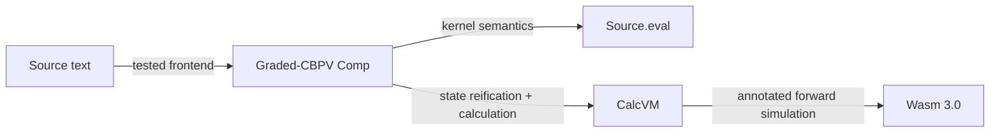

# BANG

A small effect-typed language whose **paradigm and runtime are values, not language features**. The kernel is thunks, effect rows, handlers, and STM; mutability, IO, async, actors, and signals are library-defined effects and handlers.

```bang
let c = {7} in $c
```

`{7}` describes a computation. `$c` is the explicit observation that runs it.

- **Trying the language?** Start below, then take the [guided tour](https://phibkro.github.io/bang/tour).
- **Contributing?** Follow [`ONBOARDING.md`](ONBOARDING.md), then [`CONTRIBUTING.md`](CONTRIBUTING.md).
- **Coding agent?** Read [`CLAUDE.md`](CLAUDE.md) first; repository-local `CONTEXT.md` is the volatile current position.

## Install and run

Download the latest prebuilt binary for x86_64 Linux, aarch64 Linux, or Apple Silicon macOS:

```bash
curl -fsSL https://raw.githubusercontent.com/phibkro/bang/main/tools/install.sh | sh
bang eval '1 + 2'
# 3
```

The installer selects the matching [GitHub Release](https://github.com/phibkro/bang/releases) asset and writes it to `~/.local/bin`. Linux binaries require glibc 2.26 or newer. Intel macOS and Windows are not release targets yet.

Build from source with the pinned Nix environment:

```bash
git clone https://github.com/phibkro/bang.git
cd bang
nix develop -c lake exe cache get   # one-time Mathlib olean fetch
nix develop -c lake build bang
./.lake/build/bin/bang eval '1 + 2'
```

A cold setup downloads a multi-gigabyte Mathlib cache and builds the runner; budget roughly 10–15 minutes depending on network and CPU. Do not run concurrent first-time Lake setup commands in the same checkout.

## Two-minute language model

First, make forcing visible:

```bash
bang eval 'let c = {7} in $c'
# 7
```

Then run the same effectful program through all three engines:

```bash
bang run --engine=env      examples/logger-counting/main.bang  # 3
bang run --engine=oracle   examples/logger-counting/main.bang  # 3
bang run --engine=compiled examples/logger-counting/main.bang  # 3
```

The source declares a `Log` effect and installs a counting handler. Changing the handler changes the runtime policy without changing the kernel.

| Engine | Role |
|---|---|
| `env` | Default environment/closure machine; proved to agree with the reference and differentially gated |
| `oracle` | `Source.eval`, the substitution-based kernel reference and failure arbiter |
| `compiled` | Calculated `exec ∘ compile` machine; `--compiled` is an alias |

`bang --help` lists the remaining compiler-service commands: `check`, `query`, `fmt`, `rewrite`, `lint`, `test`, `emit`, and `build`.

## Architecture and evidence



**Reading the diagram:** CalcVM is calculated from the source semantics rather than designed independently. Wasm 3.0 is the compiler target; WasmFX is only a future fast path for the post-v1 general-resumption slot.

Two proof methods answer different questions:

| Claim | Method |
|---|---|
| Two source programs are contextually equivalent | Binary, step-indexed, biorthogonal logical relation |
| A source success is preserved by compilation | Annotated one-way forward simulation |

See [`docs/architecture/core-overview.md`](docs/architecture/core-overview.md) for the current pipeline, dependency tiers, engine distinctions, and evidence boundaries. The decisions are [ADR-0016](docs/decisions/0016-two-hop-architecture-calcvm-and-wasmfx.md), revised by [ADR-0059](docs/decisions/0059-wasm3-grade-directed-pluggable-backend.md), with the proof split fixed by [ADR-0035](docs/decisions/0035-lr-for-equivalence-simulation-for-compilation.md).

## Repository map

| Path | Purpose |
|---|---|
| `Bang/Core/` | IR, rows/grades, typing, kernel semantics, syntactic soundness |
| `Bang/Frontend/` | Parser, modules, inference/elaboration, diagnostics, formatter, query/rewrite/lint |
| `Bang/Backend/` | `evalD`, calculated and environment machines, formal Wasm, concrete WasmGC emitter |
| `Bang/Meta/` | Binary logical relations and contextual equivalence |
| `Bang/Witness/` | Executable regressions, counterexamples, fuzzing, laws, proof export |
| `Bang/Reify/` | Calculated-machine proof laboratory, separate from the production pipeline |
| `Bang/{Spec,Audit,Distribution,Examples}.lean` | Public theorem façade, axiom gate, distribution, executable corpus |
| `examples/` | Gated whole-program examples with expected results |
| `tools/` | Generators, differential batteries, architecture and documentation fitness checks |
| `docs/decisions/` | Accepted decisions and rejected alternatives |
| `docs/reference/` | Generated product reference |
| `CONTEXT.md`, `paths/` | Repository-local volatile work state |

Dependencies point inward at Core. `tools/import_facts.py` derives the module graph from both `import` and `public import`; `tools/arch-check.py` fails when the dependency V is violated.

## Contribute and verify

```bash
nix develop
just verify
```

`just verify` builds the real project and runs the static, executable, differential, generated-document, and axiom gates. For theorem trust, use `just axioms`; a headline theorem is accepted only when its axiom set is contained in `{propext, Classical.choice, Quot.sound}`.

Use the narrowest loop that can detect your change:

```bash
just check Bang/Core/Typing.lean
python3 tools/check-architecture-assertions.py --check
just fitness
just verify
```

The exact route depends on what you are changing; [`ONBOARDING.md`](ONBOARDING.md) provides frontend, proof, backend, tooling/docs, and agent tracks. Live checkpoint and branch state intentionally stay out of this versioned README—read repository-local `CONTEXT.md` in a checkout.

## Distribution

Release binaries are built by [`.github/workflows/release.yml`](https://github.com/phibkro/bang/blob/main/.github/workflows/release.yml). Reproducible Nix packaging lives in [`nix/bang.nix`](https://github.com/phibkro/bang/blob/main/nix/bang.nix): a fixed-output dependency fetch supplies Mathlib oleans, then a pure offline derivation builds the native runner. See [`docs/notes/distribution-survey.md`](docs/notes/distribution-survey.md) for the supported-platform ladder and known costs.
