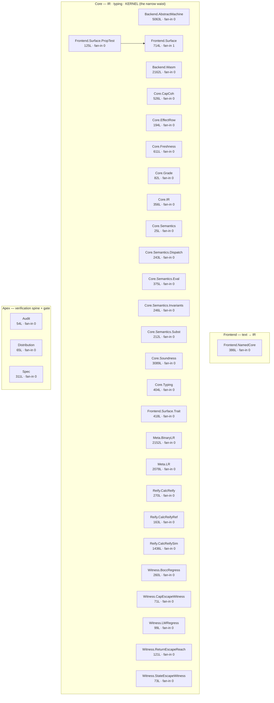

# Core implementation — architectural overview

> The map of *what we've built and how the pieces couple* — so we can reason about which decisions
> reinforce each other and which work against each other. Code is the source of truth; this is the
> approximation that makes the coupling **visible** (the thing whose absence let ADR-0053's cap bug hide).
> Generated-where-possible, hand-written for the interaction judgement. Links to ADRs/refs, never restates them.

## 1. The pipeline (ADR-0016, architecture in force)

```
  source  ──►  graded-CBPV semantics  ──►  CalcVM (Bahr–Hutton)  ──►  WasmFX (Benton–Hur LR)
              the executable spec          calculated machine        verified compiler output
```

Two verification spines ride this: the **calculated VM** (`compile, Code, exec` derived from `eval`) and
the **step-indexed logical relation** (`lr_sound`/`lr_fundamental`, the Compat layer) that backs
`compile_forward_sim`. Both are checked against `exec` (invariant #1: proof rides the reference).

## 2. The module graph — the "V" (enforced by `tools/arch-check.sh`)

<!-- BEGIN GENERATED import-graph (just import-graph) — do not hand-edit -->
_Generated by `tools/gen-import-graph.py` from the `import Bang.*` edges. Node label = `module (LOC · fan-in)`. Tiers are the restructure target (task #17); files are flat in `Bang/` until the post-reshape move._



| module | tier | LOC | fan-in |
|---|---|---|---|
| `Frontend.Surface` | ? | 714 | 1 |
| `Audit` | Apex | 54 | 0 |
| `Backend.AbstractMachine` | ? | 5063 | 0 |
| `Backend.Wasm` | ? | 2162 | 0 |
| `Core.CapCoh` | ? | 526 | 0 |
| `Core.EffectRow` | ? | 194 | 0 |
| `Core.Freshness` | ? | 611 | 0 |
| `Core.Grade` | ? | 82 | 0 |
| `Core.IR` | ? | 356 | 0 |
| `Core.Semantics` | ? | 25 | 0 |
| `Core.Semantics.Dispatch` | ? | 243 | 0 |
| `Core.Semantics.Eval` | ? | 375 | 0 |
| `Core.Semantics.Invariants` | ? | 246 | 0 |
| `Core.Semantics.Subst` | ? | 212 | 0 |
| `Core.Soundness` | ? | 3089 | 0 |
| `Core.Typing` | ? | 404 | 0 |
| `Distribution` | Apex | 65 | 0 |
| `Frontend.NamedCore` | Frontend | 386 | 0 |
| `Frontend.Surface.PropTest` | ? | 125 | 0 |
| `Frontend.Surface.Trait` | ? | 418 | 0 |
| `Meta.BinaryLR` | ? | 2152 | 0 |
| `Meta.LR` | ? | 2078 | 0 |
| `Reify.CalcReify` | ? | 270 | 0 |
| `Reify.CalcReifyRef` | ? | 163 | 0 |
| `Reify.CalcReifySim` | ? | 1436 | 0 |
| `Spec` | Apex | 311 | 0 |
| `Witness.BoccRegress` | ? | 260 | 0 |
| `Witness.CapEscapeWitness` | ? | 71 | 0 |
| `Witness.LWRegress` | ? | 99 | 0 |
| `Witness.ReturnEscapeReach` | ? | 121 | 0 |
| `Witness.StateEscapeWitness` | ? | 73 | 0 |
<!-- END GENERATED import-graph -->

**What the shape reveals** (from `import` DAG + per-symbol reference counts):

- **`Operational` is the single load-bearing hub** (fan-in 10). Healthy otherwise: complexity lives in the
  big *leaves* (CalcVM/Metatheory/Compile/Compat, fan-in 1–2 — write-once proof bodies), coupling lives in
  the *small* core (Core/Syntax/Operational). The hub is the exception: small-ish, but high fan-in **and**
  high internal density.
- **The "V" is real and enforced**: Frontend (Surface/Syntax/NamedCore) and Backend (CalcVM/Compile) cannot
  reach into each other; they meet only at Core.

**Per-module role** (absorbed from the retired `Bang.lean` barrel; the build closure is now the
`Bang.+` lake glob in `lakefile.toml`, not a hand-maintained import list):

| module | role |
|---|---|
| `EffectRow` | K1: effect-row algebra (the sound unifier) |
| `Core` · `Syntax` · `Operational` · `LR` · `Compile` · `Spec` | the Spec spine — `Spec` re-exports the rest (frozen theorems) |
| `Mult` | concrete QTT instance of `[Semiring Mult]` |
| `Metatheory` | syntactic metatheory: weakening + graded substitution (backs `subst_value`) |
| `Compat` · `Distribution` | Phase B targets |
| `Audit` | the `#print axioms` gate |
| `Surface` | tracer bullet: surface → graded-CBPV `Comp` → `Source.eval` → value (additive layer, outside the spine) |
| `Surface.Trait` | laws-as-algebraic-interfaces surface (ADR-0040): trait/impl + proof-first discharge ladder |
| `Frontend.NamedCore` | the canonical core made WRITABLE (ADR-0046/0047): named S-expr IR + name→de-Bruijn elaboration |
| `CalcReify` · `CalcReifyRef` · `CalcReifySim` · `CalcVM` | K3: the calculated machine (the paused reification frontier, ADR-0015) |
| `Freshness` · `CapCoh` · `Model` | LIVE freshness layer + cap-coherence (`Model` engine/diagonal dead per ADR-0063, see §6) |
| `*Regress` · `*Witness` · `*Refute` · `*Probe` | committed regression/refutation witnesses (the `H→False` do-not-weaken gate) — now in the build closure via the glob (#81) |

## 3. The coupling map — cross-cutting representations (the part that bites)

A concern's *blast radius* is how many modules reference it, independent of the import graph:

| concern | # modules | reads as… |
|---|---|---|
| effect rows (`Eff`/`labelEff`) | 14 | total pervasion — the type-level spine (by design, ADR-0001/0018) |
| `handlesOp` (dispatch) | 9 | effect dispatch is everywhere → the ADR-0054 blast radius |
| `substFrom`/`shiftFrom` | 7 | substitution pervasive |
| `splitAt` (LEGACY dynamic dispatch) | 6 | still smeared despite ADR-0045 static dispatch → **debt** |
| caps (`CapResolves`/`staticSplit`/`shiftCap`) | 4–5 | the cap representation — **kernel-confined, NOT in CalcVM/Compile** |
| `closeC` | 4 | `closeC ≡ Comp.subst`, in LR/Compat/Metatheory — **the bug's fingerprint** |

### The missing seam (architectural root of the ADR-0053 mistake)

The cap representation lives in `Operational` (the hub) **and** is mirrored by `closeC ≡ subst` in the LR.
There is **no boundary isolating "how dispatch resolves a handler" from "how subst/closeC closes an
environment"** — so any cap change must stay consistent across the kernel↔LR seam *simultaneously*.

```
  cap representation is load-bearing in FOUR places at once:
     kernel dispatch (absSplit) · Comp.subst · LR closeC(≡subst) · CalcVM evalD
                                       └──────── the SAME function ────────┘
```

That absent seam is why absolute caps *looked* safe in isolation: nothing showed that a substitution-time
shift (migration soundness) and an unshifted `closeC` (the LR 5→2 win) are the **same knob in opposite
positions**. ADR-0054's generative-identity representation **decouples** them (a stable identity → `subst`
doesn't shift → `closeC` mirrors no shift → the kernel↔LR cap-consistency obligation disappears).

## 4. Symbol coupling — file boundaries vs logical units

Move-analysis (symbol defined in A, used predominantly in B) shows three places where **file boundaries do
not match logical units**:

```
1. LR defines, Compat uses — nearly ONE unit split across two files
     closeC 86/90 · closeV 72/72 · VrelK 71/71 · CrelK 63/68 · KrelS 87/89 · EnvRelK 37/38  → in Compat
   LR.lean = "the relation DEFINITIONS", Compat.lean = "the fundamental-theorem PROOFS over them".

2. MISLOCATED: Stack.plug / Cxt.plug — defined in LR, used 80/89× in COMPILE
   machine/continuation ops living in the relation file, serving the backend → wrong layer.

3. The HUB is overloaded: Operational = kernel-reduction + cap-dispatch + LWT-invariants + substitution
   (FOUR concerns, fan-in 9). The reason the cap concern smeared and the seam above is missing.
```

## 5. Decision interaction — what reinforces vs what fights

```
  REINFORCING                                         IN TENSION
  ─────────────────────────────────────────────────────────────────────────────────────────
  effect rows = sets (0001/0018)                      LR-simplicity  ⟂  migration-soundness
    → lacks-discipline → no_accidental_handling          single-int cap: absolute(0053, unsound)
    → drops Biernacki ρ-maps (0024)                       vs relative+shift(0046, LR wall)
  STM-as-handler (0030) → 5 primitives hold              → resolved by identity caps (0054)
  calculated VM (0016) — machine is an OUTPUT          dynamic dispatch(0023/0024) vs static(0045)
  stratification: verified core + tested superset        → kernel vs evalD DISAGREE (0052, lexical)
    at a typed seam (0026/0028)                        the dispatch⟂subst HUB coupling (this doc §3)
```

The single most useful entry: **`LR-simplicity ⟂ migration-soundness`** — the axis ADR-0053 (unsound) and
ADR-0054 (the fix) live on, and the reason a representation change is forced rather than a patch (the shared
`subst`/`closeC` knob, §3).

## 6. Cleanup + restructuring (status + target)

### Done
- **−316 LOC**: the dead `WellCapped`/`WCComp` island removed from the hub (superseded by `LWConfig`,
  ADR-0045). `Operational` 1265 → 949. Verified `lake build Bang.Compat` = 711 jobs green. (`d1f0916`)

### NOT dead (corrected)
- **CalcReify\*** (~1850 LOC) is the ADR-0015 *paused reification frontier* (multi-shot/non-tail handler
  representation), deliberately in the build so its #guards gate — **not** the ADR-0051 rejected recast.

### Target restructuring (gated on the tree being green — see below)
```
  split Operational along its 4 concerns:
     Bang.Kernel       (reduction · Source.step · eval)
     Bang.Dispatch     (staticSplit/absSplit · handlesOp · the cap-resolution surface)
     Bang.Invariants   (LWT · LWConfig · HasConfig)
     Bang.Subst        (shiftFrom · substFrom · the closeC-mirrored substitution theory)
  relocate Stack.plug / Cxt.plug  LR → the machine layer (Operational/Eval), where Compile uses them
  reorganise LR/Compat around logical units (value-rel · stack-rel · compat-lemmas), not def-vs-proof
  prune: legacy splitAt (6 modules) once dispatch settles; the orphaned WC helpers (CtxKindEq, hframes…)
```

**Timing.** The restructuring is entangled with the **red-by-design** build (deferred CalcVM route-B,
ADR-0052): `plug` is used by Compile (red), and splitting `Operational` rewrites imports in all 9
dependents including red CalcVM/Compile/Surface — module-boundary moves there cannot be *verified* until the
tree gates green. So execute the code-moves **after** the CalcVM route-B lands (or as tightly-scoped moves
contained within the green subset). Doing them now would add unverifiable changes to red modules — the exact
way a hidden break hides.

### Tier + rename map — the legibility layer (task #17; gated on green tree)

The deeper concern-splits above are the *hard* refactor. Sitting on top is a cheap **legibility** win: move
the flat `Bang/*.lean` files into tier directories AND rename to communicate concern — so `ls Bang/` shows
the architecture, and `arch-check`'s layer becomes **path-derived (GENERATE)** instead of a hand-map. The
tier map below is the single source already encoded in `tools/gen-import-graph.py` (the §2 diagram); the move
makes the files match it. **Headline renames** (`Operational→Kernel`, `Core→IR`, `Syntax→Typing`,
`Metatheory→Soundness`):

```
Bang/Core/        the narrow waist (IR · typing · kernel · algebras)
  EffectRow                              → Core.EffectRow        (effect-row algebra)        [keep]
  Mult                                   → Core.Grade            (QTT multiplicity grade)    ★ rename
  Core   (Val/Comp/Handler · VTy/CTy)    → Core.IR               (the IR — terms + types)    ★ rename
  Syntax (HasVTy/HasCTy judgments)       → Core.Typing           (it's TYPING, not syntax)   ★ rename
  Operational (Source.eval · dispatch)   → Core.Kernel           (the reference semantics)   ★ rename
        └ or split per the concern-split above: Kernel · Dispatch · Invariants · Subst
Bang/Frontend/    text → IR
  Surface · Surface.Trait · NamedCore    → Frontend.{Surface,Trait,NamedCore}
Bang/Backend/     IR → calc-VM → WasmFX
  CalcVM                                 → Backend.CalcVM        (calculated machine)        [keep]
  Compile                                → Backend.Wasm          (the WasmFX lowering)       ★ rename
Bang/Meta/        the proofs
  Metatheory (progress/preservation)     → Meta.Soundness                                    ★ rename
  LR                                     → Meta.LogRel           (or keep LR)                 ~ optional
  Compat (binary-LR diagonal)            → Meta.Compat / Meta.BinaryLR                        ~ optional
Bang/ (apex, top-level)
  Spec  (verification spine)             → Spec                                              [keep]
  Audit (the gate)                       → Audit                                             [keep]
  Distribution                           → Meta.Distribution
Bang/Regress/     CapEscapeWitness · LWRegress         (build-gated witnesses)
Bang/Reify/       CalcReify{,Ref,Sim}                  (ADR-0015 paused frontier; NOT dead — §6 above)
```

This refines **ADR-0048** (which named only Frontend/Core/Backend, lumping the proofs into Core): add the
**Meta** tier (proofs depend on Core+Backend, feed the apex). Worth an ADR-0048 amendment when executed.
Mechanical once green: rename + `git mv` into tiers · update `Bang.lean` (could itself become generated) ·
flip `arch-check`'s `layer_of` from the case-map to `Bang.<Tier>.*` path-derivation · the `gen-import-graph`
`TIER` map then becomes the *truth*, not a forward-declaration.

### Module system + deep-module target (verified v4.30, 2026-06-26 spike)

The toolchain (Lean v4.30) ships the **module system**, and a spike empirically gated what it buys us.
This **revises the "many public peers" target above** — the real target is deep modules
(directories with hidden internals), not a flat split.

**What the spike verified (empirically gated, not from docs):**
- The module system IS available and **HEADER-DRIVEN** — a `module` line at the top of a file; **no
  lakefile change**. `module` / `public` / `public import` all parse.
- A non-`public` def is **HIDDEN from importers** (cross-file encapsulation) — and even **CLASSIC
  (non-module) importers respect it**. The boundary holds regardless of whether the importer opted in.
- Module mode is **PRIVATE-BY-DEFAULT**: a plain `def` is module-local; `public` opts into the
  interface. **Mathlib-interop works** — module files import and use Mathlib normally.

**→ Incremental BOTTOM-UP migration is viable.** Module-ify a leaf, mark its internals non-`public`,
and its (still-classic) importers automatically see only the public interface AND still compile.
**No big-bang.** The v4.30 module system **dissolves the encapsulation-vs-incrementality tradeoff**
that forced the earlier flat-peer target.

**DEEP-MODULE TARGET (revised).** Not single large files, not many flat peers, but
**DIRECTORIES-WITH-HIDDEN-INTERNALS** — ~12 public modules:

```
  Algebra · Syntax · Typing · Semantics · Safety · Model(=LR+Compat)
  · CalcVM · Compile · Surface · Spec · Audit · Witness
```

Each module = a `module` **barrel** re-exporting only its `public` interface; the internals are plain
files (non-`public`), hidden behind it.

**SEQUENCING.** The restructure **TRAILS GREEN, module-by-module** — each module is restructured +
module-ified **the moment inc-5/inc-6 greens it** (boundary moves in still-red modules stay
unverifiable until then, per §6 "Timing" above). Module-ify **bottom-up** (leaves first).

## See also
- ADR-0016 (architecture in force) · ADR-0054 (the cap representation) · ADR-0052 (CalcVM route-B, the red)
- `CLAUDE.md` (the stratification principle, the invariants) · `tools/arch-check.sh` (the V fitness function)
