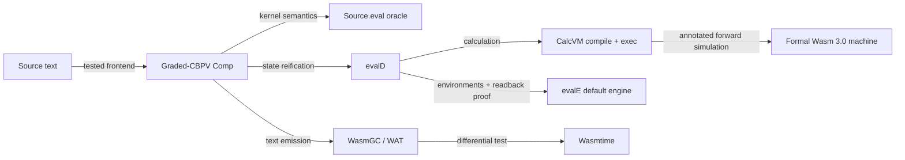
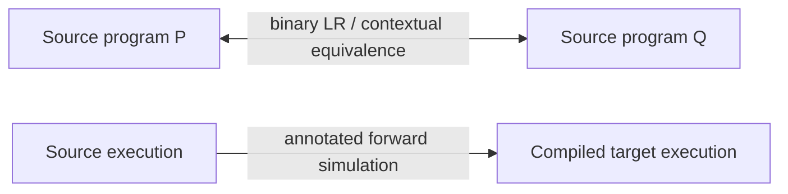

# Core implementation — current architecture

> **Summary:** BANG has one graded-CBPV semantic core observed through several representations. The source oracle defines behavior; the calculated machine is the executable compiler specification; Wasm 3.0 is the target; each arrow carries its own proof or differential-test status.

Read this page to answer three questions:

1. Which representation or engine am I looking at?
2. What evidence connects it to the source meaning?
3. Which tier owns a change, and what may that tier import?

Architecture decisions remain authoritative: [ADR-0016](../decisions/0016-two-hop-architecture-calcvm-and-wasmfx.md) fixes the two-hop shape, [ADR-0059](../decisions/0059-wasm3-grade-directed-pluggable-backend.md) revises the target to Wasm 3.0, and [ADR-0035](../decisions/0035-lr-for-equivalence-simulation-for-compilation.md) separates source equivalence from compilation simulation.

## 1. One meaning, several representations


```mermaid
flowchart LR
  S[Source text] -->|tested frontend| C[Graded-CBPV Comp]
  C -->|kernel semantics| O[Source.eval oracle]
  C -->|state reification| D[evalD]
  D -->|calculation| VM[CalcVM compile + exec]
  D -->|environments + readback proof| E[evalE default engine]
  VM -->|annotated forward simulation| W[Formal Wasm 3.0 machine]
  C -->|text emission| G[WasmGC / WAT]
  G -->|differential test| R[Wasmtime]
```

**Reading the diagram:** solid arrows are transformations or execution paths. The label names the evidence expected at that boundary; it does not imply that every arrow has the same verification status.

| Representation | Role | Evidence boundary |
|---|---|---|
| Surface parser, modules, inference, elaboration | Human/agent-facing language → monomorphic `Comp` | Tested superset: corpus, structured diagnostics, and differential engine tests |
| `Source.eval` | Substitution-based CK kernel semantics; the behavioral oracle | Verified core in `Bang/Core/Semantics*` and public theorem façade `Bang/Spec.lean` |
| `evalD` | Same semantics with handler state reified into explicit stores | `Bang.CalcVM.evalD_agrees_source` |
| `compile` + `exec` | Calculated instruction machine; executable compiler specification | `Bang.CalcVM.compile_correct` composed with `evalD_agrees_source` |
| `evalE` | Environment/closure representation used by the default CLI engine | Readback agreement with `evalD`; differential example battery |
| formal Wasm target (`Bang/Backend/Wasm.lean`) | Lean model used for compiler simulation | `compile_forward_sim`, an annotated one-way simulation |
| concrete WasmGC emitter (`Bang/Backend/WasmEmit.lean`) | Emits real WAT/WasmGC executed by Wasmtime | Tested stratum: real-engine differential harnesses against the source result |
| host IO driver (`Main.lean`) | Grants, records, and replays ambient effects outside the pure evaluators | Tested boundary; least-authority grants and replay traces, not a kernel primitive |

The namespace `Wasmfx` survives in parts of the formal Lean model for historical reasons. It does **not** make WasmFX the current product target. ADR-0059 makes stock Wasm 3.0 primary; WasmFX is a future fast path for the post-v1 general-resumption slot only.

<!-- BEGIN GENERATED architecture-assertions (just architecture-assertions) — do not hand-edit -->
### Architecture assertions

_Generated from Lean source, module paths, and accepted ADRs. This is a reviewable projection, not a second architecture authority._

| Fact | Current value | Authority |
|---|---|---|
| Compiler target | **Wasm 3.0**, grade-directed; WasmFX is only a future general-case fast path | [ADR-0059](../decisions/0059-wasm3-grade-directed-pluggable-backend.md) |
| Source equivalence | binary biorthogonal LR: `lr_sound`, `lr_fundamental` | [ADR-0035](../decisions/0035-lr-for-equivalence-simulation-for-compilation.md), `Bang/Spec.lean`, `Bang/Audit.lean` |
| Compilation correctness | annotated forward simulation: `compile_forward_sim` | [ADR-0035](../decisions/0035-lr-for-equivalence-simulation-for-compilation.md), `Bang/Spec.lean`, `Bang/Audit.lean` |
| CLI engines | `oracle`, `compiled`, `env`; default **`env`**; `--compiled` aliases compiled | `Main.lean:Engine`, `Main.lean:parseEngine` |
| Module graph | 58 modules · 116 internal edges · Apex 4 · Backend 6 · Core 12 · Frontend 12 · Meta 2 · Reify 3 · Witness 19 | `tools/import_facts.py` over `Bang/**/*.lean` |
| Architecture lineage | ADR-0016 two-hop shape, target revised by ADR-0059 | [ADR-0016](../decisions/0016-two-hop-architecture-calcvm-and-wasmfx.md), [ADR-0059](../decisions/0059-wasm3-grade-directed-pluggable-backend.md) |
<!-- END GENERATED architecture-assertions -->

## 2. Proof arrows are different claims


```mermaid
flowchart LR
  P1[Source program P] <-->|binary LR / contextual equivalence| P2[Source program Q]
  S[Source execution] -->|annotated forward simulation| T[Compiled target execution]
```

**Reading the diagram:** the upper arrow compares two source programs in arbitrary contexts; the lower arrow preserves one source execution into one target execution.

| Question | Method | Headline theorems |
|---|---|---|
| Are two source programs contextually indistinguishable? | Binary, step-indexed, biorthogonal logical relation | `lr_fundamental`, `lr_sound`, `zero_usage_erasable` |
| Does compiling a source success preserve its value? | One-way annotated forward simulation | `compile_forward_sim` |

Do not describe compiler correctness as “the Benton–Hur LR.” The LR and simulation are complementary, not interchangeable; ADR-0035 is the decision record.

## 3. The dependency V

Dependencies point inward at Core even though program data flows Frontend → Core → Backend.

| Tier | Owns | Dependency rule |
|---|---|---|
| Core | IR, rows/grades, typing, kernel semantics, syntactic soundness | Imports no outer tier |
| Frontend | Surface syntax, modules, inference/elaboration, formatter, diagnostics, query/rewrite/lint | May import Core; never Backend |
| Backend | `evalD`, calculated machines, environment machine, formal Wasm, concrete emitter | May import Core; never Frontend |
| Meta | Binary logical relations and contextual-equivalence proofs | Consumes the lower V |
| Witness | Executable regressions, countermodels, fuzzers, law/proof-export evidence | Consumes lower tiers; is not imported by them |
| Reify | Standalone calculated-machine proof laboratory | Consumer tier, not the production CalcVM pipeline |
| Apex | `Spec`, `Audit`, `Distribution`, `Examples` | Public façade and gates; may import all tiers |

`tools/import_facts.py` is the single parser/classifier for the graph and the dependency fitness check. `tools/arch-check.py` enforces the V. Unknown tiers and missing internal imports fail rather than silently falling into a default layer.

<!-- BEGIN GENERATED import-graph (just import-graph) — do not hand-edit -->
_Generated by `tools/gen-import-graph.py` through `tools/import_facts.py` from current `import Bang.*` and `public import Bang.*` edges. Node label = `module (LOC · fan-in)`; an arrow `A → B` means A imports B._


```mermaid
graph TD
  subgraph tier_Frontend["Frontend — text → typed core"]
    Frontend_Annotate["Frontend.Annotate<br/>252L · fan-in 1"]
    Frontend_DiagCodes["Frontend.DiagCodes<br/>320L · fan-in 1"]
    Frontend_Diagnostics["Frontend.Diagnostics<br/>227L · fan-in 1"]
    Frontend_Format["Frontend.Format<br/>1139L · fan-in 4"]
    Frontend_Lint["Frontend.Lint<br/>289L · fan-in 0"]
    Frontend_NamedCore["Frontend.NamedCore<br/>386L · fan-in 0"]
    Frontend_Query["Frontend.Query<br/>899L · fan-in 3"]
    Frontend_Rewrite["Frontend.Rewrite<br/>313L · fan-in 0"]
    Frontend_Surface["Frontend.Surface<br/>3406L · fan-in 7"]
    Frontend_Surface_PropTest["Frontend.Surface.PropTest<br/>127L · fan-in 0"]
    Frontend_Surface_Trait["Frontend.Surface.Trait<br/>418L · fan-in 0"]
    Frontend_TypeCheck["Frontend.TypeCheck<br/>9490L · fan-in 5"]
  end
  subgraph tier_Core["Core — IR · typing · semantics · soundness"]
    Core_CapCoh["Core.CapCoh<br/>566L · fan-in 1"]
    Core_EffectRow["Core.EffectRow<br/>203L · fan-in 1"]
    Core_Freshness["Core.Freshness<br/>833L · fan-in 5"]
    Core_Grade["Core.Grade<br/>84L · fan-in 11"]
    Core_IR["Core.IR<br/>440L · fan-in 7"]
    Core_Semantics["Core.Semantics<br/>25L · fan-in 16"]
    Core_Semantics_Dispatch["Core.Semantics.Dispatch<br/>273L · fan-in 2"]
    Core_Semantics_Eval["Core.Semantics.Eval<br/>621L · fan-in 3"]
    Core_Semantics_Invariants["Core.Semantics.Invariants<br/>264L · fan-in 1"]
    Core_Semantics_Subst["Core.Semantics.Subst<br/>947L · fan-in 2"]
    Core_Soundness["Core.Soundness<br/>3400L · fan-in 10"]
    Core_Typing["Core.Typing<br/>510L · fan-in 7"]
  end
  subgraph tier_Backend["Backend — calculated machines → Wasm 3.0"]
    Backend_AbstractMachine["Backend.AbstractMachine<br/>6871L · fan-in 8"]
    Backend_EnvMachine["Backend.EnvMachine<br/>3624L · fan-in 0"]
    Backend_Rung5ProofGrade["Backend.Rung5ProofGrade<br/>143L · fan-in 1"]
    Backend_U5bComplete["Backend.U5bComplete<br/>1649L · fan-in 1"]
    Backend_Wasm["Backend.Wasm<br/>2931L · fan-in 4"]
    Backend_WasmEmit["Backend.WasmEmit<br/>1757L · fan-in 1"]
  end
  subgraph tier_Meta["Meta — contextual equivalence"]
    Meta_BinaryLR["Meta.BinaryLR<br/>1854L · fan-in 1"]
    Meta_LR["Meta.LR<br/>1998L · fan-in 2"]
  end
  subgraph tier_Witness["Witness — executable evidence and counterexamples"]
    Witness_AgreeOutcome["Witness.AgreeOutcome<br/>236L · fan-in 1"]
    Witness_BinopTyping["Witness.BinopTyping<br/>70L · fan-in 0"]
    Witness_BoccRegress["Witness.BoccRegress<br/>261L · fan-in 0"]
    Witness_CapEscapeWitness["Witness.CapEscapeWitness<br/>72L · fan-in 0"]
    Witness_CtrGradeRefute["Witness.CtrGradeRefute<br/>138L · fan-in 0"]
    Witness_CustomStage1Refute["Witness.CustomStage1Refute<br/>39L · fan-in 0"]
    Witness_D5ParamHandlerWitness["Witness.D5ParamHandlerWitness<br/>161L · fan-in 0"]
    Witness_EffectTraceWitness["Witness.EffectTraceWitness<br/>127L · fan-in 0"]
    Witness_ElabFuzz["Witness.ElabFuzz<br/>430L · fan-in 0"]
    Witness_Fuzz["Witness.Fuzz<br/>281L · fan-in 2"]
    Witness_GradePolyReturner["Witness.GradePolyReturner<br/>165L · fan-in 0"]
    Witness_LWRegress["Witness.LWRegress<br/>100L · fan-in 1"]
    Witness_LawTest["Witness.LawTest<br/>693L · fan-in 1"]
    Witness_ProofExport["Witness.ProofExport<br/>372L · fan-in 0"]
    Witness_ReturnEscapeReach["Witness.ReturnEscapeReach<br/>121L · fan-in 0"]
    Witness_ScopedCapWitness["Witness.ScopedCapWitness<br/>141L · fan-in 0"]
    Witness_SendableFragment["Witness.SendableFragment<br/>148L · fan-in 0"]
    Witness_StateEscapeWitness["Witness.StateEscapeWitness<br/>73L · fan-in 0"]
    Witness_VcapFreeRefute["Witness.VcapFreeRefute<br/>55L · fan-in 0"]
  end
  subgraph tier_Reify["Reify — calculated-machine proof laboratory"]
    Reify_CalcReify["Reify.CalcReify<br/>283L · fan-in 2"]
    Reify_CalcReifyRef["Reify.CalcReifyRef<br/>164L · fan-in 1"]
    Reify_CalcReifySim["Reify.CalcReifySim<br/>1436L · fan-in 0"]
  end
  subgraph tier_Apex["Apex — public theorem façade · audit · distribution"]
    Audit["Audit<br/>69L · fan-in 0"]
    Distribution["Distribution<br/>67L · fan-in 0"]
    Examples["Examples<br/>510L · fan-in 0"]
    Spec["Spec<br/>358L · fan-in 2"]
  end
  Audit --> Backend_AbstractMachine
  Audit --> Backend_Rung5ProofGrade
  Audit --> Frontend_Surface
  Audit --> Spec
  Backend_AbstractMachine --> Core_CapCoh
  Backend_AbstractMachine --> Core_Semantics
  Backend_EnvMachine --> Backend_AbstractMachine
  Backend_EnvMachine --> Core_Semantics
  Backend_Rung5ProofGrade --> Backend_Wasm
  Backend_Rung5ProofGrade --> Backend_WasmEmit
  Backend_U5bComplete --> Backend_AbstractMachine
  Backend_U5bComplete --> Core_Freshness
  Backend_Wasm --> Backend_AbstractMachine
  Backend_Wasm --> Backend_U5bComplete
  Backend_Wasm --> Core_Freshness
  Backend_Wasm --> Core_IR
  Backend_Wasm --> Core_Semantics
  Backend_Wasm --> Core_Typing
  Backend_WasmEmit --> Backend_AbstractMachine
  Core_CapCoh --> Core_Freshness
  Core_Freshness --> Core_Soundness
  Core_IR --> Core_EffectRow
  Core_Semantics --> Core_Semantics_Dispatch
  Core_Semantics --> Core_Semantics_Eval
  Core_Semantics --> Core_Semantics_Invariants
  Core_Semantics --> Core_Semantics_Subst
  Core_Semantics_Dispatch --> Core_Semantics_Subst
  Core_Semantics_Eval --> Core_Semantics_Dispatch
  Core_Semantics_Invariants --> Core_Semantics_Eval
  Core_Semantics_Subst --> Core_IR
  Core_Semantics_Subst --> Core_Typing
  Core_Soundness --> Core_IR
  Core_Soundness --> Core_Semantics
  Core_Soundness --> Core_Typing
  Core_Typing --> Core_IR
  Distribution --> Spec
  Examples --> Backend_AbstractMachine
  Examples --> Frontend_Surface
  Examples --> Frontend_TypeCheck
  Frontend_Annotate --> Frontend_Query
  Frontend_Diagnostics --> Frontend_DiagCodes
  Frontend_Diagnostics --> Frontend_TypeCheck
  Frontend_Format --> Frontend_Surface
  Frontend_Lint --> Frontend_Format
  Frontend_Lint --> Frontend_Query
  Frontend_NamedCore --> Core_Semantics
  Frontend_Query --> Frontend_Diagnostics
  Frontend_Rewrite --> Frontend_Annotate
  Frontend_Rewrite --> Frontend_Format
  Frontend_Rewrite --> Frontend_Query
  Frontend_Surface --> Core_Semantics
  Frontend_Surface_PropTest --> Frontend_Surface
  Frontend_Surface_Trait --> Frontend_Surface
  Frontend_TypeCheck --> Core_Grade
  Frontend_TypeCheck --> Core_Typing
  Frontend_TypeCheck --> Frontend_Format
  Frontend_TypeCheck --> Frontend_Surface
  Meta_BinaryLR --> Core_IR
  Meta_BinaryLR --> Core_Semantics
  Meta_BinaryLR --> Core_Soundness
  Meta_BinaryLR --> Core_Typing
  Meta_BinaryLR --> Meta_LR
  Meta_LR --> Core_IR
  Meta_LR --> Core_Semantics
  Meta_LR --> Core_Typing
  Reify_CalcReifyRef --> Reify_CalcReify
  Reify_CalcReifySim --> Reify_CalcReify
  Reify_CalcReifySim --> Reify_CalcReifyRef
  Spec --> Backend_Wasm
  Spec --> Core_IR
  Spec --> Core_Semantics
  Spec --> Core_Soundness
  Spec --> Core_Typing
  Spec --> Meta_BinaryLR
  Spec --> Meta_LR
  Witness_AgreeOutcome --> Backend_AbstractMachine
  Witness_BinopTyping --> Core_Grade
  Witness_BinopTyping --> Core_Soundness
  Witness_BoccRegress --> Core_Grade
  Witness_BoccRegress --> Core_Soundness
  Witness_CapEscapeWitness --> Core_Grade
  Witness_CapEscapeWitness --> Core_Semantics
  Witness_CapEscapeWitness --> Witness_LWRegress
  Witness_CtrGradeRefute --> Core_Grade
  Witness_CtrGradeRefute --> Core_Soundness
  Witness_CustomStage1Refute --> Backend_Wasm
  Witness_D5ParamHandlerWitness --> Core_Grade
  Witness_D5ParamHandlerWitness --> Core_Semantics
  Witness_EffectTraceWitness --> Core_Semantics_Eval
  Witness_ElabFuzz --> Frontend_Format
  Witness_ElabFuzz --> Frontend_Surface
  Witness_ElabFuzz --> Frontend_TypeCheck
  Witness_ElabFuzz --> Witness_Fuzz
  Witness_Fuzz --> Backend_AbstractMachine
  Witness_Fuzz --> Witness_AgreeOutcome
  Witness_GradePolyReturner --> Core_Grade
  Witness_GradePolyReturner --> Core_Soundness
  Witness_LWRegress --> Core_Grade
  Witness_LWRegress --> Core_Semantics
  Witness_LawTest --> Core_Semantics
  Witness_LawTest --> Frontend_TypeCheck
  Witness_LawTest --> Witness_Fuzz
  Witness_ProofExport --> Core_Semantics
  Witness_ProofExport --> Frontend_TypeCheck
  Witness_ProofExport --> Witness_LawTest
  Witness_ReturnEscapeReach --> Core_Grade
  Witness_ReturnEscapeReach --> Core_Soundness
  Witness_ScopedCapWitness --> Core_Grade
  Witness_ScopedCapWitness --> Core_Soundness
  Witness_SendableFragment --> Core_Freshness
  Witness_SendableFragment --> Core_Semantics
  Witness_StateEscapeWitness --> Core_Grade
  Witness_StateEscapeWitness --> Core_Semantics
  Witness_StateEscapeWitness --> Core_Soundness
  Witness_VcapFreeRefute --> Backend_Wasm
  Witness_VcapFreeRefute --> Core_Freshness
```

| module | tier | LOC | fan-in |
|---|---|---|---|
| `Core.Semantics` | Core | 25 | 16 |
| `Core.Grade` | Core | 84 | 11 |
| `Core.Soundness` | Core | 3400 | 10 |
| `Backend.AbstractMachine` | Backend | 6871 | 8 |
| `Core.IR` | Core | 440 | 7 |
| `Core.Typing` | Core | 510 | 7 |
| `Frontend.Surface` | Frontend | 3406 | 7 |
| `Core.Freshness` | Core | 833 | 5 |
| `Frontend.TypeCheck` | Frontend | 9490 | 5 |
| `Backend.Wasm` | Backend | 2931 | 4 |
| `Frontend.Format` | Frontend | 1139 | 4 |
| `Core.Semantics.Eval` | Core | 621 | 3 |
| `Frontend.Query` | Frontend | 899 | 3 |
| `Core.Semantics.Dispatch` | Core | 273 | 2 |
| `Core.Semantics.Subst` | Core | 947 | 2 |
| `Meta.LR` | Meta | 1998 | 2 |
| `Reify.CalcReify` | Reify | 283 | 2 |
| `Spec` | Apex | 358 | 2 |
| `Witness.Fuzz` | Witness | 281 | 2 |
| `Backend.Rung5ProofGrade` | Backend | 143 | 1 |
| `Backend.U5bComplete` | Backend | 1649 | 1 |
| `Backend.WasmEmit` | Backend | 1757 | 1 |
| `Core.CapCoh` | Core | 566 | 1 |
| `Core.EffectRow` | Core | 203 | 1 |
| `Core.Semantics.Invariants` | Core | 264 | 1 |
| `Frontend.Annotate` | Frontend | 252 | 1 |
| `Frontend.DiagCodes` | Frontend | 320 | 1 |
| `Frontend.Diagnostics` | Frontend | 227 | 1 |
| `Meta.BinaryLR` | Meta | 1854 | 1 |
| `Reify.CalcReifyRef` | Reify | 164 | 1 |
| `Witness.AgreeOutcome` | Witness | 236 | 1 |
| `Witness.LWRegress` | Witness | 100 | 1 |
| `Witness.LawTest` | Witness | 693 | 1 |
| `Audit` | Apex | 69 | 0 |
| `Backend.EnvMachine` | Backend | 3624 | 0 |
| `Distribution` | Apex | 67 | 0 |
| `Examples` | Apex | 510 | 0 |
| `Frontend.Lint` | Frontend | 289 | 0 |
| `Frontend.NamedCore` | Frontend | 386 | 0 |
| `Frontend.Rewrite` | Frontend | 313 | 0 |
| `Frontend.Surface.PropTest` | Frontend | 127 | 0 |
| `Frontend.Surface.Trait` | Frontend | 418 | 0 |
| `Reify.CalcReifySim` | Reify | 1436 | 0 |
| `Witness.BinopTyping` | Witness | 70 | 0 |
| `Witness.BoccRegress` | Witness | 261 | 0 |
| `Witness.CapEscapeWitness` | Witness | 72 | 0 |
| `Witness.CtrGradeRefute` | Witness | 138 | 0 |
| `Witness.CustomStage1Refute` | Witness | 39 | 0 |
| `Witness.D5ParamHandlerWitness` | Witness | 161 | 0 |
| `Witness.EffectTraceWitness` | Witness | 127 | 0 |
| `Witness.ElabFuzz` | Witness | 430 | 0 |
| `Witness.GradePolyReturner` | Witness | 165 | 0 |
| `Witness.ProofExport` | Witness | 372 | 0 |
| `Witness.ReturnEscapeReach` | Witness | 121 | 0 |
| `Witness.ScopedCapWitness` | Witness | 141 | 0 |
| `Witness.SendableFragment` | Witness | 148 | 0 |
| `Witness.StateEscapeWitness` | Witness | 73 | 0 |
| `Witness.VcapFreeRefute` | Witness | 55 | 0 |
<!-- END GENERATED import-graph -->

The generated graph reports direct imports and direct fan-in. It shows coupling pressure; it does not by itself prove semantic correctness or justify moving a module.

## 4. Contributor routing

| Change | Start at | Required cross-check |
|---|---|---|
| Syntax, inference, modules, diagnostics | `Bang/Frontend/` | Follow every relevant surface traversal; run structured CLI/corpus gates |
| Kernel behavior or typing rule | `Bang/Core/` | Preserve the five-primitive boundary; run proof and axiom gates |
| Calculated machine or formal target | `Bang/Backend/AbstractMachine.lean`, `Bang/Backend/Wasm.lean` | Tie execution back to `Source.eval`; preserve simulation statements |
| Concrete WasmGC emission | `Bang/Backend/WasmEmit.lean` | Run the real Wasmtime differential harness, not only Lean tests |
| Contextual equivalence | `Bang/Meta/` | Keep LR claims separate from compilation simulation |
| Public theorem or trust claim | `Bang/Spec.lean`, `Bang/Audit.lean` | `#print axioms`; trusted set must remain within `{propext, Classical.choice, Quot.sound}` |
| Evidence/counterexample | `Bang/Witness/` | State whether it is a regression, refutation, fuzz pole, or tested law |

## 5. Current boundary versus horizon

- **Current:** v1 handlers are abortive or one-shot tail-resumptive; stock Wasm 3.0 exceptions, tail calls, GC values, and the tested concrete emitter are sufficient for the shipped path.
- **Post-v1 horizon:** general/multishot resumptions may use the GC-frame-chain slot, with WasmFX as a swappable fast path once standardized and deployed.
- **Separate laboratory:** `Bang/Reify/` studies calculated handler machines; it is not another production execution path.
- **Volatile project position:** read repository-local `CONTEXT.md` in a checkout. This page intentionally contains no active-branch, checkpoint, or issue-status narrative.

## 6. Gates

```bash
python3 tools/import_facts.py --self-test
python3 tools/arch-check.py
python3 tools/gen-import-graph.py --check
python3 tools/check-architecture-assertions.py --check
just fitness
```

For theorem trust, run `just axioms`; for the full repository gate, run `just verify` from the Nix development shell.
