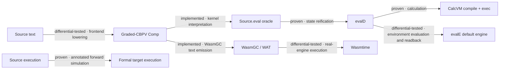
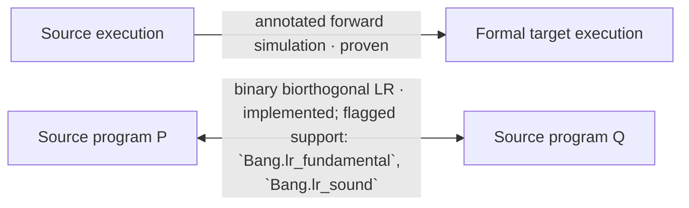

# Core implementation — current architecture

> **Summary:** BANG has one graded-CBPV semantic core observed through several representations. The source oracle defines behavior; the calculated machine is the executable compiler specification; Wasm 3.0 is the target; each arrow carries its own proof or differential-test status.

Read this page to answer three questions:

1. Which representation or engine am I looking at?
2. What evidence connects it to the source meaning?
3. Which tier owns a change, and what may that tier import?

Architecture decisions remain authoritative: [ADR-0016](../decisions/0016-two-hop-architecture-calcvm-and-wasmfx.md) fixes the two-hop shape, [ADR-0059](../decisions/0059-wasm3-grade-directed-pluggable-backend.md) revises the target to Wasm 3.0, and [ADR-0035](../decisions/0035-lr-for-equivalence-simulation-for-compilation.md) separates source equivalence from compilation simulation.

## 1. One meaning, several representations

<!-- BEGIN GENERATED architecture-pipeline (just architecture-assertions) — do not hand-edit -->

```mermaid
flowchart LR
  n_63616c63766d["CalcVM compile + exec"]
  n_636f6d70["Graded-CBPV Comp"]
  n_656d69747465642d776174["WasmGC / WAT"]
  n_656e762d656e67696e65["evalE default engine"]
  n_6576616c64["evalD"]
  n_736f757263652d6576616c["Source.eval oracle"]
  n_736f757263652d657865637574696f6e["Source execution"]
  n_736f757263652d74657874["Source text"]
  n_7461726765742d657865637574696f6e["Formal target execution"]
  n_7761736d74696d65["Wasmtime"]
  n_636f6d70 -->|implemented · WasmGC text emission| n_656d69747465642d776174
  n_636f6d70 -->|implemented · kernel interpretation| n_736f757263652d6576616c
  n_656d69747465642d776174 -->|differential-tested · real-engine execution| n_7761736d74696d65
  n_6576616c64 -->|proven · calculation| n_63616c63766d
  n_6576616c64 -->|differential-tested · environment evaluation and readback| n_656e762d656e67696e65
  n_736f757263652d6576616c -->|proven · state reification| n_6576616c64
  n_736f757263652d657865637574696f6e -->|proven · annotated forward simulation| n_7461726765742d657865637574696f6e
  n_736f757263652d74657874 -->|differential-tested · frontend lowering| n_636f6d70
```

**Reading the diagram:** each edge label is the serialized evidence label followed by the serialized method; labels do not imply a stronger status.

| Representation | Kind | Sources | Outgoing boundaries |
|---|---|---|---|
| `CalcVM compile + exec` | machine | `Bang/Backend/AbstractMachine.lean` | — |
| `Graded-CBPV Comp` | core-ir | `Bang/Core/IR.lean` | WasmGC text emission → `WasmGC / WAT` (implemented); kernel interpretation → `Source.eval oracle` (implemented) |
| `WasmGC / WAT` | emitted-wat | `Bang/Backend/WasmEmit.lean` | real-engine execution → `Wasmtime` (differential-tested) |
| `evalE default engine` | environment-machine | `Bang/Backend/EnvMachine.lean`, `Main.lean` | — |
| `evalD` | state-semantics | `Bang/Backend/AbstractMachine.lean` | calculation → `CalcVM compile + exec` (proven); environment evaluation and readback → `evalE default engine` (differential-tested) |
| `Source.eval oracle` | source-semantics | `Bang/Core/Semantics/Eval.lean` | state reification → `evalD` (proven) |
| `Source execution` | source-execution | `Bang/Spec.lean` | annotated forward simulation → `Formal target execution` (proven) |
| `Source text` | text | `Bang/Frontend/Surface.lean` | frontend lowering → `Graded-CBPV Comp` (differential-tested) |
| `Formal target execution` | target-execution | `Bang/Backend/Wasm.lean` | — |
| `Wasmtime` | runtime | `tools/emit-rung4-diff.sh` | — |
<!-- END GENERATED architecture-pipeline -->

The namespace `Wasmfx` survives in parts of the formal Lean model for historical reasons. It does **not** make WasmFX the current product target. ADR-0059 makes stock Wasm 3.0 primary; WasmFX is a future fast path for the post-v1 general-resumption slot only.

<!-- BEGIN GENERATED architecture-assertions (just architecture-assertions) — do not hand-edit -->
### Architecture assertions

_Generated from validated committed architecture and proof facts. The JSON is the consumer seam; source checks remain in the fact producers._

| Fact | Current value | Source/evidence |
|---|---|---|
| Compiler target | **Wasm 3.0**, grade-directed pluggable backend; WasmFX: future general-case fast path | `docs/decisions/0016-two-hop-architecture-calcvm-and-wasmfx.md`, `docs/decisions/0059-wasm3-grade-directed-pluggable-backend.md` |
| Source equivalence | binary biorthogonal LR: `Bang.lr_fundamental`, `Bang.lr_sound` | implemented; flagged support: `Bang.lr_fundamental`, `Bang.lr_sound`; `Bang/Spec.lean`, `Bang/Meta/LR.lean`, `Bang/Meta/BinaryLR.lean`, `Bang/Audit.lean`; validate: `lake env lean Bang/Audit.lean` |
| Compilation correctness | annotated forward simulation: `Bang.compile_forward_sim` | proven; `Bang/Spec.lean`, `Bang/Backend/Wasm.lean`, `Bang/Audit.lean`, `docs/decisions/0059-wasm3-grade-directed-pluggable-backend.md`; validate: `lake env lean Bang/Audit.lean` |
| CLI engines | `oracle`, `compiled`, `env`; default **`env`**; `--compiled` aliases `compiled` | `Bang/Backend/EnvMachine.lean`, `Main.lean`, `docs/decisions/0094-env-semantics-in-the-machine-layer.md` |
| Module graph | 58 modules · 116 internal edges · Apex 4 · Backend 6 · Core 12 · Frontend 12 · Meta 2 · Reify 3 · Witness 19 | 58 serialized module records in `docfacts/architecture.json` |
| Architecture lineage | ADR-0016 two-hop shape; target refined by ADR-0059 | [ADR-0016](../decisions/0016-two-hop-architecture-calcvm-and-wasmfx.md) (Accepted; implemented), [ADR-0059](../decisions/0059-wasm3-grade-directed-pluggable-backend.md) (Accepted; implemented) |
<!-- END GENERATED architecture-assertions -->

## 2. Proof arrows are different claims

<!-- BEGIN GENERATED proof-arrows (just architecture-assertions) — do not hand-edit -->

```mermaid
flowchart LR
  n_736f757263652d657865637574696f6e["Source execution"]
  n_736f757263652d70726f6772616d2d6c656674["Source program P"]
  n_736f757263652d70726f6772616d2d7269676874["Source program Q"]
  n_7461726765742d657865637574696f6e["Formal target execution"]
  n_736f757263652d70726f6772616d2d6c656674 <-->|binary biorthogonal LR · implemented; flagged support: `Bang.lr_fundamental`, `Bang.lr_sound`| n_736f757263652d70726f6772616d2d7269676874
  n_736f757263652d657865637574696f6e -->|annotated forward simulation · proven| n_7461726765742d657865637574696f6e
```

| Question / endpoint type | Direction | Method and theorem refs | Evidence status |
|---|---|---|---|
| source-programs: `Source program P` → `Source program Q` | bidirectional-contextual | binary biorthogonal LR; `Bang.lr_fundamental`, `Bang.lr_sound` | implemented; flagged support: `Bang.lr_fundamental`, `Bang.lr_sound`; validate: `lake env lean Bang/Audit.lean` |
| source-to-target-executions: `Source execution` → `Formal target execution` | forward | annotated forward simulation; `Bang.compile_forward_sim` | proven; validate: `lake env lean Bang/Audit.lean` |
<!-- END GENERATED proof-arrows -->

Do not describe compiler correctness as “the Benton–Hur LR.” The LR and simulation are complementary, not interchangeable; ADR-0035 is the decision record.

### Audited theorem census

<!-- BEGIN GENERATED audited-axioms (just architecture-assertions) — do not hand-edit -->
**Census:** 27 enrolled theorems · 22 trusted · 5 flagged · 2 with no axioms.

_Live validator: `python3 tools/docfacts_proof.py --live-check`._

| Theorem | Source | Axiom set | Status/evidence |
|---|---|---|---|
| `Bang.lr_sound` | `Bang/Spec.lean:249` | `Classical.choice`, `Quot.sound`, `propext`, `sorryAx` | flagged |
| `Bang.lr_fundamental` | `Bang/Spec.lean:280` | `Classical.choice`, `Quot.sound`, `propext`, `sorryAx` | flagged |
| `Bang.lr_fundamental_closed` | `Bang/Spec.lean:290` | `Classical.choice`, `Quot.sound`, `propext`, `sorryAx` | flagged |
| `Bang.seq_unit` | `Bang/Spec.lean:306` | `Classical.choice`, `Quot.sound`, `propext` | trusted · proven |
| `Bang.compile_forward_sim` | `Bang/Spec.lean:338` | `Classical.choice`, `Quot.sound`, `propext` | trusted · proven |
| `Bang.compile_forward_sim_pure` | `Bang/Backend/Wasm.lean:2771` | `Classical.choice`, `Quot.sound`, `propext` | trusted · proven |
| `Bang.source_eval_to_exec` | `Bang/Backend/Wasm.lean:2759` | `Classical.choice`, `Quot.sound`, `propext` | trusted · proven |
| `Bang.Rung5ProofGrade.s5_effectful_forward_sim` | `Bang/Backend/Rung5ProofGrade.lean:101` | `Classical.choice`, `Quot.sound`, `propext` | trusted · proven |
| `Bang.Rung5ProofGrade.s5_exec_wexec_lockstep` | `Bang/Backend/Rung5ProofGrade.lean:110` | `Quot.sound`, `propext` | trusted · proven |
| `Bang.compile_well_typed` | `Bang/Spec.lean:320` | `propext` | trusted · proven |
| `Bang.handler_compiles` | `Bang/Spec.lean:345` | `sorryAx` | flagged |
| `Bang.zero_grade_no_code` | `Bang/Spec.lean:349` | `propext` | trusted · proven |
| `Bang.subst_value` | `Bang/Spec.lean:104` | `Classical.choice`, `Quot.sound`, `propext` | trusted · proven |
| `Bang.preservation` | `Bang/Spec.lean:119` | `Classical.choice`, `Quot.sound`, `propext` | trusted · proven |
| `Bang.progress` | `Bang/Spec.lean:134` | `Quot.sound`, `propext` | trusted · proven |
| `Bang.type_safety` | `Bang/Spec.lean:156` | `Classical.choice`, `Quot.sound`, `propext` | trusted · proven |
| `Bang.no_accidental_handling` | `Bang/Spec.lean:60` | — | trusted · proven |
| `Bang.no_accidental_handling_custom` | `Bang/Spec.lean:71` | `propext` | trusted · proven |
| `Bang.custom_program_safe` | `Bang/Spec.lean:84` | `Classical.choice`, `Quot.sound`, `propext` | trusted · proven |
| `Bang.rowinst_requires_disjoint` | `Bang/Spec.lean:49` | — | trusted · proven |
| `Bang.effect_sound` | `Bang/Spec.lean:200` | `Quot.sound`, `propext` | trusted · proven |
| `Bang.zero_usage_erasable` | `Bang/Spec.lean:165` | `propext`, `sorryAx` | flagged |
| `Bang.Surface.cell_reflects_latest` | `Bang/Frontend/Surface.lean:2828` | `propext` | trusted · proven |
| `Bang.CalcVM.compile_correct` | `Bang/Backend/AbstractMachine.lean:3456` | `Classical.choice`, `Quot.sound`, `propext` | trusted · proven |
| `Bang.CalcVM.evalD_agrees_source` | `Bang/Backend/AbstractMachine.lean:6843` | `Classical.choice`, `Quot.sound`, `propext` | trusted · proven |
| `Bang.CalcVM.sim` | `Bang/Backend/AbstractMachine.lean:2296` | `Classical.choice`, `Quot.sound`, `propext` | trusted · proven |
| `Bang.CalcVM.run_evalD` | `Bang/Backend/AbstractMachine.lean:5494` | `Classical.choice`, `Quot.sound`, `propext` | trusted · proven |
<!-- END GENERATED audited-axioms -->

## 3. The dependency V

Dependencies point inward at Core even though program data flows Frontend → Core → Backend.

| Tier | Owns | Dependency rule |
|---|---|---|
| Core | IR, rows/grades, typing, kernel semantics, syntactic soundness | Imports no outer tier |
| Frontend | Surface syntax, modules, inference/elaboration, formatter, diagnostics, query/rewrite/lint | May import Core; never Backend |
| Backend | `evalD`, calculated machines, environment machine, formal Wasm, concrete emitter | May import Core; never Frontend |
| Meta | Binary logical relations and contextual-equivalence proofs | Consumes the lower V |
| Witness | Executable regressions, countermodels, fuzzers, law/proof-export evidence | Consumes lower tiers; is not imported by them |
| Reify | Standalone calculated-machine proof laboratory | Consumer tier, not the production CalcVM pipeline |
| Apex | `Spec`, `Audit`, `Distribution`, `Examples` | Public façade and gates; may import all tiers |

`tools/import_facts.py` is the single parser/classifier for the graph and the dependency fitness check. `tools/arch-check.py` enforces the V. Unknown tiers and missing internal imports fail rather than silently falling into a default layer.

<!-- BEGIN GENERATED import-graph (just import-graph) — do not hand-edit -->
_Generated by `tools/gen-import-graph.py` from validated `docfacts/architecture.json` module records. Node label = `module (LOC · fan-in)`; an arrow `A → B` means A imports B._

```mermaid
graph TD
  subgraph tier_Frontend["Frontend — text → typed core"]
    n_42616e672e46726f6e74656e642e416e6e6f74617465["Frontend.Annotate<br/>252L · fan-in 1"]
    n_42616e672e46726f6e74656e642e44696167436f646573["Frontend.DiagCodes<br/>320L · fan-in 1"]
    n_42616e672e46726f6e74656e642e446961676e6f7374696373["Frontend.Diagnostics<br/>227L · fan-in 1"]
    n_42616e672e46726f6e74656e642e466f726d6174["Frontend.Format<br/>1139L · fan-in 4"]
    n_42616e672e46726f6e74656e642e4c696e74["Frontend.Lint<br/>289L · fan-in 0"]
    n_42616e672e46726f6e74656e642e4e616d6564436f7265["Frontend.NamedCore<br/>386L · fan-in 0"]
    n_42616e672e46726f6e74656e642e5175657279["Frontend.Query<br/>899L · fan-in 3"]
    n_42616e672e46726f6e74656e642e52657772697465["Frontend.Rewrite<br/>313L · fan-in 0"]
    n_42616e672e46726f6e74656e642e53757266616365["Frontend.Surface<br/>3406L · fan-in 7"]
    n_42616e672e46726f6e74656e642e537572666163652e50726f7054657374["Frontend.Surface.PropTest<br/>127L · fan-in 0"]
    n_42616e672e46726f6e74656e642e537572666163652e5472616974["Frontend.Surface.Trait<br/>418L · fan-in 0"]
    n_42616e672e46726f6e74656e642e54797065436865636b["Frontend.TypeCheck<br/>9490L · fan-in 5"]
  end
  subgraph tier_Core["Core — IR · typing · semantics · soundness"]
    n_42616e672e436f72652e436170436f68["Core.CapCoh<br/>566L · fan-in 1"]
    n_42616e672e436f72652e456666656374526f77["Core.EffectRow<br/>203L · fan-in 1"]
    n_42616e672e436f72652e46726573686e657373["Core.Freshness<br/>833L · fan-in 5"]
    n_42616e672e436f72652e4772616465["Core.Grade<br/>84L · fan-in 11"]
    n_42616e672e436f72652e4952["Core.IR<br/>440L · fan-in 7"]
    n_42616e672e436f72652e53656d616e74696373["Core.Semantics<br/>25L · fan-in 16"]
    n_42616e672e436f72652e53656d616e746963732e4469737061746368["Core.Semantics.Dispatch<br/>273L · fan-in 2"]
    n_42616e672e436f72652e53656d616e746963732e4576616c["Core.Semantics.Eval<br/>621L · fan-in 3"]
    n_42616e672e436f72652e53656d616e746963732e496e76617269616e7473["Core.Semantics.Invariants<br/>264L · fan-in 1"]
    n_42616e672e436f72652e53656d616e746963732e5375627374["Core.Semantics.Subst<br/>947L · fan-in 2"]
    n_42616e672e436f72652e536f756e646e657373["Core.Soundness<br/>3400L · fan-in 10"]
    n_42616e672e436f72652e547970696e67["Core.Typing<br/>510L · fan-in 7"]
  end
  subgraph tier_Backend["Backend — calculated machines → Wasm 3.0"]
    n_42616e672e4261636b656e642e41627374726163744d616368696e65["Backend.AbstractMachine<br/>6871L · fan-in 8"]
    n_42616e672e4261636b656e642e456e764d616368696e65["Backend.EnvMachine<br/>3624L · fan-in 0"]
    n_42616e672e4261636b656e642e52756e673550726f6f664772616465["Backend.Rung5ProofGrade<br/>143L · fan-in 1"]
    n_42616e672e4261636b656e642e553562436f6d706c657465["Backend.U5bComplete<br/>1649L · fan-in 1"]
    n_42616e672e4261636b656e642e5761736d["Backend.Wasm<br/>2931L · fan-in 4"]
    n_42616e672e4261636b656e642e5761736d456d6974["Backend.WasmEmit<br/>1757L · fan-in 1"]
  end
  subgraph tier_Meta["Meta — contextual equivalence"]
    n_42616e672e4d6574612e42696e6172794c52["Meta.BinaryLR<br/>1854L · fan-in 1"]
    n_42616e672e4d6574612e4c52["Meta.LR<br/>1998L · fan-in 2"]
  end
  subgraph tier_Witness["Witness — executable evidence and counterexamples"]
    n_42616e672e5769746e6573732e41677265654f7574636f6d65["Witness.AgreeOutcome<br/>236L · fan-in 1"]
    n_42616e672e5769746e6573732e42696e6f70547970696e67["Witness.BinopTyping<br/>70L · fan-in 0"]
    n_42616e672e5769746e6573732e426f636352656772657373["Witness.BoccRegress<br/>261L · fan-in 0"]
    n_42616e672e5769746e6573732e4361704573636170655769746e657373["Witness.CapEscapeWitness<br/>72L · fan-in 0"]
    n_42616e672e5769746e6573732e4374724772616465526566757465["Witness.CtrGradeRefute<br/>138L · fan-in 0"]
    n_42616e672e5769746e6573732e437573746f6d537461676531526566757465["Witness.CustomStage1Refute<br/>39L · fan-in 0"]
    n_42616e672e5769746e6573732e4435506172616d48616e646c65725769746e657373["Witness.D5ParamHandlerWitness<br/>161L · fan-in 0"]
    n_42616e672e5769746e6573732e45666665637454726163655769746e657373["Witness.EffectTraceWitness<br/>127L · fan-in 0"]
    n_42616e672e5769746e6573732e456c616246757a7a["Witness.ElabFuzz<br/>430L · fan-in 0"]
    n_42616e672e5769746e6573732e46757a7a["Witness.Fuzz<br/>281L · fan-in 2"]
    n_42616e672e5769746e6573732e4772616465506f6c7952657475726e6572["Witness.GradePolyReturner<br/>165L · fan-in 0"]
    n_42616e672e5769746e6573732e4c5752656772657373["Witness.LWRegress<br/>100L · fan-in 1"]
    n_42616e672e5769746e6573732e4c617754657374["Witness.LawTest<br/>693L · fan-in 1"]
    n_42616e672e5769746e6573732e50726f6f664578706f7274["Witness.ProofExport<br/>372L · fan-in 0"]
    n_42616e672e5769746e6573732e52657475726e4573636170655265616368["Witness.ReturnEscapeReach<br/>121L · fan-in 0"]
    n_42616e672e5769746e6573732e53636f7065644361705769746e657373["Witness.ScopedCapWitness<br/>141L · fan-in 0"]
    n_42616e672e5769746e6573732e53656e6461626c65467261676d656e74["Witness.SendableFragment<br/>148L · fan-in 0"]
    n_42616e672e5769746e6573732e53746174654573636170655769746e657373["Witness.StateEscapeWitness<br/>73L · fan-in 0"]
    n_42616e672e5769746e6573732e5663617046726565526566757465["Witness.VcapFreeRefute<br/>55L · fan-in 0"]
  end
  subgraph tier_Reify["Reify — calculated-machine proof laboratory"]
    n_42616e672e52656966792e43616c635265696679["Reify.CalcReify<br/>283L · fan-in 2"]
    n_42616e672e52656966792e43616c635265696679526566["Reify.CalcReifyRef<br/>164L · fan-in 1"]
    n_42616e672e52656966792e43616c63526569667953696d["Reify.CalcReifySim<br/>1436L · fan-in 0"]
  end
  subgraph tier_Apex["Apex — public theorem façade · audit · distribution"]
    n_42616e672e4175646974["Audit<br/>69L · fan-in 0"]
    n_42616e672e446973747269627574696f6e["Distribution<br/>67L · fan-in 0"]
    n_42616e672e4578616d706c6573["Examples<br/>510L · fan-in 0"]
    n_42616e672e53706563["Spec<br/>358L · fan-in 2"]
  end
  n_42616e672e4175646974 --> n_42616e672e4261636b656e642e41627374726163744d616368696e65
  n_42616e672e4175646974 --> n_42616e672e4261636b656e642e52756e673550726f6f664772616465
  n_42616e672e4175646974 --> n_42616e672e46726f6e74656e642e53757266616365
  n_42616e672e4175646974 --> n_42616e672e53706563
  n_42616e672e4261636b656e642e41627374726163744d616368696e65 --> n_42616e672e436f72652e436170436f68
  n_42616e672e4261636b656e642e41627374726163744d616368696e65 --> n_42616e672e436f72652e53656d616e74696373
  n_42616e672e4261636b656e642e456e764d616368696e65 --> n_42616e672e4261636b656e642e41627374726163744d616368696e65
  n_42616e672e4261636b656e642e456e764d616368696e65 --> n_42616e672e436f72652e53656d616e74696373
  n_42616e672e4261636b656e642e52756e673550726f6f664772616465 --> n_42616e672e4261636b656e642e5761736d
  n_42616e672e4261636b656e642e52756e673550726f6f664772616465 --> n_42616e672e4261636b656e642e5761736d456d6974
  n_42616e672e4261636b656e642e553562436f6d706c657465 --> n_42616e672e4261636b656e642e41627374726163744d616368696e65
  n_42616e672e4261636b656e642e553562436f6d706c657465 --> n_42616e672e436f72652e46726573686e657373
  n_42616e672e4261636b656e642e5761736d --> n_42616e672e4261636b656e642e41627374726163744d616368696e65
  n_42616e672e4261636b656e642e5761736d --> n_42616e672e4261636b656e642e553562436f6d706c657465
  n_42616e672e4261636b656e642e5761736d --> n_42616e672e436f72652e46726573686e657373
  n_42616e672e4261636b656e642e5761736d --> n_42616e672e436f72652e4952
  n_42616e672e4261636b656e642e5761736d --> n_42616e672e436f72652e53656d616e74696373
  n_42616e672e4261636b656e642e5761736d --> n_42616e672e436f72652e547970696e67
  n_42616e672e4261636b656e642e5761736d456d6974 --> n_42616e672e4261636b656e642e41627374726163744d616368696e65
  n_42616e672e436f72652e436170436f68 --> n_42616e672e436f72652e46726573686e657373
  n_42616e672e436f72652e46726573686e657373 --> n_42616e672e436f72652e536f756e646e657373
  n_42616e672e436f72652e4952 --> n_42616e672e436f72652e456666656374526f77
  n_42616e672e436f72652e53656d616e74696373 --> n_42616e672e436f72652e53656d616e746963732e4469737061746368
  n_42616e672e436f72652e53656d616e74696373 --> n_42616e672e436f72652e53656d616e746963732e4576616c
  n_42616e672e436f72652e53656d616e74696373 --> n_42616e672e436f72652e53656d616e746963732e496e76617269616e7473
  n_42616e672e436f72652e53656d616e74696373 --> n_42616e672e436f72652e53656d616e746963732e5375627374
  n_42616e672e436f72652e53656d616e746963732e4469737061746368 --> n_42616e672e436f72652e53656d616e746963732e5375627374
  n_42616e672e436f72652e53656d616e746963732e4576616c --> n_42616e672e436f72652e53656d616e746963732e4469737061746368
  n_42616e672e436f72652e53656d616e746963732e496e76617269616e7473 --> n_42616e672e436f72652e53656d616e746963732e4576616c
  n_42616e672e436f72652e53656d616e746963732e5375627374 --> n_42616e672e436f72652e4952
  n_42616e672e436f72652e53656d616e746963732e5375627374 --> n_42616e672e436f72652e547970696e67
  n_42616e672e436f72652e536f756e646e657373 --> n_42616e672e436f72652e4952
  n_42616e672e436f72652e536f756e646e657373 --> n_42616e672e436f72652e53656d616e74696373
  n_42616e672e436f72652e536f756e646e657373 --> n_42616e672e436f72652e547970696e67
  n_42616e672e436f72652e547970696e67 --> n_42616e672e436f72652e4952
  n_42616e672e446973747269627574696f6e --> n_42616e672e53706563
  n_42616e672e4578616d706c6573 --> n_42616e672e4261636b656e642e41627374726163744d616368696e65
  n_42616e672e4578616d706c6573 --> n_42616e672e46726f6e74656e642e53757266616365
  n_42616e672e4578616d706c6573 --> n_42616e672e46726f6e74656e642e54797065436865636b
  n_42616e672e46726f6e74656e642e416e6e6f74617465 --> n_42616e672e46726f6e74656e642e5175657279
  n_42616e672e46726f6e74656e642e446961676e6f7374696373 --> n_42616e672e46726f6e74656e642e44696167436f646573
  n_42616e672e46726f6e74656e642e446961676e6f7374696373 --> n_42616e672e46726f6e74656e642e54797065436865636b
  n_42616e672e46726f6e74656e642e466f726d6174 --> n_42616e672e46726f6e74656e642e53757266616365
  n_42616e672e46726f6e74656e642e4c696e74 --> n_42616e672e46726f6e74656e642e466f726d6174
  n_42616e672e46726f6e74656e642e4c696e74 --> n_42616e672e46726f6e74656e642e5175657279
  n_42616e672e46726f6e74656e642e4e616d6564436f7265 --> n_42616e672e436f72652e53656d616e74696373
  n_42616e672e46726f6e74656e642e5175657279 --> n_42616e672e46726f6e74656e642e446961676e6f7374696373
  n_42616e672e46726f6e74656e642e52657772697465 --> n_42616e672e46726f6e74656e642e416e6e6f74617465
  n_42616e672e46726f6e74656e642e52657772697465 --> n_42616e672e46726f6e74656e642e466f726d6174
  n_42616e672e46726f6e74656e642e52657772697465 --> n_42616e672e46726f6e74656e642e5175657279
  n_42616e672e46726f6e74656e642e53757266616365 --> n_42616e672e436f72652e53656d616e74696373
  n_42616e672e46726f6e74656e642e537572666163652e50726f7054657374 --> n_42616e672e46726f6e74656e642e53757266616365
  n_42616e672e46726f6e74656e642e537572666163652e5472616974 --> n_42616e672e46726f6e74656e642e53757266616365
  n_42616e672e46726f6e74656e642e54797065436865636b --> n_42616e672e436f72652e4772616465
  n_42616e672e46726f6e74656e642e54797065436865636b --> n_42616e672e436f72652e547970696e67
  n_42616e672e46726f6e74656e642e54797065436865636b --> n_42616e672e46726f6e74656e642e466f726d6174
  n_42616e672e46726f6e74656e642e54797065436865636b --> n_42616e672e46726f6e74656e642e53757266616365
  n_42616e672e4d6574612e42696e6172794c52 --> n_42616e672e436f72652e4952
  n_42616e672e4d6574612e42696e6172794c52 --> n_42616e672e436f72652e53656d616e74696373
  n_42616e672e4d6574612e42696e6172794c52 --> n_42616e672e436f72652e536f756e646e657373
  n_42616e672e4d6574612e42696e6172794c52 --> n_42616e672e436f72652e547970696e67
  n_42616e672e4d6574612e42696e6172794c52 --> n_42616e672e4d6574612e4c52
  n_42616e672e4d6574612e4c52 --> n_42616e672e436f72652e4952
  n_42616e672e4d6574612e4c52 --> n_42616e672e436f72652e53656d616e74696373
  n_42616e672e4d6574612e4c52 --> n_42616e672e436f72652e547970696e67
  n_42616e672e52656966792e43616c635265696679526566 --> n_42616e672e52656966792e43616c635265696679
  n_42616e672e52656966792e43616c63526569667953696d --> n_42616e672e52656966792e43616c635265696679
  n_42616e672e52656966792e43616c63526569667953696d --> n_42616e672e52656966792e43616c635265696679526566
  n_42616e672e53706563 --> n_42616e672e4261636b656e642e5761736d
  n_42616e672e53706563 --> n_42616e672e436f72652e4952
  n_42616e672e53706563 --> n_42616e672e436f72652e53656d616e74696373
  n_42616e672e53706563 --> n_42616e672e436f72652e536f756e646e657373
  n_42616e672e53706563 --> n_42616e672e436f72652e547970696e67
  n_42616e672e53706563 --> n_42616e672e4d6574612e42696e6172794c52
  n_42616e672e53706563 --> n_42616e672e4d6574612e4c52
  n_42616e672e5769746e6573732e41677265654f7574636f6d65 --> n_42616e672e4261636b656e642e41627374726163744d616368696e65
  n_42616e672e5769746e6573732e42696e6f70547970696e67 --> n_42616e672e436f72652e4772616465
  n_42616e672e5769746e6573732e42696e6f70547970696e67 --> n_42616e672e436f72652e536f756e646e657373
  n_42616e672e5769746e6573732e426f636352656772657373 --> n_42616e672e436f72652e4772616465
  n_42616e672e5769746e6573732e426f636352656772657373 --> n_42616e672e436f72652e536f756e646e657373
  n_42616e672e5769746e6573732e4361704573636170655769746e657373 --> n_42616e672e436f72652e4772616465
  n_42616e672e5769746e6573732e4361704573636170655769746e657373 --> n_42616e672e436f72652e53656d616e74696373
  n_42616e672e5769746e6573732e4361704573636170655769746e657373 --> n_42616e672e5769746e6573732e4c5752656772657373
  n_42616e672e5769746e6573732e4374724772616465526566757465 --> n_42616e672e436f72652e4772616465
  n_42616e672e5769746e6573732e4374724772616465526566757465 --> n_42616e672e436f72652e536f756e646e657373
  n_42616e672e5769746e6573732e437573746f6d537461676531526566757465 --> n_42616e672e4261636b656e642e5761736d
  n_42616e672e5769746e6573732e4435506172616d48616e646c65725769746e657373 --> n_42616e672e436f72652e4772616465
  n_42616e672e5769746e6573732e4435506172616d48616e646c65725769746e657373 --> n_42616e672e436f72652e53656d616e74696373
  n_42616e672e5769746e6573732e45666665637454726163655769746e657373 --> n_42616e672e436f72652e53656d616e746963732e4576616c
  n_42616e672e5769746e6573732e456c616246757a7a --> n_42616e672e46726f6e74656e642e466f726d6174
  n_42616e672e5769746e6573732e456c616246757a7a --> n_42616e672e46726f6e74656e642e53757266616365
  n_42616e672e5769746e6573732e456c616246757a7a --> n_42616e672e46726f6e74656e642e54797065436865636b
  n_42616e672e5769746e6573732e456c616246757a7a --> n_42616e672e5769746e6573732e46757a7a
  n_42616e672e5769746e6573732e46757a7a --> n_42616e672e4261636b656e642e41627374726163744d616368696e65
  n_42616e672e5769746e6573732e46757a7a --> n_42616e672e5769746e6573732e41677265654f7574636f6d65
  n_42616e672e5769746e6573732e4772616465506f6c7952657475726e6572 --> n_42616e672e436f72652e4772616465
  n_42616e672e5769746e6573732e4772616465506f6c7952657475726e6572 --> n_42616e672e436f72652e536f756e646e657373
  n_42616e672e5769746e6573732e4c5752656772657373 --> n_42616e672e436f72652e4772616465
  n_42616e672e5769746e6573732e4c5752656772657373 --> n_42616e672e436f72652e53656d616e74696373
  n_42616e672e5769746e6573732e4c617754657374 --> n_42616e672e436f72652e53656d616e74696373
  n_42616e672e5769746e6573732e4c617754657374 --> n_42616e672e46726f6e74656e642e54797065436865636b
  n_42616e672e5769746e6573732e4c617754657374 --> n_42616e672e5769746e6573732e46757a7a
  n_42616e672e5769746e6573732e50726f6f664578706f7274 --> n_42616e672e436f72652e53656d616e74696373
  n_42616e672e5769746e6573732e50726f6f664578706f7274 --> n_42616e672e46726f6e74656e642e54797065436865636b
  n_42616e672e5769746e6573732e50726f6f664578706f7274 --> n_42616e672e5769746e6573732e4c617754657374
  n_42616e672e5769746e6573732e52657475726e4573636170655265616368 --> n_42616e672e436f72652e4772616465
  n_42616e672e5769746e6573732e52657475726e4573636170655265616368 --> n_42616e672e436f72652e536f756e646e657373
  n_42616e672e5769746e6573732e53636f7065644361705769746e657373 --> n_42616e672e436f72652e4772616465
  n_42616e672e5769746e6573732e53636f7065644361705769746e657373 --> n_42616e672e436f72652e536f756e646e657373
  n_42616e672e5769746e6573732e53656e6461626c65467261676d656e74 --> n_42616e672e436f72652e46726573686e657373
  n_42616e672e5769746e6573732e53656e6461626c65467261676d656e74 --> n_42616e672e436f72652e53656d616e74696373
  n_42616e672e5769746e6573732e53746174654573636170655769746e657373 --> n_42616e672e436f72652e4772616465
  n_42616e672e5769746e6573732e53746174654573636170655769746e657373 --> n_42616e672e436f72652e53656d616e74696373
  n_42616e672e5769746e6573732e53746174654573636170655769746e657373 --> n_42616e672e436f72652e536f756e646e657373
  n_42616e672e5769746e6573732e5663617046726565526566757465 --> n_42616e672e4261636b656e642e5761736d
  n_42616e672e5769746e6573732e5663617046726565526566757465 --> n_42616e672e436f72652e46726573686e657373
```

| module | tier | LOC | fan-in |
|---|---|---|---|
| `Core.Semantics` | Core | 25 | 16 |
| `Core.Grade` | Core | 84 | 11 |
| `Core.Soundness` | Core | 3400 | 10 |
| `Backend.AbstractMachine` | Backend | 6871 | 8 |
| `Core.IR` | Core | 440 | 7 |
| `Core.Typing` | Core | 510 | 7 |
| `Frontend.Surface` | Frontend | 3406 | 7 |
| `Core.Freshness` | Core | 833 | 5 |
| `Frontend.TypeCheck` | Frontend | 9490 | 5 |
| `Backend.Wasm` | Backend | 2931 | 4 |
| `Frontend.Format` | Frontend | 1139 | 4 |
| `Core.Semantics.Eval` | Core | 621 | 3 |
| `Frontend.Query` | Frontend | 899 | 3 |
| `Core.Semantics.Dispatch` | Core | 273 | 2 |
| `Core.Semantics.Subst` | Core | 947 | 2 |
| `Meta.LR` | Meta | 1998 | 2 |
| `Reify.CalcReify` | Reify | 283 | 2 |
| `Spec` | Apex | 358 | 2 |
| `Witness.Fuzz` | Witness | 281 | 2 |
| `Backend.Rung5ProofGrade` | Backend | 143 | 1 |
| `Backend.U5bComplete` | Backend | 1649 | 1 |
| `Backend.WasmEmit` | Backend | 1757 | 1 |
| `Core.CapCoh` | Core | 566 | 1 |
| `Core.EffectRow` | Core | 203 | 1 |
| `Core.Semantics.Invariants` | Core | 264 | 1 |
| `Frontend.Annotate` | Frontend | 252 | 1 |
| `Frontend.DiagCodes` | Frontend | 320 | 1 |
| `Frontend.Diagnostics` | Frontend | 227 | 1 |
| `Meta.BinaryLR` | Meta | 1854 | 1 |
| `Reify.CalcReifyRef` | Reify | 164 | 1 |
| `Witness.AgreeOutcome` | Witness | 236 | 1 |
| `Witness.LWRegress` | Witness | 100 | 1 |
| `Witness.LawTest` | Witness | 693 | 1 |
| `Audit` | Apex | 69 | 0 |
| `Backend.EnvMachine` | Backend | 3624 | 0 |
| `Distribution` | Apex | 67 | 0 |
| `Examples` | Apex | 510 | 0 |
| `Frontend.Lint` | Frontend | 289 | 0 |
| `Frontend.NamedCore` | Frontend | 386 | 0 |
| `Frontend.Rewrite` | Frontend | 313 | 0 |
| `Frontend.Surface.PropTest` | Frontend | 127 | 0 |
| `Frontend.Surface.Trait` | Frontend | 418 | 0 |
| `Reify.CalcReifySim` | Reify | 1436 | 0 |
| `Witness.BinopTyping` | Witness | 70 | 0 |
| `Witness.BoccRegress` | Witness | 261 | 0 |
| `Witness.CapEscapeWitness` | Witness | 72 | 0 |
| `Witness.CtrGradeRefute` | Witness | 138 | 0 |
| `Witness.CustomStage1Refute` | Witness | 39 | 0 |
| `Witness.D5ParamHandlerWitness` | Witness | 161 | 0 |
| `Witness.EffectTraceWitness` | Witness | 127 | 0 |
| `Witness.ElabFuzz` | Witness | 430 | 0 |
| `Witness.GradePolyReturner` | Witness | 165 | 0 |
| `Witness.ProofExport` | Witness | 372 | 0 |
| `Witness.ReturnEscapeReach` | Witness | 121 | 0 |
| `Witness.ScopedCapWitness` | Witness | 141 | 0 |
| `Witness.SendableFragment` | Witness | 148 | 0 |
| `Witness.StateEscapeWitness` | Witness | 73 | 0 |
| `Witness.VcapFreeRefute` | Witness | 55 | 0 |
<!-- END GENERATED import-graph -->

The generated graph reports direct imports and direct fan-in. It shows coupling pressure; it does not by itself prove semantic correctness or justify moving a module.

## 4. Contributor routing

| Change | Start at | Required cross-check |
|---|---|---|
| Syntax, inference, modules, diagnostics | `Bang/Frontend/` | Follow every relevant surface traversal; run structured CLI/corpus gates |
| Kernel behavior or typing rule | `Bang/Core/` | Preserve the five-primitive boundary; run proof and axiom gates |
| Calculated machine or formal target | `Bang/Backend/AbstractMachine.lean`, `Bang/Backend/Wasm.lean` | Tie execution back to `Source.eval`; preserve simulation statements |
| Concrete WasmGC emission | `Bang/Backend/WasmEmit.lean` | Run the real Wasmtime differential harness, not only Lean tests |
| Contextual equivalence | `Bang/Meta/` | Keep LR claims separate from compilation simulation |
| Public theorem or trust claim | `Bang/Spec.lean`, `Bang/Audit.lean` | `#print axioms`; trusted set must remain within `{propext, Classical.choice, Quot.sound}` |
| Evidence/counterexample | `Bang/Witness/` | State whether it is a regression, refutation, fuzz pole, or tested law |

## 5. Current boundary versus horizon

- **Current:** v1 handlers are abortive or one-shot tail-resumptive; stock Wasm 3.0 exceptions, tail calls, GC values, and the tested concrete emitter are sufficient for the shipped path.
- **Post-v1 horizon:** general/multishot resumptions may use the GC-frame-chain slot, with WasmFX as a swappable fast path once standardized and deployed.
- **Separate laboratory:** `Bang/Reify/` studies calculated handler machines; it is not another production execution path.
- **Volatile project position:** read repository-local `CONTEXT.md` in a checkout. This page intentionally contains no active-branch, checkpoint, or issue-status narrative.

## 6. Gates

```bash
python3 tools/import_facts.py --self-test
python3 tools/arch-check.py
python3 tools/gen-import-graph.py --check
python3 tools/check-architecture-assertions.py --check
just fitness
```

For theorem trust, run `just axioms`; for the full repository gate, run `just verify` from the Nix development shell.
