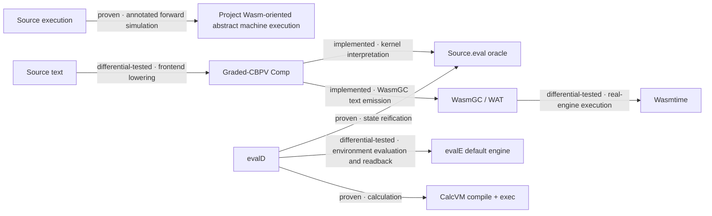
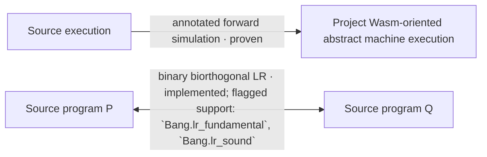

# Core implementation — current architecture

> **Summary:** BANG has one graded-CBPV semantic core observed through several representations. The source oracle defines behavior; the calculated machine is the executable compiler specification; Wasm 3.0 is the target; each arrow carries its own proof or differential-test status.

Read this page to answer three questions:

1. Which representation or engine am I looking at?
2. What evidence connects it to the source meaning?
3. Which tier owns a change, and what may that tier import?

Architecture decisions remain authoritative: [ADR-0016](../decisions/0016-two-hop-architecture-calcvm-and-wasmfx.md) fixes the two-hop shape, [ADR-0059](../decisions/0059-wasm3-grade-directed-pluggable-backend.md) revises the product target to Wasm 3.0, [ADR-0110](../decisions/0110-wasm-proof-model-concrete-emitter-boundary.md) preserves the abstract-model to concrete-emitter evidence boundary, and [ADR-0035](../decisions/0035-lr-for-equivalence-simulation-for-compilation.md) separates source equivalence from compilation simulation.

## 1. One meaning, several representations

<!-- BEGIN GENERATED architecture-pipeline (just architecture-assertions) — do not hand-edit -->

```mermaid
flowchart LR
  n_abstract_target_execution["Project Wasm-oriented abstract machine execution"]
  n_calcvm["CalcVM compile + exec"]
  n_comp["Graded-CBPV Comp"]
  n_emitted_wat["WasmGC / WAT"]
  n_env_engine["evalE default engine"]
  n_evald["evalD"]
  n_source_eval["Source.eval oracle"]
  n_source_execution["Source execution"]
  n_source_text["Source text"]
  n_wasmtime["Wasmtime"]
  n_comp -->|implemented · WasmGC text emission| n_emitted_wat
  n_comp -->|implemented · kernel interpretation| n_source_eval
  n_emitted_wat -->|differential-tested · real-engine execution| n_wasmtime
  n_evald -->|proven · calculation| n_calcvm
  n_evald -->|differential-tested · environment evaluation and readback| n_env_engine
  n_evald -->|proven · state reification| n_source_eval
  n_source_execution -->|proven · annotated forward simulation| n_abstract_target_execution
  n_source_text -->|differential-tested · frontend lowering| n_comp
```

**Reading the diagram:** each edge label is the serialized evidence label followed by the serialized method; labels do not imply a stronger status.

| Representation | Kind | Sources | Outgoing boundaries |
|---|---|---|---|
| `Project Wasm-oriented abstract machine execution` | abstract-target-execution | `Bang/Backend/Wasm.lean`, `docs/decisions/0110-wasm-proof-model-concrete-emitter-boundary.md` | — |
| `CalcVM compile + exec` | machine | `Bang/Backend/AbstractMachine.lean` | — |
| `Graded-CBPV Comp` | core-ir | `Bang/Core/IR.lean` | WasmGC text emission → `WasmGC / WAT` (implemented); kernel interpretation → `Source.eval oracle` (implemented) |
| `WasmGC / WAT` | emitted-wat | `Bang/Backend/WasmEmit.lean` | real-engine execution → `Wasmtime` (differential-tested) |
| `evalE default engine` | environment-machine | `Bang/Backend/EnvMachine.lean`, `Main.lean` | — |
| `evalD` | state-semantics | `Bang/Backend/AbstractMachine.lean` | calculation → `CalcVM compile + exec` (proven); environment evaluation and readback → `evalE default engine` (differential-tested); state reification → `Source.eval oracle` (proven) |
| `Source.eval oracle` | source-semantics | `Bang/Core/Semantics/Eval.lean` | — |
| `Source execution` | source-execution | `Bang/Spec.lean` | annotated forward simulation → `Project Wasm-oriented abstract machine execution` (proven) |
| `Source text` | text | `Bang/Frontend/Surface.lean` | frontend lowering → `Graded-CBPV Comp` (differential-tested) |
| `Wasmtime` | runtime | `tools/emit-rung4-diff.sh` | — |
<!-- END GENERATED architecture-pipeline -->

The namespace `Wasmfx` survives in the formal Lean model for historical reasons. The model is a project-defined Wasm-oriented abstract machine: the checked `compile_forward_sim` theorem targets its `Wasmfx.run`, not the concrete WAT emitter or official Wasm semantics. `Wasmfx.run` returns `Option Wasmfx.Val`: only a singleton successful final value is `some`, and its neutral `none` does not classify fuel, stack-shape, handler-state, or unhandled-operation non-values using the source evaluator's `Result`. ADR-0059 separately makes stock Wasm 3.0 the product target through the concrete emitter, whose real-engine edge is differentially tested. A formal correspondence between those two target layers remains open; WasmFX is only a future fast path for the post-v1 general-resumption slot.

<!-- BEGIN GENERATED architecture-assertions (just architecture-assertions) — do not hand-edit -->
### Architecture assertions

_Generated from validated committed architecture and proof facts. The JSON is the consumer seam; source checks remain in the fact producers._

| Fact | Current value | Source/evidence |
|---|---|---|
| Compiler target | **Wasm 3.0**, grade-directed pluggable backend; WasmFX: future general-case fast path | `docs/decisions/0016-two-hop-architecture-calcvm-and-wasmfx.md`, `docs/decisions/0059-wasm3-grade-directed-pluggable-backend.md`, `docs/decisions/0110-wasm-proof-model-concrete-emitter-boundary.md` |
| Source equivalence | binary biorthogonal LR: `Bang.lr_fundamental`, `Bang.lr_sound` | implemented; flagged support: `Bang.lr_fundamental`, `Bang.lr_sound`; `Bang/Spec.lean`, `Bang/Meta/LR.lean`, `Bang/Meta/BinaryLR.lean`, `Bang/Audit.lean`; validate: `lake env lean Bang/Audit.lean` |
| Compilation correctness | annotated forward simulation: `Bang.compile_forward_sim` | proven; `Bang/Spec.lean`, `Bang/Backend/Wasm.lean`, `Bang/Audit.lean`, `docs/decisions/0059-wasm3-grade-directed-pluggable-backend.md`, `docs/decisions/0110-wasm-proof-model-concrete-emitter-boundary.md`; validate: `lake env lean Bang/Audit.lean` |
| CLI engines | `oracle`, `compiled`, `env`; default **`env`**; `--compiled` aliases `compiled` | `Bang/Backend/EnvMachine.lean`, `Main.lean`, `docs/decisions/0094-env-semantics-in-the-machine-layer.md` |
| Module graph | 59 modules · 121 internal edges · Apex 4 · Backend 6 · Core 13 · Frontend 12 · Meta 2 · Reify 3 · Witness 19 | 59 serialized module records in `docfacts/architecture.json` |
| Architecture lineage | ADR-0016 two-hop shape; product target refined by ADR-0059; evidence boundary amended by ADR-0110 | [ADR-0016](../decisions/0016-two-hop-architecture-calcvm-and-wasmfx.md) (Accepted; implemented), [ADR-0059](../decisions/0059-wasm3-grade-directed-pluggable-backend.md) (Accepted; implemented), [ADR-0110](../decisions/0110-wasm-proof-model-concrete-emitter-boundary.md) (Accepted; implemented) |
<!-- END GENERATED architecture-assertions -->

## 2. Proof arrows are different claims

<!-- BEGIN GENERATED proof-arrows (just architecture-assertions) — do not hand-edit -->

```mermaid
flowchart LR
  n_abstract_target_execution["Project Wasm-oriented abstract machine execution"]
  n_source_execution["Source execution"]
  n_source_program_left["Source program P"]
  n_source_program_right["Source program Q"]
  n_source_program_left <-->|binary biorthogonal LR · implemented; flagged support: `Bang.lr_fundamental`, `Bang.lr_sound`| n_source_program_right
  n_source_execution -->|annotated forward simulation · proven| n_abstract_target_execution
```

| Question / endpoint type | Direction | Method and theorem refs | Evidence status |
|---|---|---|---|
| source-programs: `Source program P` → `Source program Q` | bidirectional-contextual | binary biorthogonal LR; `Bang.lr_fundamental`, `Bang.lr_sound` | implemented; flagged support: `Bang.lr_fundamental`, `Bang.lr_sound`; validate: `lake env lean Bang/Audit.lean` |
| source-to-target-executions: `Source execution` → `Project Wasm-oriented abstract machine execution` | forward | annotated forward simulation; `Bang.compile_forward_sim` | proven; validate: `lake env lean Bang/Audit.lean` |
<!-- END GENERATED proof-arrows -->

Do not describe compiler correctness as “the Benton–Hur LR.” The LR and simulation are complementary, not interchangeable; ADR-0035 is the decision record.

### Audited theorem census

<!-- BEGIN GENERATED audited-axioms (just architecture-assertions) — do not hand-edit -->
**Census:** 33 enrolled theorems · 27 trusted · 6 flagged · 2 with no axioms.

**Semantic inventory:** 17 strong scoped claims · 3 structural · 2 bounded · 3 partial · 1 conjectural · 1 placeholder · 6 aliases. Alias and placeholder rows never increase the strong count.

**Strong, precisely scoped claims:** `Bang.seq_unit`, `Bang.compile_forward_sim`, `Bang.compile_forward_sim_pure`, `Bang.source_eval_to_exec`, `Bang.Rung5ProofGrade.s5_exec_wexec_lockstep`, `Bang.subst_value`, `Bang.preservation`, `Bang.progress`, `Bang.type_safety`, `Bang.no_accidental_handling`, `Bang.no_accidental_handling_custom`, `Bang.closed_fully_handled_program_no_unclassified_stuck`, `Bang.CalcVM.compile_correct`, `Bang.CalcVM.evalD_agrees_source`, `Bang.CalcVM.sim`, `Bang.CalcVM.run_evalD`, `Bang.EnvMachine.evalE_agrees_evalD`.

_Live validator: `python3 tools/docfacts_proof.py --live-check`._

Axiom trust and semantic strength are independent axes. `trusted` means only that the kernel-reported axiom set is within the reviewed trusted set; it is not a generic product-level `proven` badge.

| Theorem / source | Axiom trust | Semantic evidence | Target / premise usage | Exact guarantee and boundary |
|---|---|---|---|---|
| `Bang.lr_sound`<br>`Bang/Spec.lean:267` | flagged<br>`Classical.choice`, `Quot.sound`, `propext`, `sorryAx` | partial · logical-relation · partial-kernel-declaration · role canonical | typed-contextual-semantics<br>load-bearing: step-indexed Crel premise; unused: none | Partial logical-relation adequacy from related computations to typed contextual approximation. Scope: Typed source computations at one effect and computation type. Limitations: Depends on sorryAx at the documented capability-reshape observation bridge. Statement: `(forall n, Crel n B e c1 c2) -> ctxApprox c1 c2` |
| `Bang.lr_fundamental`<br>`Bang/Spec.lean:298` | flagged<br>`Classical.choice`, `Quot.sound`, `propext`, `sorryAx` | partial · logical-relation · partial-kernel-declaration · role canonical | typed-contextual-semantics<br>load-bearing: source typing, related closing environments; unused: none | Partial fundamental theorem for related closures of a typed open computation. Scope: Step-indexed binary logical relation over typed source terms. Limitations: Depends on sorryAx in the handler and up compatibility spine. Statement: `HasCTy gamma Gamma c e B -> forall n delta1 delta2, EnvRel n Gamma delta1 delta2 -> Crel n B e (closeC delta1 c) (closeC delta2 c)` |
| `Bang.lr_fundamental_closed`<br>`Bang/Spec.lean:308` | flagged<br>`Classical.choice`, `Quot.sound`, `propext`, `sorryAx` | partial · logical-relation · partial-kernel-declaration · role supporting | typed-contextual-semantics<br>load-bearing: closed source typing; unused: none | Closed-program specialization of the partial logical-relation fundamental theorem. Scope: Closed typed source computations. Limitations: Inherits the sorryAx dependencies of lr_fundamental and is not independent evidence. Statement: `HasCTy gamma [] c e B -> forall n, Crel n B e c c` |
| `Bang.seq_unit`<br>`Bang/Spec.lean:324` | trusted<br>`Classical.choice`, `Quot.sound`, `propext` | strong · contextual-equivalence-law · kernel-checked-theorem · role canonical | typed-contextual-semantics<br>load-bearing: none; unused: none | Returning a value and then sequencing is contextually equivalent to the continuation. Scope: Every typed observation effect and computation type. Limitations: A single sequencing law, not a complete equational theory. Statement: `ctxEquiv (seqComp (ret v) c) c` |
| `Bang.compile_forward_sim`<br>`Bang/Spec.lean:365` | trusted<br>`Classical.choice`, `Quot.sound`, `propext` | strong · forward-simulation · kernel-checked-theorem · role canonical | source-to-project-wasm-oriented-abstract-machine<br>load-bearing: literal-capability freedom, successful source evaluation; unused: none | A successful source run has a value-preserving run in the project Wasm-oriented abstract machine. Scope: Literal-capability-free programs and terminating-success executions. Limitations: One-way only.; Does not target the concrete WAT emitter or official Wasm semantics.; Excludes ambient host IO represented by literal capabilities. Statement: `VcapFree c -> Source.eval fuel c = done v -> exists fuel', Wasmfx.run fuel' (compileC c) = some (compileV v)` |
| `Bang.compile_forward_sim_pure`<br>`Bang/Backend/Wasm.lean:2794` | trusted<br>`Classical.choice`, `Quot.sound`, `propext` | strong · forward-simulation · kernel-checked-specialization · role supporting | source-to-project-wasm-oriented-abstract-machine<br>load-bearing: pure-fragment premise, successful source evaluation; unused: none | Pure successful source runs have matching abstract-target runs. Scope: Pure source fragment and terminating-success executions. Limitations: One-way only.; Does not target concrete emitted Wasm. Statement: `Pure c -> Source.eval fuel c = done v -> exists fuel', Wasmfx.run fuel' (compileC c) = some (compileV v)` |
| `Bang.source_eval_to_exec`<br>`Bang/Backend/Wasm.lean:2782` | trusted<br>`Classical.choice`, `Quot.sound`, `propext` | strong · forward-simulation · kernel-checked-theorem · role supporting | source-to-calcvm<br>load-bearing: pure-fragment premise, successful source evaluation; unused: none | Pure successful source evaluation is reproduced by compiled CalcVM code. Scope: Pure source programs with successful terminating runs. Limitations: Does not cover non-pure programs or non-success outcomes. Statement: `Pure c -> Source.eval fuel c = done v -> exists F, CalcVM.exec F 0 (compile c []) [] [] = some [ret v]` |
| `Bang.Rung5ProofGrade.s5_effectful_forward_sim`<br>`Bang/Backend/Rung5ProofGrade.lean:101` | trusted<br>`Classical.choice`, `Quot.sound`, `propext` | alias · compatibility-alias · theorem-alias · role alias of `compile_forward_sim` | source-to-project-wasm-oriented-abstract-machine<br>load-bearing: literal-capability freedom, successful source evaluation; unused: none | Named re-export of compile_forward_sim for the rung-5 census. Scope: Exactly the scope of compile_forward_sim. Limitations: Provides no independent proof evidence. Statement: `Same proposition as compile_forward_sim` |
| `Bang.Rung5ProofGrade.s5_exec_wexec_lockstep`<br>`Bang/Backend/Rung5ProofGrade.lean:110` | trusted<br>`Quot.sound`, `propext` | strong · machine-correspondence · kernel-checked-theorem · role supporting | calcvm-to-project-wasm-oriented-abstract-machine<br>load-bearing: code well-formedness, handler-stack well-formedness, successful CalcVM execution; unused: none | Successful CalcVM execution is preserved by the project abstract target executor. Scope: Well-formed code and handler stacks on successful executions. Limitations: One-way success correspondence between two in-repo abstract machines. Statement: `CodeOk code -> HStackOk hs -> exec ... = some s' -> wexec ... = some (injStack s')` |
| `Bang.compileC_satisfies_current_instrWF`<br>`Bang/Spec.lean:340` | trusted<br>`propext` | structural · structural-invariant · kernel-checked-theorem · role canonical | project-wasm-oriented-abstract-machine<br>load-bearing: compileC output shape; unused: none | Every compileC instruction satisfies the current project-defined InstrWF predicate. Scope: All source computations lowered to the project abstract instruction list. Limitations: InstrWF only rejects local get/set today.; Not source type preservation, official Wasm validation, or concrete-emitter validation. Statement: `Wasmfx.WellTyped (compileC c)` |
| `Bang.compile_well_typed`<br>`Bang/Spec.lean:347` | trusted<br>`propext` | alias · compatibility-alias · deprecated-theorem-alias · role deprecated-alias of `compileC_satisfies_current_instrWF` | project-wasm-oriented-abstract-machine<br>load-bearing: none; unused: source typing | Compatibility form of the current structural InstrWF invariant. Scope: Typed closed source programs, although the structural conclusion holds for every input. Limitations: Name overstates the current predicate and must not be presented as target validation. Statement: `HasCTy [] [] c e (F q A) -> Wasmfx.WellTyped (compileC c)` |
| `Bang.handler_lowering_placeholder`<br>`Bang/Spec.lean:374` | flagged<br>`sorryAx` | placeholder · placeholder · placeholder-kernel-declaration · role placeholder | handler-lowering-placeholder<br>load-bearing: none; unused: HandlerLawful h | Tracks the intended future handler-lowering proposition only. Scope: Roadmap placeholder over an empty compiled module and True predicates. Limitations: Depends on sorryAx.; Current premise and conclusion are True placeholders and constrain no behavior. Statement: `HandlerLawful h -> Wasmfx.HandlerEquiv (compileHandler h) h` |
| `Bang.handler_compiles`<br>`Bang/Spec.lean:379` | flagged<br>`sorryAx` | alias · compatibility-alias · deprecated-theorem-alias · role deprecated-alias of `handler_lowering_placeholder` | handler-lowering-placeholder<br>load-bearing: none; unused: HandlerLawful h | Compatibility name for the handler-lowering roadmap placeholder. Scope: No product-evidence scope. Limitations: Depends on the placeholder and provides no independent evidence. Statement: `Same proposition as handler_lowering_placeholder` |
| `Bang.compileC_emits_no_locals`<br>`Bang/Spec.lean:386` | trusted<br>`propext` | structural · structural-invariant · kernel-checked-theorem · role canonical | project-wasm-oriented-abstract-machine<br>load-bearing: compileC output shape; unused: none | The substitution-based abstract lowering emits no local get/set instruction at any index. Scope: Every source computation and every local index in the abstract instruction list. Limitations: Not grade-directed erasure.; Does not inspect the concrete Wasm emitter or source computations embedded in abstract instructions. Statement: `not Wasmfx.MentionsLocal (compileC c) k` |
| `Bang.zero_grade_no_code`<br>`Bang/Spec.lean:392` | trusted<br>`propext` | alias · compatibility-alias · deprecated-theorem-alias · role deprecated-alias of `compileC_emits_no_locals` | project-wasm-oriented-abstract-machine<br>load-bearing: none; unused: grade-zero source typing | Compatibility specialization of compileC_emits_no_locals at local index zero. Scope: Grade-zero-typed inputs, although the structural conclusion holds for every input. Limitations: Not evidence that grade zero directs erasure or that the concrete emitter omits code. Statement: `HasCTy (0 :: gamma) (A :: Gamma) c e B -> not Wasmfx.MentionsLocal (compileC c) 0` |
| `Bang.subst_value`<br>`Bang/Spec.lean:109` | trusted<br>`Classical.choice`, `Quot.sound`, `propext` | strong · typing-metatheorem · kernel-checked-theorem · role canonical | source-type-system<br>load-bearing: value typing, computation typing, binder grade rho; unused: none | Capture-avoiding value substitution preserves typing with graded context arithmetic. Scope: Core graded source typing. Limitations: A syntactic typing theorem, not observational grade erasure. Statement: `HasVTy gammaV Gamma v A -> HasCTy (rho :: gamma) (A :: Gamma) c e B -> HasCTy (gamma + rho * gammaV) Gamma (subst v c) e B` |
| `Bang.preservation`<br>`Bang/Spec.lean:124` | trusted<br>`Classical.choice`, `Quot.sound`, `propext` | strong · typing-metatheorem · kernel-checked-theorem · role canonical | source-ck-machine<br>load-bearing: configuration typing and NonEscape, concrete step equality; unused: none | One source CK step preserves the whole-program type while the running effect may shrink. Scope: Configurations satisfying the stronger HasConfig invariant. Limitations: One-step preservation only; it does not establish termination. Statement: `HasConfig cfg eo Co -> step cfg = some cfg' -> exists eo', eo' <= eo and HasConfig cfg' eo' Co` |
| `Bang.progress`<br>`Bang/Spec.lean:139` | trusted<br>`Quot.sound`, `propext` | strong · machine-safety · kernel-checked-theorem · role canonical | source-ck-machine<br>load-bearing: configuration typing at bottom effect and returner type; unused: tautological NonEscape' conjunct | A fully handled typed configuration returns, steps, or reaches the classified capability-escape terminal. Scope: Bottom-effect configurations with returner type. Limitations: Defined capability escape is allowed.; Not a return-or-step-only theorem or termination proof. Statement: `HasConfig' cfg bottom (F q A) -> isReturnConfig cfg or (exists cfg', step cfg = some cfg') or IsDefinedEscape cfg` |
| `Bang.type_safety`<br>`Bang/Spec.lean:161` | trusted<br>`Classical.choice`, `Quot.sound`, `propext` | strong · machine-safety · kernel-checked-theorem · role canonical | source-ck-machine<br>load-bearing: initial configuration typing at bottom effect; unused: tautological NonEscape' conjunct | A fully handled well-typed source program cannot produce the unclassified stuck result. Scope: Fuel-bounded Source.eval from a fresh empty configuration. Limitations: Defined capability escape and the `outOfFuel` outcome remain allowed.; Does not prove termination. Statement: `HasConfig' (0, [], c) bottom (F q A) -> forall fuel, Source.eval fuel c != stuck` |
| `Bang.no_accidental_handling`<br>`Bang/Spec.lean:60` | trusted<br>— | strong · dispatch-isolation · kernel-checked-theorem · role canonical | effect-dispatch-predicate<br>load-bearing: handler label containment, row disjointness, foreign-label membership; unused: none | A handler scoped to one row cannot report that it handles an operation in a disjoint row. Scope: The label-indexed handlesOp dispatch predicate. Limitations: Not by itself a whole-run noninterference theorem. Statement: `HandlesWithin l h -> Disjoint l e -> labelEff l' <= e -> handlesOp h l' op = false` |
| `Bang.no_accidental_handling_custom`<br>`Bang/Spec.lean:71` | trusted<br>`propext` | strong · dispatch-isolation · kernel-checked-specialization · role supporting | effect-dispatch-predicate<br>load-bearing: row disjointness, foreign-label membership; unused: custom handler parameter and clauses | A custom handler cannot report that it handles a foreign label. Scope: Custom-handler specialization of dispatch isolation. Limitations: Constrains label matching only, not arbitrary handler behavior. Statement: `Disjoint (labelEff l) e -> labelEff l' <= e -> handlesOp (custom l p cl) l' op = false` |
| `Bang.closed_fully_handled_program_no_unclassified_stuck`<br>`Bang/Spec.lean:81` | trusted<br>`Classical.choice`, `Quot.sound`, `propext` | strong · machine-safety · kernel-checked-corollary · role canonical | source-ck-machine<br>load-bearing: closed bottom-effect source typing; unused: none | Every closed, fully handled, well-typed program avoids the unclassified stuck result. Scope: All closed bottom-effect programs, including but not requiring custom handlers. Limitations: Defined capability escape and the `outOfFuel` outcome remain allowed.; Does not identify or isolate a custom-handler fragment. Statement: `HasCTy [] [] c bottom (F q A) -> forall fuel, Source.eval fuel c != stuck` |
| `Bang.custom_program_safe`<br>`Bang/Spec.lean:89` | trusted<br>`Classical.choice`, `Quot.sound`, `propext` | alias · compatibility-alias · deprecated-theorem-alias · role deprecated-alias of `closed_fully_handled_program_no_unclassified_stuck` | source-ck-machine<br>load-bearing: closed bottom-effect source typing; unused: none | Compatibility name for generic closed-program no-unclassified-stuck safety. Scope: Exactly the scope of closed_fully_handled_program_no_unclassified_stuck. Limitations: The name does not establish that a program contains or exercises a custom handler. Statement: `Same proposition as closed_fully_handled_program_no_unclassified_stuck` |
| `Bang.rowinst_requires_disjoint`<br>`Bang/Spec.lean:49` | trusted<br>— | structural · definition-projection · kernel-checked-definition-projection · role canonical | row-instantiation-judgment<br>load-bearing: WfInst record proposition; unused: none | Well-formed row instantiation includes its required disjointness condition. Scope: The project WfInst definition. Limitations: A projection from the definition, not an independently derived metatheorem. Statement: `WfInst q L epsilon -> Disjoint epsilon L` |
| `Bang.evalTrace_dispatches_within_recorded_live_bound`<br>`Bang/Spec.lean:207` | trusted<br>`Quot.sound`, `propext` | bounded · runtime-invariant · kernel-checked-theorem · role canonical | source-trace-runtime<br>load-bearing: successful instrumented run; unused: source typing | Every recorded dispatch label lies within the runtime live bound recorded beside that dispatch. Scope: Successful runs of the instrumented source CK trace evaluator. Limitations: Not static effect soundness.; The checked bound is runtime instrumentation stored in each trace event. Statement: `HasCTy [] [] c e (F q A) -> evalTrace fuel c e = done (v, t) -> traceWithin t` |
| `Bang.effect_sound`<br>`Bang/Spec.lean:220` | trusted<br>`Quot.sound`, `propext` | alias · compatibility-alias · deprecated-theorem-alias · role deprecated-alias of `evalTrace_dispatches_within_recorded_live_bound` | source-trace-runtime<br>load-bearing: successful instrumented run; unused: source typing | Compatibility name for the runtime-recorded-live-bound invariant. Scope: Exactly the scope of evalTrace_dispatches_within_recorded_live_bound. Limitations: Must not be described as static effect soundness. Statement: `Same proposition as evalTrace_dispatches_within_recorded_live_bound` |
| `Bang.zero_usage_erasable`<br>`Bang/Spec.lean:170` | flagged<br>`propext`, `sorryAx` | conjectural · conjecture · conjectural-kernel-declaration · role canonical | typed-contextual-semantics<br>load-bearing: intended grade-zero source typing premise; unused: none | Conjectures observational irrelevance of substitutions for a zero-graded binder. Scope: Typed contextual equivalence at every observation type. Limitations: The proof body is sorry and depends on sorryAx.; Must not be presented as established grade erasure. Statement: `HasCTy (0 :: gamma) (A :: Gamma) c e B -> NotEvaluated 0 c` |
| `Bang.Surface.cell_reflects_latest`<br>`Bang/Frontend/Surface.lean:2929` | trusted<br>`propext` | bounded · example-law · kernel-checked-theorem · role supporting | surface-example<br>load-bearing: none; unused: none | The canonical cell example returns the latest written integer under the fixed evaluator bound. Scope: One fixed cellComp program family at fuel 80. Limitations: Example-level regression law, not a universal theorem about reactive cells. Statement: `forall s0 v, Source.eval 80 (cellComp s0 v) = done (vint v)` |
| `Bang.CalcVM.compile_correct`<br>`Bang/Backend/AbstractMachine.lean:3706` | trusted<br>`Classical.choice`, `Quot.sound`, `propext` | strong · machine-correspondence · kernel-checked-theorem · role canonical | calcvm<br>load-bearing: terminating evalD term result; unused: none | A terminating evalD term result is reproduced by compiled CalcVM code. Scope: Successful term outcomes from empty initial machine state. Limitations: One-way convergent result theorem and does not directly mention Source.eval. Statement: `evalD n 0 [] [] [] M = some (term t, ...) -> exists F, exec F 0 (compile M []) [] [] = some [t]` |
| `Bang.CalcVM.evalD_agrees_source`<br>`Bang/Backend/AbstractMachine.lean:7562` | trusted<br>`Classical.choice`, `Quot.sound`, `propext` | strong · machine-correspondence · kernel-checked-theorem · role canonical | calcvm-to-source-ck-machine<br>load-bearing: literal-capability freedom, successful evalD return; unused: none | A literal-capability-free terminating evalD return is reproduced by Source.eval. Scope: Successful returned values from empty initial state. Limitations: One-way success correspondence and excludes literal capabilities. Statement: `VcapFree M -> evalD f 0 [] [] [] M = some (term (ret v), ...) -> exists F, Source.eval F M = done v` |
| `Bang.CalcVM.sim`<br>`Bang/Backend/AbstractMachine.lean:2521` | trusted<br>`Classical.choice`, `Quot.sound`, `propext` | strong · machine-correspondence · kernel-checked-theorem · role supporting | calcvm<br>load-bearing: evalD result, store correspondence, handler-stack correspondence, freshness and disjointness invariants; unused: none | The invariant-rich calculation theorem relates evalD outcomes to CalcVM execution. Scope: Term and raised outcomes under the stated machine invariants. Limitations: Internal proof infrastructure rather than a direct end-user compiler equation. Statement: `evalD result plus store and handler-stack invariants -> matching exec behavior and preserved invariants` |
| `Bang.CalcVM.run_evalD`<br>`Bang/Backend/AbstractMachine.lean:6161` | trusted<br>`Classical.choice`, `Quot.sound`, `propext` | strong · machine-correspondence · kernel-checked-theorem · role supporting | calcvm-to-source-config-run<br>load-bearing: evalD result, store and context correspondence, capability-label coherence, freshness, NoResume for raised results; unused: none | Relates evalD term and raised outcomes to source configuration execution under explicit invariants. Scope: Invariant-rich internal bridge to the source CK configuration runner. Limitations: Not a premise-free whole-program evaluator equality. Statement: `evalD term or raised result plus correspondence, coherence, freshness, and NoResume premises -> matching Config.run behavior` |
| `Bang.EnvMachine.evalE_agrees_evalD`<br>`Bang/Backend/EnvMachine.lean:3269` | trusted<br>`Classical.choice`, `Quot.sound`, `propext` | strong · machine-correspondence · kernel-checked-theorem · role canonical | environment-machine-to-calcvm<br>load-bearing: environment agreement, environment well-formedness, closure well-formedness, source scoping, handler well-formedness, successful empty-store evalE return; unused: none | A successful default environment-machine return is reproduced by evalD after closing the source term and reading back the value. Scope: Empty input stores, agreeing well-formed environments, scoped handler-well-formed source terms, and successful returned outcomes. Limitations: Concludes evalD correspondence, not direct Source.eval agreement.; Does not cover non-success outcomes or arbitrary initial stores. Statement: `EnvAgrees rho gamma -> MEnv.WF rho -> MEnv.WFClos rho -> ScopedC gamma.length M -> HandlerWF gamma.length M -> evalE f 0 [] [] [] rho M = some (mterm (mret mv), g', eSigma', eTau', eKappa') -> exists g'' sigma' tau' kappa', evalD f 0 [] [] [] (substEnv gamma M) = some (term (ret (readback mv)), g'', sigma', tau', kappa')` |
<!-- END GENERATED audited-axioms -->

## 3. C4 component dependencies

The useful architecture zoom is the **component** level: repository tiers such as `Frontend`, `Core`, and `Backend`. Individual Lean modules are code-level detail—kept exact in the serialized fact, but intentionally omitted from the visual.

The dependency V still points inward at Core even though program data flows Frontend → Core → Backend. `tools/import_facts.py` is the single parser/classifier; `tools/arch-check.py` enforces the V. Unknown tiers and missing internal imports fail rather than silently falling into a default component.

<!-- BEGIN GENERATED import-graph (just import-graph) — do not hand-edit -->
BANG uses the [C4 abstraction hierarchy](https://c4model.com/abstractions) to choose a useful zoom level for this page:

| C4 abstraction | BANG mapping | This view |
|---|---|---|
| Software system | BANG implementation and toolchain | Shown as the outer boundary |
| Container | Lean compiler/reference toolchain | Shown as the application boundary |
| Component | 7 repository tiers (`Frontend`, `Core`, …) | Dependency nodes below |
| Code | 59 Lean modules and 121 direct imports | Serialized in `docfacts/architecture.json`; intentionally not drawn |

A C4 [component](https://c4model.com/abstractions/component) is related functionality behind a defined interface and is not separately deployable. That matches these tiers better than C4's application/data-store [container](https://c4model.com/abstractions/container) term.


```mermaid
flowchart LR
  subgraph system_BANG["Software system: BANG implementation"]
    subgraph container_Lean_toolchain["Container: Lean compiler/reference toolchain"]
      component_Frontend["Frontend<br/>12 modules · 18783 LOC"]
      component_Core["Core<br/>13 modules · 8582 LOC"]
      component_Backend["Backend<br/>6 modules · 18029 LOC"]
      component_Meta["Meta<br/>2 modules · 4094 LOC"]
      component_Witness["Witness<br/>19 modules · 3653 LOC"]
      component_Reify["Reify<br/>3 modules · 1883 LOC"]
      component_Apex["Apex<br/>4 modules · 1060 LOC"]
    end
  end
  component_Frontend -->|6 code imports| component_Core
  component_Backend -->|8 code imports| component_Core
  component_Meta -->|7 code imports| component_Core
  component_Witness -->|5 code imports| component_Frontend
  component_Witness -->|28 code imports| component_Core
  component_Witness -->|4 code imports| component_Backend
  component_Apex -->|3 code imports| component_Frontend
  component_Apex -->|4 code imports| component_Core
  component_Apex -->|5 code imports| component_Backend
  component_Apex -->|2 code imports| component_Meta
```

**Reading the diagram:** arrows are dependencies between C4 components; edge labels aggregate the 72 code-level imports that cross a component boundary. Internal module-to-module imports are deliberately omitted from the visual.

| Component (repository tier) | Responsibility | Modules | LOC | Depends on |
|---|---|---:|---:|---|
| `Frontend` | text → typed core | 12 | 18783 | `Core` (6) |
| `Core` | IR · typing · semantics · soundness | 13 | 8582 | — |
| `Backend` | calculated + abstract target machines · separate WasmGC emitter | 6 | 18029 | `Core` (8) |
| `Meta` | contextual-equivalence metatheory | 2 | 4094 | `Core` (7) |
| `Witness` | executable evidence and counterexamples | 19 | 3653 | `Frontend` (5), `Core` (28), `Backend` (4) |
| `Reify` | calculated-machine proof laboratory | 3 | 1883 | — |
| `Apex` | public theorem façade · audit · distribution | 4 | 1060 | `Frontend` (3), `Core` (4), `Backend` (5), `Meta` (2) |
<!-- END GENERATED import-graph -->

The generated graph reports aggregate direct imports that cross component boundaries. It shows coupling pressure; it does not by itself prove semantic correctness or justify moving code.

## 4. Contributor routing

| Change | Start at | Required cross-check |
|---|---|---|
| Syntax, inference, modules, diagnostics | `Bang/Frontend/` | Follow every relevant surface traversal; run structured CLI/corpus gates |
| Kernel behavior or typing rule | `Bang/Core/` | Preserve the five-primitive boundary; run proof and axiom gates |
| Calculated machine or formal target | `Bang/Backend/AbstractMachine.lean`, `Bang/Backend/Wasm.lean` | Tie execution back to `Source.eval`; preserve simulation statements |
| Concrete WasmGC emission | `Bang/Backend/WasmEmit.lean` | Run the real Wasmtime differential harness, not only Lean tests |
| Contextual equivalence | `Bang/Meta/` | Keep LR claims separate from compilation simulation |
| Public theorem or trust claim | `Bang/Spec.lean`, `Bang/Audit.lean` | `#print axioms`; trusted set must remain within `{propext, Classical.choice, Quot.sound}` |
| Evidence/counterexample | `Bang/Witness/` | State whether it is a regression, refutation, fuzz pole, or tested law |

## 5. Current boundary versus horizon

- **Current:** v1 handlers are abortive or one-shot tail-resumptive; stock Wasm 3.0 exceptions, tail calls, GC values, and the tested concrete emitter are sufficient for the shipped path.
- **Post-v1 horizon:** general/multishot resumptions may use the GC-frame-chain slot, with WasmFX as a swappable fast path once standardized and deployed.
- **Separate laboratory:** `Bang/Reify/` studies calculated handler machines; it is not another production execution path.
- **Volatile project position:** read repository-local `CONTEXT.md` in a checkout. This page intentionally contains no active-branch, checkpoint, or issue-status narrative.

## 6. Gates

```bash
python3 tools/import_facts.py --self-test
python3 tools/arch-check.py
python3 tools/gen-import-graph.py --check
python3 tools/check-architecture-assertions.py --check
just fitness
```

For theorem trust, run `just axioms`; for the full repository gate, run `just verify` from the Nix development shell.
