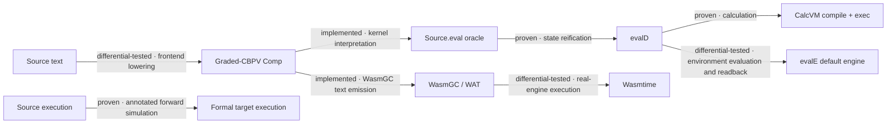
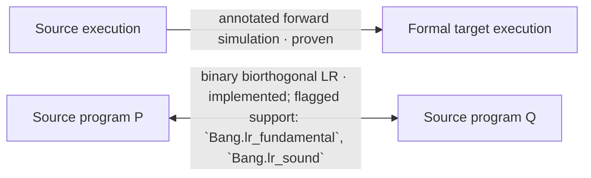
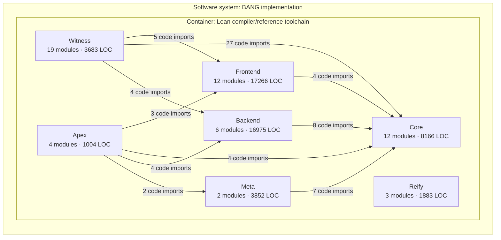

# Core implementation — current architecture

> **Summary:** BANG has one graded-CBPV semantic core observed through several representations. The source oracle defines behavior; the calculated machine is the executable compiler specification; Wasm 3.0 is the target; each arrow carries its own proof or differential-test status.

Read this page to answer three questions:

1. Which representation or engine am I looking at?
2. What evidence connects it to the source meaning?
3. Which tier owns a change, and what may that tier import?

Architecture decisions remain authoritative: [ADR-0016](../decisions/0016-two-hop-architecture-calcvm-and-wasmfx.md) fixes the two-hop shape, [ADR-0059](../decisions/0059-wasm3-grade-directed-pluggable-backend.md) revises the target to Wasm 3.0, and [ADR-0035](../decisions/0035-lr-for-equivalence-simulation-for-compilation.md) separates source equivalence from compilation simulation.

## 1. One meaning, several representations

<!-- BEGIN GENERATED architecture-pipeline (just architecture-assertions) — do not hand-edit -->

```mermaid
flowchart LR
  n_calcvm["CalcVM compile + exec"]
  n_comp["Graded-CBPV Comp"]
  n_emitted_wat["WasmGC / WAT"]
  n_env_engine["evalE default engine"]
  n_evald["evalD"]
  n_source_eval["Source.eval oracle"]
  n_source_execution["Source execution"]
  n_source_text["Source text"]
  n_target_execution["Formal target execution"]
  n_wasmtime["Wasmtime"]
  n_comp -->|implemented · WasmGC text emission| n_emitted_wat
  n_comp -->|implemented · kernel interpretation| n_source_eval
  n_emitted_wat -->|differential-tested · real-engine execution| n_wasmtime
  n_evald -->|proven · calculation| n_calcvm
  n_evald -->|differential-tested · environment evaluation and readback| n_env_engine
  n_source_eval -->|proven · state reification| n_evald
  n_source_execution -->|proven · annotated forward simulation| n_target_execution
  n_source_text -->|differential-tested · frontend lowering| n_comp
```

**Reading the diagram:** each edge label is the serialized evidence label followed by the serialized method; labels do not imply a stronger status.

| Representation | Kind | Sources | Outgoing boundaries |
|---|---|---|---|
| `CalcVM compile + exec` | machine | `Bang/Backend/AbstractMachine.lean` | — |
| `Graded-CBPV Comp` | core-ir | `Bang/Core/IR.lean` | WasmGC text emission → `WasmGC / WAT` (implemented); kernel interpretation → `Source.eval oracle` (implemented) |
| `WasmGC / WAT` | emitted-wat | `Bang/Backend/WasmEmit.lean` | real-engine execution → `Wasmtime` (differential-tested) |
| `evalE default engine` | environment-machine | `Bang/Backend/EnvMachine.lean`, `Main.lean` | — |
| `evalD` | state-semantics | `Bang/Backend/AbstractMachine.lean` | calculation → `CalcVM compile + exec` (proven); environment evaluation and readback → `evalE default engine` (differential-tested) |
| `Source.eval oracle` | source-semantics | `Bang/Core/Semantics/Eval.lean` | state reification → `evalD` (proven) |
| `Source execution` | source-execution | `Bang/Spec.lean` | annotated forward simulation → `Formal target execution` (proven) |
| `Source text` | text | `Bang/Frontend/Surface.lean` | frontend lowering → `Graded-CBPV Comp` (differential-tested) |
| `Formal target execution` | target-execution | `Bang/Backend/Wasm.lean` | — |
| `Wasmtime` | runtime | `tools/emit-rung4-diff.sh` | — |
<!-- END GENERATED architecture-pipeline -->

The namespace `Wasmfx` survives in parts of the formal Lean model for historical reasons. It does **not** make WasmFX the current product target. ADR-0059 makes stock Wasm 3.0 primary; WasmFX is a future fast path for the post-v1 general-resumption slot only.

<!-- BEGIN GENERATED architecture-assertions (just architecture-assertions) — do not hand-edit -->
### Architecture assertions

_Generated from validated committed architecture and proof facts. The JSON is the consumer seam; source checks remain in the fact producers._

| Fact | Current value | Source/evidence |
|---|---|---|
| Compiler target | **Wasm 3.0**, grade-directed pluggable backend; WasmFX: future general-case fast path | `docs/decisions/0016-two-hop-architecture-calcvm-and-wasmfx.md`, `docs/decisions/0059-wasm3-grade-directed-pluggable-backend.md` |
| Source equivalence | binary biorthogonal LR: `Bang.lr_fundamental`, `Bang.lr_sound` | implemented; flagged support: `Bang.lr_fundamental`, `Bang.lr_sound`; `Bang/Spec.lean`, `Bang/Meta/LR.lean`, `Bang/Meta/BinaryLR.lean`, `Bang/Audit.lean`; validate: `lake env lean Bang/Audit.lean` |
| Compilation correctness | annotated forward simulation: `Bang.compile_forward_sim` | proven; `Bang/Spec.lean`, `Bang/Backend/Wasm.lean`, `Bang/Audit.lean`, `docs/decisions/0059-wasm3-grade-directed-pluggable-backend.md`; validate: `lake env lean Bang/Audit.lean` |
| CLI engines | `oracle`, `compiled`, `env`; default **`env`**; `--compiled` aliases `compiled` | `Bang/Backend/EnvMachine.lean`, `Main.lean`, `docs/decisions/0094-env-semantics-in-the-machine-layer.md` |
| Module graph | 58 modules · 116 internal edges · Apex 4 · Backend 6 · Core 12 · Frontend 12 · Meta 2 · Reify 3 · Witness 19 | 58 serialized module records in `docfacts/architecture.json` |
| Architecture lineage | ADR-0016 two-hop shape; target refined by ADR-0059 | [ADR-0016](../decisions/0016-two-hop-architecture-calcvm-and-wasmfx.md) (Accepted; implemented), [ADR-0059](../decisions/0059-wasm3-grade-directed-pluggable-backend.md) (Accepted; implemented) |
<!-- END GENERATED architecture-assertions -->

## 2. Proof arrows are different claims

<!-- BEGIN GENERATED proof-arrows (just architecture-assertions) — do not hand-edit -->

```mermaid
flowchart LR
  n_source_execution["Source execution"]
  n_source_program_left["Source program P"]
  n_source_program_right["Source program Q"]
  n_target_execution["Formal target execution"]
  n_source_program_left <-->|binary biorthogonal LR · implemented; flagged support: `Bang.lr_fundamental`, `Bang.lr_sound`| n_source_program_right
  n_source_execution -->|annotated forward simulation · proven| n_target_execution
```

| Question / endpoint type | Direction | Method and theorem refs | Evidence status |
|---|---|---|---|
| source-programs: `Source program P` → `Source program Q` | bidirectional-contextual | binary biorthogonal LR; `Bang.lr_fundamental`, `Bang.lr_sound` | implemented; flagged support: `Bang.lr_fundamental`, `Bang.lr_sound`; validate: `lake env lean Bang/Audit.lean` |
| source-to-target-executions: `Source execution` → `Formal target execution` | forward | annotated forward simulation; `Bang.compile_forward_sim` | proven; validate: `lake env lean Bang/Audit.lean` |
<!-- END GENERATED proof-arrows -->

Do not describe compiler correctness as “the Benton–Hur LR.” The LR and simulation are complementary, not interchangeable; ADR-0035 is the decision record.

### Audited theorem census

<!-- BEGIN GENERATED audited-axioms (just architecture-assertions) — do not hand-edit -->
**Census:** 27 enrolled theorems · 22 trusted · 5 flagged · 2 with no axioms.

_Live validator: `python3 tools/docfacts_proof.py --live-check`._

| Theorem | Source | Axiom set | Status/evidence |
|---|---|---|---|
| `Bang.lr_sound` | `Bang/Spec.lean:249` | `Classical.choice`, `Quot.sound`, `propext`, `sorryAx` | flagged |
| `Bang.lr_fundamental` | `Bang/Spec.lean:280` | `Classical.choice`, `Quot.sound`, `propext`, `sorryAx` | flagged |
| `Bang.lr_fundamental_closed` | `Bang/Spec.lean:290` | `Classical.choice`, `Quot.sound`, `propext`, `sorryAx` | flagged |
| `Bang.seq_unit` | `Bang/Spec.lean:306` | `Classical.choice`, `Quot.sound`, `propext` | trusted · proven |
| `Bang.compile_forward_sim` | `Bang/Spec.lean:338` | `Classical.choice`, `Quot.sound`, `propext` | trusted · proven |
| `Bang.compile_forward_sim_pure` | `Bang/Backend/Wasm.lean:2771` | `Classical.choice`, `Quot.sound`, `propext` | trusted · proven |
| `Bang.source_eval_to_exec` | `Bang/Backend/Wasm.lean:2759` | `Classical.choice`, `Quot.sound`, `propext` | trusted · proven |
| `Bang.Rung5ProofGrade.s5_effectful_forward_sim` | `Bang/Backend/Rung5ProofGrade.lean:101` | `Classical.choice`, `Quot.sound`, `propext` | trusted · proven |
| `Bang.Rung5ProofGrade.s5_exec_wexec_lockstep` | `Bang/Backend/Rung5ProofGrade.lean:110` | `Quot.sound`, `propext` | trusted · proven |
| `Bang.compile_well_typed` | `Bang/Spec.lean:320` | `propext` | trusted · proven |
| `Bang.handler_compiles` | `Bang/Spec.lean:345` | `sorryAx` | flagged |
| `Bang.zero_grade_no_code` | `Bang/Spec.lean:349` | `propext` | trusted · proven |
| `Bang.subst_value` | `Bang/Spec.lean:104` | `Classical.choice`, `Quot.sound`, `propext` | trusted · proven |
| `Bang.preservation` | `Bang/Spec.lean:119` | `Classical.choice`, `Quot.sound`, `propext` | trusted · proven |
| `Bang.progress` | `Bang/Spec.lean:134` | `Quot.sound`, `propext` | trusted · proven |
| `Bang.type_safety` | `Bang/Spec.lean:156` | `Classical.choice`, `Quot.sound`, `propext` | trusted · proven |
| `Bang.no_accidental_handling` | `Bang/Spec.lean:60` | — | trusted · proven |
| `Bang.no_accidental_handling_custom` | `Bang/Spec.lean:71` | `propext` | trusted · proven |
| `Bang.custom_program_safe` | `Bang/Spec.lean:84` | `Classical.choice`, `Quot.sound`, `propext` | trusted · proven |
| `Bang.rowinst_requires_disjoint` | `Bang/Spec.lean:49` | — | trusted · proven |
| `Bang.effect_sound` | `Bang/Spec.lean:200` | `Quot.sound`, `propext` | trusted · proven |
| `Bang.zero_usage_erasable` | `Bang/Spec.lean:165` | `propext`, `sorryAx` | flagged |
| `Bang.Surface.cell_reflects_latest` | `Bang/Frontend/Surface.lean:2828` | `propext` | trusted · proven |
| `Bang.CalcVM.compile_correct` | `Bang/Backend/AbstractMachine.lean:3456` | `Classical.choice`, `Quot.sound`, `propext` | trusted · proven |
| `Bang.CalcVM.evalD_agrees_source` | `Bang/Backend/AbstractMachine.lean:6843` | `Classical.choice`, `Quot.sound`, `propext` | trusted · proven |
| `Bang.CalcVM.sim` | `Bang/Backend/AbstractMachine.lean:2296` | `Classical.choice`, `Quot.sound`, `propext` | trusted · proven |
| `Bang.CalcVM.run_evalD` | `Bang/Backend/AbstractMachine.lean:5494` | `Classical.choice`, `Quot.sound`, `propext` | trusted · proven |
<!-- END GENERATED audited-axioms -->

## 3. C4 component dependencies

The useful architecture zoom is the **component** level: repository tiers such as `Frontend`, `Core`, and `Backend`. Individual Lean modules are code-level detail—kept exact in the serialized fact, but intentionally omitted from the visual.

The dependency V still points inward at Core even though program data flows Frontend → Core → Backend. `tools/import_facts.py` is the single parser/classifier; `tools/arch-check.py` enforces the V. Unknown tiers and missing internal imports fail rather than silently falling into a default component.

<!-- BEGIN GENERATED import-graph (just import-graph) — do not hand-edit -->
BANG uses the [C4 abstraction hierarchy](https://c4model.com/abstractions) to choose a useful zoom level for this page:

| C4 abstraction | BANG mapping | This view |
|---|---|---|
| Software system | BANG implementation and toolchain | Shown as the outer boundary |
| Container | Lean compiler/reference toolchain | Shown as the application boundary |
| Component | 7 repository tiers (`Frontend`, `Core`, …) | Dependency nodes below |
| Code | 58 Lean modules and 116 direct imports | Serialized in `docfacts/architecture.json`; intentionally not drawn |

A C4 [component](https://c4model.com/abstractions/component) is related functionality behind a defined interface and is not separately deployable. That matches these tiers better than C4's application/data-store [container](https://c4model.com/abstractions/container) term.


```mermaid
flowchart LR
  subgraph system_BANG["Software system: BANG implementation"]
    subgraph container_Lean_toolchain["Container: Lean compiler/reference toolchain"]
      component_Frontend["Frontend<br/>12 modules · 17266 LOC"]
      component_Core["Core<br/>12 modules · 8166 LOC"]
      component_Backend["Backend<br/>6 modules · 16975 LOC"]
      component_Meta["Meta<br/>2 modules · 3852 LOC"]
      component_Witness["Witness<br/>19 modules · 3683 LOC"]
      component_Reify["Reify<br/>3 modules · 1883 LOC"]
      component_Apex["Apex<br/>4 modules · 1004 LOC"]
    end
  end
  component_Frontend -->|4 code imports| component_Core
  component_Backend -->|8 code imports| component_Core
  component_Meta -->|7 code imports| component_Core
  component_Witness -->|5 code imports| component_Frontend
  component_Witness -->|27 code imports| component_Core
  component_Witness -->|4 code imports| component_Backend
  component_Apex -->|3 code imports| component_Frontend
  component_Apex -->|4 code imports| component_Core
  component_Apex -->|4 code imports| component_Backend
  component_Apex -->|2 code imports| component_Meta
```

**Reading the diagram:** arrows are dependencies between C4 components; edge labels aggregate the 68 code-level imports that cross a component boundary. Internal module-to-module imports are deliberately omitted from the visual.

| Component (repository tier) | Responsibility | Modules | LOC | Depends on |
|---|---|---:|---:|---|
| `Frontend` | text → typed core | 12 | 17266 | `Core` (4) |
| `Core` | IR · typing · semantics · soundness | 12 | 8166 | — |
| `Backend` | calculated machines → Wasm 3.0 | 6 | 16975 | `Core` (8) |
| `Meta` | contextual-equivalence metatheory | 2 | 3852 | `Core` (7) |
| `Witness` | executable evidence and counterexamples | 19 | 3683 | `Frontend` (5), `Core` (27), `Backend` (4) |
| `Reify` | calculated-machine proof laboratory | 3 | 1883 | — |
| `Apex` | public theorem façade · audit · distribution | 4 | 1004 | `Frontend` (3), `Core` (4), `Backend` (4), `Meta` (2) |
<!-- END GENERATED import-graph -->

The generated graph reports aggregate direct imports that cross component boundaries. It shows coupling pressure; it does not by itself prove semantic correctness or justify moving code.

## 4. Contributor routing

| Change | Start at | Required cross-check |
|---|---|---|
| Syntax, inference, modules, diagnostics | `Bang/Frontend/` | Follow every relevant surface traversal; run structured CLI/corpus gates |
| Kernel behavior or typing rule | `Bang/Core/` | Preserve the five-primitive boundary; run proof and axiom gates |
| Calculated machine or formal target | `Bang/Backend/AbstractMachine.lean`, `Bang/Backend/Wasm.lean` | Tie execution back to `Source.eval`; preserve simulation statements |
| Concrete WasmGC emission | `Bang/Backend/WasmEmit.lean` | Run the real Wasmtime differential harness, not only Lean tests |
| Contextual equivalence | `Bang/Meta/` | Keep LR claims separate from compilation simulation |
| Public theorem or trust claim | `Bang/Spec.lean`, `Bang/Audit.lean` | `#print axioms`; trusted set must remain within `{propext, Classical.choice, Quot.sound}` |
| Evidence/counterexample | `Bang/Witness/` | State whether it is a regression, refutation, fuzz pole, or tested law |

## 5. Current boundary versus horizon

- **Current:** v1 handlers are abortive or one-shot tail-resumptive; stock Wasm 3.0 exceptions, tail calls, GC values, and the tested concrete emitter are sufficient for the shipped path.
- **Post-v1 horizon:** general/multishot resumptions may use the GC-frame-chain slot, with WasmFX as a swappable fast path once standardized and deployed.
- **Separate laboratory:** `Bang/Reify/` studies calculated handler machines; it is not another production execution path.
- **Volatile project position:** read repository-local `CONTEXT.md` in a checkout. This page intentionally contains no active-branch, checkpoint, or issue-status narrative.

## 6. Gates

```bash
python3 tools/import_facts.py --self-test
python3 tools/arch-check.py
python3 tools/gen-import-graph.py --check
python3 tools/check-architecture-assertions.py --check
just fitness
```

For theorem trust, run `just axioms`; for the full repository gate, run `just verify` from the Nix development shell.
