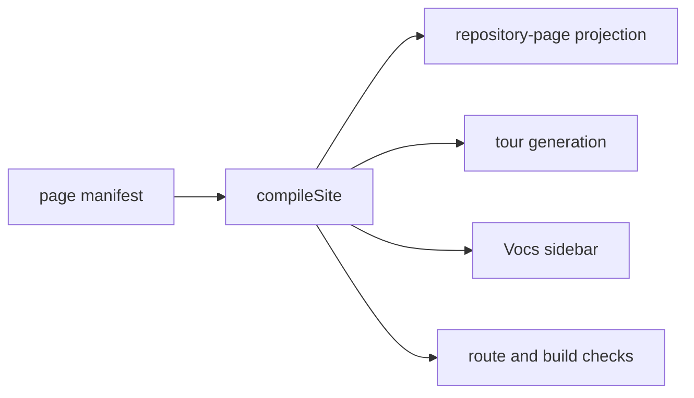

# ADR-0109 · Page manifest is the publication and navigation authority

<!-- adr-frontmatter -->

- **Status**: Accepted
- **Summary**: One schema-validated page manifest defines the public Vocs publication map and generated navigation; Vocs, repository-page projection, tour generation, and route checks consume one compiled site model. Volatile current-work pages remain repository-only links, and displayed evidence status resolves from serialized Phase 2 facts rather than styling or copied labels.
- **Depends-on**: ADR-0077 (documentation placement by audience × temporality), ADR-0078 (git-native knowledge and GitHub workflow), ADR-0108 (contributor reference and onboarding contract)
- **Relates-to**: `plans/014-developer-reference-onboarding-system.md`, `web/docs/page-manifest.json`, issue #148

- **Date**: 2026-07-14
- **Deciders**: operator
- **Layer**: meta / public documentation information architecture

## Context

The Vocs site currently has three partial authorities:

- `web/docs/sync-docs.mjs` chooses repository pages to publish;
- `web/docs/vocs.config.ts` hand-maintains most sidebar entries;
- the former tour metadata module separately owns lesson identity and order.

These lists can disagree. Missing publication inputs are warned and skipped, Vocs dead links only warn, and a page's navigation metadata has no validated audience, lifecycle, prerequisite, or evidence-status contract.

Plan 014 Phase 3 requires one git-native site, not another content store. ADR-0108 also requires stable contributor material to remain public while `CONTEXT.md`, active `paths/`, scratch research, and operational state remain repository-only.

## Decision

Use one JSON page manifest, validated by JSON Schema and compiled through the single `compileSite` interface.

Reading the diagram: every site consumer receives the same validated model; none reconstructs publication or navigation policy.

The manifest owns:

| Concern | Contract |
|---|---|
| Publication | Exact files and directory collections; volatile paths are denied. |
| Navigation | Six ordered sections: Start, Learn, Reference, Contribute, Architecture, Project. |
| Page metadata | Audience, lifecycle, prerequisites, evidence-backed status, and navigation order. |
| Routes | Internal routes are base-path-free; `/bang` is applied only at deployment/smoke time. |
| Tour | The manifest owns lesson identity/order; the tour content module owns prose and example seeds only. |
| Current project state | `CONTEXT.md` and active `paths/` appear only as clearly marked GitHub links. |
| Evidence status | Proven/Differential-tested/Generated/Implemented/Proposed labels resolve from explicit serialized Phase 2 fact references. |

`vocs.config.ts` imports the compiled model and passes its sidebar directly to Vocs. No generated sidebar snapshot is committed.

The compiler permits catalog publication rules for existing background collections and exact managed entries for maintained navigation pages. This preserves current public routes without requiring a 250-page hand-maintained manifest while keeping publication policy in one source.

## Rejected alternatives

- **Keep publication in `sync-docs.mjs` and add only a navigation manifest** — adding or moving a maintained page can require two edits, and route validity remains a cross-file convention.
- **Put metadata in page frontmatter** — the manifest and frontmatter can disagree; ordinary Markdown becomes a second navigation authority.
- **Commit generated sidebar JSON/TypeScript** — introduces a driftable copy when Vocs can consume the compiled model directly.
- **Publish volatile Project pages under a separated visual style** — presentation does not change their lifecycle; it violates ADR-0108's publication boundary.
- **Copy evidence labels into the manifest** — styling could claim a stronger status than the serialized fact and its validating commands support.
- **Require every existing background document as an exact manifest entry** — creates a large migration artifact without improving the maintained navigation seam.

## Consequences

- One manifest change deterministically updates maintained-page publication and navigation.
- Missing sources, route collisions, invalid prerequisites, publication-boundary violations, and broken evidence references become build failures.
- Existing background routes remain available through catalog rules, but only exact maintained entries appear in generated navigation.
- P2.2 and P2.3 facts can be adopted later through explicit references; their absence does not couple this increment to sibling branches.
- Vocs dead-link checking becomes strict, with an independent emitted-route and `/bang` smoke gate behind it.

## Revisit if

- Vocs can no longer consume a computed sidebar directly;
- a second publication target needs genuinely different page identity or lifecycle metadata;
- catalog publication hides enough maintenance errors to justify exact entries for every public document; or
- Phase 2 adopts a canonical cross-family evidence-reference registry that should replace explicit fact/schema pointers.
