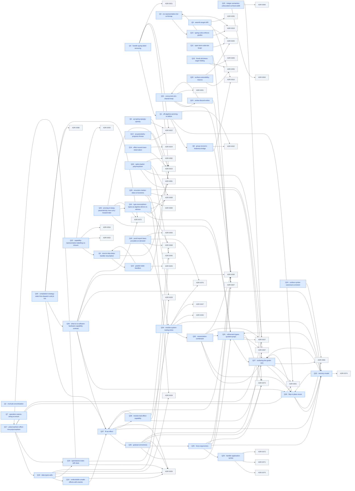

<!-- note-status: active -->
<!-- GENERATED by tools/gen-questions-index.py — do not hand-edit. Regenerate with `just questions-index`; `--check` gates it in `just fitness`. -->

# Open questions — the design-question ledger

<!-- PREAMBLE:START (hand-written, stable) -->
> **The design-question ledger — deferred design decisions (PROJECT / NEXT docs).**
> These are contributor-facing questions about where the *language* goes next: forks that
> surfaced during work and were intentionally deferred, not bugs and not in-flight tasks
> (those live in GitHub Issues · `CONTEXT.md` · `paths/`). A question with an ADR is
> **closed** — its resolution is recorded here (status `decided`) and in that ADR.
>
> One file per question under `docs/notes/questions/` (OKF-shaped: `type`/`title`/
> `description` frontmatter + `status`/`area`/`ties`, optional `resolved-by`). This file
> is GENERATED from those files by `tools/gen-questions-index.py` — three views over the
> same frontmatter, so they cannot drift. `ties` edges are VALIDATED (a tie to a
> nonexistent question/ADR fails the generator); `see-also` is freeform.
>
> **Add a question:** drop a `Q<N>-<slug>.md` in `docs/notes/questions/` (copy an existing
> one), then `just questions-index`. Discipline (`docs/notes/spec-proof-discipline.md`):
> never silently mutate a theorem/definition to dodge a question — record it here instead.
<!-- PREAMBLE:END -->

## By area

### type-system (12)

- **[Q2 — Mult = QTT concretization](questions/Q2-mult-qtt-concretization.md)** — concretize the multiplicity semiring as QTT (0/1/ω); the spec stays parametric in Mult · _decided_ \
  ties: —
- **[Q10 — Typing rules must enforce grades (resource discipline)](questions/Q10-typing-rules-enforce-grades.md)** — make HasVTy/HasCTy resource-enforcing (thread + check grades) — the QTT-payoff gate · _decided_ \
  ties: Q3, ADR-0019, ADR-0020
- **[Q17 — Polymorphism + effect-row polymorphism](questions/Q17-polymorphism-effect-row-polymorphism.md)** — parametric + effect-row + grade polymorphism, staged monomorphic → HM → System F · _decided_ \
  ties: Q18, Q19, ADR-0001, ADR-0027
- **[Q18 — Data types: ADTs, inductive/coinductive, law attachment](questions/Q18-data-types-adts.md)** — iso-recursive ADTs (sum/product/μ), inductive-only; laws via assert + plausible · _decided_ \
  ties: Q16, Q19, ADR-0026, ADR-0028, ADR-0029
- **[Q19 — Typeclasses/traits with laws (ad-hoc polymorphism + the laws surface)](questions/Q19-typeclasses-traits-with-laws.md)** — ad-hoc polymorphism = the laws surface; enforced algebraic interfaces (traits + law members) · _decided_ \
  ties: Q17, ADR-0026, ADR-0040
- **[Q25 — Integer semantics: unbounded Int vs fixed-width (width + overflow)](questions/Q25-integer-semantics-unbounded-vs-fixed-width.md)** — spec Int = unbounded ℤ v1 (matches the oracle); width lives behind the oracle, a later verified opt · _decided_ \
  ties: ADR-0063, ADR-0065, ADR-0067
- **[Q26 — Optics as the lawful-polymorphism north-star (+ the HKT fork, + graded optics)](questions/Q26-optics-lawful-polymorphism.md)** — optics (lens/prism/traversal) as law-carrying stdlib; forces the HKT/F_ω fork; graded optics · _open_ \
  ties: Q27, ADR-0027, ADR-0040, ADR-0069, ADR-0082
- **[Q27 — Surfacing the grade axis: declare effect shape AND grade (resumption grade → compilation)](questions/Q27-surfacing-the-grade-axis.md)** — declare the effect ROW + the GRADE; surface the resumption grade (→ the compilation strategy) · _open_ \
  ties: Q30, ADR-0001, ADR-0066
- **[Q31 — Refinement types surface / quotient-proposition underlying: `Nat`, decidable checking, and the road to dependent types](questions/Q31-refinement-types-quotient-props.md)** — refinement types (surface) over quotient-truncated decidable props (kernel); the road to dependent types · _open_ \
  ties: Q27, ADR-0027, ADR-0067, ADR-0073
- **[Q36 — Gradual correctness / prototyping mode: typed holes, run-with-warnings, the coarse-vs-fine escape-hatch gap](questions/Q36-gradual-correctness.md)** — surface + tooling; the vague-spec / exploratory end of the gradient · _open_ \
  ties: Q31, Q35, ADR-0026, ADR-0073, ADR-0067
- **[Q41 — Type isomorphism — how to check two types are isomorphic and convert between them (types-as-algebra: derive structural isos, law-check witnessed ones)](questions/Q41-type-isomorphism-types-as-algebra-derive-vs-witness.md)** — A type iso is a lawful inverse pair (to/from with from∘to=id, to∘from=id). Two ways: STRUCTURAL — types-as-algebra (sum=+, product=×, Unit=1, Void=0 semiring), normalize both + compare, DERIVE the iso; WITNESSED — user gives to/from, property-test the laws (the bite-2 trait-law mechanism). Option a ≅ Either Unit a, Result e a ≅ Either e a are structural. · _open_ \
  ties: Q31, ADR-0081, ADR-0068, ADR-0069, ADR-0083
- **[Q42 — Proving in bang — parametricity gives free substitutability NOW; Curry-Howard/dependent types make bang a prover LATER](questions/Q42-proving-in-bang-parametricity-now-curry-howard-later.md)** — Two levels of proof. Substitutability/uniformity: FREE from parametricity (Reynolds' abstraction theorem — a parametric client can't distinguish instances of an interface; the type IS the proof), already latent in bang's polymorphism. Arbitrary propositions: needs dependent types (Curry-Howard: propositions-as-types, proofs-as-programs) — the Q31 far end, where a bang program IS a proof. · _open_ \
  ties: Q31, Q41, ADR-0075, ADR-0081

### effects (16)

- **[Q1 — Eff algebra: Semiring vs Lattice](questions/Q1-eff-algebra-semiring-vs-lattice.md)** — effect algebra — switched to Lattice+OrderBot (⊥ / ⊔ / ≤); rows are a join-semilattice · _decided_ \
  ties: Q8, ADR-0001, ADR-0032
- **[Q4 — `handle` typing rule: simplified vs label-removing](questions/Q4-handle-typing-label-removing.md)** — handler typing must discharge its label so the effect row shrinks at the handler · _decided_ \
  ties: Q1, ADR-0021, ADR-0022, ADR-0023
- **[Q5 — `up` typing rule + opArgTy/opResTy](questions/Q5-up-typing-opargty-opresty.md)** — the perform/up typing rule + per-(label,op) effect signatures (EffSig) · _decided_ \
  ties: ADR-0022, ADR-0023
- **[Q6 — Source.step's deep-handler resumption](questions/Q6-source-step-deep-handler-resumption.md)** — deep-handler operational semantics = the CK machine; throws resolved, state threading → Q12 · _partial_ \
  ties: Q12, ADR-0023
- **[Q7 — Operation names as strings vs symbolic enum](questions/Q7-operation-names-string-vs-enum.md)** — OpId = String vs a symbolic enum vs per-effect operation alphabets · _open_ \
  ties: —
- **[Q8 — `group_recovers` bridge: E group ⇒ F dagger-Frobenius?](questions/Q8-group-recovers-frobenius-bridge.md)** — reversibility needs Frobenius (stronger than a group); group_recovers RETIRED, unresolved-but-bounded · _decided_ \
  ties: ADR-0016, ADR-0030, ADR-0032
- **[Q12 — Graded state handlers: how does `state ℓ s` thread grades?](questions/Q12-graded-state-handlers.md)** — how state ℓ s threads grades — the closed focus dissolves the tension (no ω-restriction needed) · _decided_ \
  ties: Q6, ADR-0023, ADR-0025
- **[Q13 — Operation-granularity: `progress` for `throws` needs op-aware signatures](questions/Q13-op-granularity-progress-throws.md)** — label-granular rows vs op-granular handlers — op-partial EffSig signatures close progress · _decided_ \
  ties: ADR-0022, ADR-0023
- **[Q16 — Undecidable + unsafe programs: effects-with-oracles vs FFI](questions/Q16-undecidable-unsafe-effects-with-oracles.md)** — admit non-terminating (Div) + unsafe programs as row-tracked effects with oracles, not FFI holes · _open_ \
  ties: Q37, ADR-0026
- **[Q21 — Concurrent STM: the privileged shared-heap upgrade](questions/Q21-concurrent-stm-shared-heap.md)** — STM's genuinely-concurrent privileged form (shared heap, opacity) when threads/multi-shot arrive · _open_ \
  ties: Q23, ADR-0030, ADR-0031
- **[Q22 — Capability representation: labelling vs closure (multi-shot fork)](questions/Q22-capability-representation-labelling-vs-closure.md)** — labelling (name + stack-search) vs closure/evidence-passing cap rep, at multi-shot resumption · _open_ \
  ties: Q6, ADR-0052, ADR-0054, ADR-0055
- **[Q23 — `orElse`: how does the alternative discard the first branch's writes?](questions/Q23-orelse-discard-writes.md)** — orElse must run b as if a's transactional writes never happened — savepoint vs nested-tx · _open_ \
  ties: Q21, ADR-0030
- **[Q32 — Memoization as a pure-function combinator: the `⊥`-row license, opt-in because space↔time is a resource EFFECT](questions/Q32-memoization-combinator.md)** — memoization = a resource EFFECT (space↔time trade), opt-in; a library memo combinator over ⊥-row fns · _open_ \
  ties: Q27, Q30, Q31, ADR-0027, ADR-0030
- **[Q37 — FFI as a typed EFFECT: the external-boundary seam (schema-declared contract · capability security · the road to OS/distributed)](questions/Q37-ffi-as-effect.md)** — northstar direction — the first interactive-program capability · _open_ \
  ties: Q36, Q33, Q38, ADR-0026, ADR-0030
- **[Q38 — module ≟ trait ≟ effect ≟ capability: one interface+implementation construct, dialed by resumption grade?](questions/Q38-module-trait-effect-capability.md)** — deep unification; stress-test, don't decide a priori · _open_ \
  ties: Q27, Q34, Q37, ADR-0068
- **[Q39 — What is IO? — the software↔hardware capability contract as a family of typed effects](questions/Q39-what-is-io-software-hardware-capability-contract.md)** — IO is not a primitive but the family of program↔world effects; each is a typed interface + handler; the software↔hardware contract IS the effect interface; the net interface first (web-server-demanded); HKT makes contracts implementation-agnostic + lawful · _open_ \
  ties: Q37, Q30, Q33, ADR-0030, ADR-0075

### surface (6)

- **[Q15 — Thunk strictness: uniform laziness vs demand-driven eager folding](questions/Q15-thunk-strictness-eager-folding.md)** — uniform-lazy semantics + an effect-row-gated fold pass (the evaluation-stage axis) · _open_ \
  ties: ADR-0005, ADR-0006, ADR-0007
- **[Q20 — Surface extensibility: pseudoinstructions via aliasing + macros](questions/Q20-surface-extensibility-macros.md)** — hygienic macros expanding to core Comp — keep the kernel at five primitives as the surface grows · _open_ \
  ties: ADR-0006, ADR-0020
- **[Q24 — Surface concrete-syntax discipline: canonical (formatter-normalized) vs lenient](questions/Q24-surface-syntax-canonical-vs-lenient.md)** — whitespace-insensitive grammar + a canonical formatter (the Go/Rust model) · _open_ \
  ties: ADR-0066
- **[Q28 — Recursion marker: reuse `rec` for data + functions, or keep them separate?](questions/Q28-recursion-marker-data-vs-functions.md)** — keep data (marker-free, total) and function recursion (Div) separate; unify at the effect row · _decided_ \
  ties: ADR-0028, ADR-0029, ADR-0069, ADR-0073
- **[Q29 — Handler-application syntax: prefix binder vs postfix eliminator (the effect eliminator wants eliminator syntax)](questions/Q29-handler-application-syntax.md)** — handler = the effect ELIMINATOR; ambient application → postfix eliminator, named caps → prefix binder · _open_ \
  ties: ADR-0070, ADR-0071, ADR-0072
- **[Q35 — Force ergonomics: auto-force a thunk-of-function at the call site; reserve visible `$` for meaningful observation](questions/Q35-force-ergonomics.md)** — surface ergonomics; sugar, no kernel change · _open_ \
  ties: Q29, Q33, ADR-0007, ADR-0030, ADR-0073

### tooling (6)

- **[Q9 — WasmFX target drift: frozen OOPSLA'23 syntax vs Phase-3 standard](questions/Q9-wasmfx-target-drift.md)** — the verified compiler TARGET drifted (OOPSLA'23 → Phase-3); pin-to-engine at ◊5, not the paper · _open_ \
  ties: ADR-0016, ADR-0035
- **[Q30 — FBIP (Functional But In Place): static in-place reuse justified by the value-grade (verified enabler, compiled-path optimization)](questions/Q30-fbip-in-place-reuse.md)** — turn functional updates into in-place reuse, justified STATICALLY by the value-grade (grade-1 = unique) · _open_ \
  ties: Q27, Q33, ADR-0066
- **[Q33 — Memory model: immutability + QTT + refcounting vs ownership/lifetimes; substrings, copies-vs-refs, the three axes](questions/Q33-memory-model.md)** — immutability makes aliasing free (substrings = views); QTT carries only the optimization axis — no lifetimes · _open_ \
  ties: Q27, Q30, Q31, ADR-0074
- **[Q34 — Module-system + tooling SURFACE forks (file-vs-block · qualified-vs-open · visibility · the hashing boundary) — architecture pinned by ADR-0076](questions/Q34-module-system-tooling-forks.md)** — the concrete module-system surface forks (granularity · imports · visibility · hashing · LSP); architecture pinned by ADR-0076 · _open_ \
  ties: Q32, Q33, ADR-0046, ADR-0047, ADR-0076
- **[Q40 — Compilation strategy for the dynamic escape hatch — static-first; dispatch cold, JIT-monomorphize hot](questions/Q40-compilation-strategy-static-first-dispatch-cold-jit-hot.md)** — Stay static (AOT elaborate-to-mono) by default for perf + static analysis + compile-time soundness; for runtime-known types, dispatch one-offs cheaply and JIT-monomorphize ONLY hot+type-stable sites (tiered, profile-guided); JIT-mono = the same elaborate-to-mono run late, still targeting the verified kernel · _open_ \
  ties: Q37, Q39, ADR-0080, ADR-0075
- **[Q43 — Proof export: laws fuzzed by default, PROVABLE on demand (#prove → a Lean goal over the elaborated term)](questions/Q43-proof-export-laws-provable-on-demand.md)** — the stratification seam surfaced into user programs — one law construct, two rigor rungs; content-addressed proof cache · _open_ \
  ties: Q34, ADR-0068, ADR-0076, ADR-0093

### meta (3)

- **[Q3 — Ctx representation: List vs FinMap](questions/Q3-ctx-representation-list-vs-finmap.md)** — typing-context representation — split into a Finsupp grade-vector + a type context (Torczon-style) · _decided_ \
  ties: Q10, ADR-0019
- **[Q11 — Open-term substitution: capture-avoiding subst vs de Bruijn](questions/Q11-open-term-subst-de-bruijn.md)** — open-term graded substitution — de Bruijn makes variable capture structurally impossible · _decided_ \
  ties: ADR-0020
- **[Q14 — `effect_sound`: what does the trace observe?](questions/Q14-effect-sound-trace-observation.md)** — the trace semantics under which effect_sound is both TRUE and meaningful · _open_ \
  ties: ADR-0023, ADR-0024

## By status

The `· ✓ RESOLVED (ADR-…)` / `· ◑ PARTIAL` markers below are the Q⟺ADR ledger `gen-adr-index.py` reads —
derived from each question's `resolved-by` frontmatter, so a resolution has a single home.

### open (27)

- [Q7 — Operation names as strings vs symbolic enum](questions/Q7-operation-names-string-vs-enum.md)  · OPEN
- [Q9 — WasmFX target drift: frozen OOPSLA'23 syntax vs Phase-3 standard](questions/Q9-wasmfx-target-drift.md)  · OPEN
- [Q14 — `effect_sound`: what does the trace observe?](questions/Q14-effect-sound-trace-observation.md)  · OPEN
- [Q15 — Thunk strictness: uniform laziness vs demand-driven eager folding](questions/Q15-thunk-strictness-eager-folding.md)  · OPEN
- [Q16 — Undecidable + unsafe programs: effects-with-oracles vs FFI](questions/Q16-undecidable-unsafe-effects-with-oracles.md)  · OPEN
- [Q20 — Surface extensibility: pseudoinstructions via aliasing + macros](questions/Q20-surface-extensibility-macros.md)  · OPEN
- [Q21 — Concurrent STM: the privileged shared-heap upgrade](questions/Q21-concurrent-stm-shared-heap.md)  · OPEN
- [Q22 — Capability representation: labelling vs closure (multi-shot fork)](questions/Q22-capability-representation-labelling-vs-closure.md)  · OPEN
- [Q23 — `orElse`: how does the alternative discard the first branch's writes?](questions/Q23-orelse-discard-writes.md)  · OPEN
- [Q24 — Surface concrete-syntax discipline: canonical (formatter-normalized) vs lenient](questions/Q24-surface-syntax-canonical-vs-lenient.md)  · OPEN
- [Q26 — Optics as the lawful-polymorphism north-star (+ the HKT fork, + graded optics)](questions/Q26-optics-lawful-polymorphism.md)  · OPEN
- [Q27 — Surfacing the grade axis: declare effect shape AND grade (resumption grade → compilation)](questions/Q27-surfacing-the-grade-axis.md)  · OPEN
- [Q29 — Handler-application syntax: prefix binder vs postfix eliminator (the effect eliminator wants eliminator syntax)](questions/Q29-handler-application-syntax.md)  · OPEN
- [Q30 — FBIP (Functional But In Place): static in-place reuse justified by the value-grade (verified enabler, compiled-path optimization)](questions/Q30-fbip-in-place-reuse.md)  · OPEN
- [Q31 — Refinement types surface / quotient-proposition underlying: `Nat`, decidable checking, and the road to dependent types](questions/Q31-refinement-types-quotient-props.md)  · OPEN
- [Q32 — Memoization as a pure-function combinator: the `⊥`-row license, opt-in because space↔time is a resource EFFECT](questions/Q32-memoization-combinator.md)  · OPEN
- [Q33 — Memory model: immutability + QTT + refcounting vs ownership/lifetimes; substrings, copies-vs-refs, the three axes](questions/Q33-memory-model.md)  · OPEN
- [Q34 — Module-system + tooling SURFACE forks (file-vs-block · qualified-vs-open · visibility · the hashing boundary) — architecture pinned by ADR-0076](questions/Q34-module-system-tooling-forks.md)  · OPEN
- [Q35 — Force ergonomics: auto-force a thunk-of-function at the call site; reserve visible `$` for meaningful observation](questions/Q35-force-ergonomics.md)  · OPEN
- [Q36 — Gradual correctness / prototyping mode: typed holes, run-with-warnings, the coarse-vs-fine escape-hatch gap](questions/Q36-gradual-correctness.md)  · OPEN
- [Q37 — FFI as a typed EFFECT: the external-boundary seam (schema-declared contract · capability security · the road to OS/distributed)](questions/Q37-ffi-as-effect.md)  · OPEN
- [Q38 — module ≟ trait ≟ effect ≟ capability: one interface+implementation construct, dialed by resumption grade?](questions/Q38-module-trait-effect-capability.md)  · OPEN
- [Q39 — What is IO? — the software↔hardware capability contract as a family of typed effects](questions/Q39-what-is-io-software-hardware-capability-contract.md)  · OPEN
- [Q40 — Compilation strategy for the dynamic escape hatch — static-first; dispatch cold, JIT-monomorphize hot](questions/Q40-compilation-strategy-static-first-dispatch-cold-jit-hot.md)  · OPEN
- [Q41 — Type isomorphism — how to check two types are isomorphic and convert between them (types-as-algebra: derive structural isos, law-check witnessed ones)](questions/Q41-type-isomorphism-types-as-algebra-derive-vs-witness.md)  · OPEN
- [Q42 — Proving in bang — parametricity gives free substitutability NOW; Curry-Howard/dependent types make bang a prover LATER](questions/Q42-proving-in-bang-parametricity-now-curry-howard-later.md)  · OPEN
- [Q43 — Proof export: laws fuzzed by default, PROVABLE on demand (#prove → a Lean goal over the elaborated term)](questions/Q43-proof-export-laws-provable-on-demand.md)  · OPEN

### partial (1)

- [Q6 — Source.step's deep-handler resumption](questions/Q6-source-step-deep-handler-resumption.md)  · ◑ PARTIAL (ADR-0023)

### decided (15)

- [Q1 — Eff algebra: Semiring vs Lattice](questions/Q1-eff-algebra-semiring-vs-lattice.md)  · ✓ RESOLVED
- [Q2 — Mult = QTT concretization](questions/Q2-mult-qtt-concretization.md)  · ✓ RESOLVED
- [Q3 — Ctx representation: List vs FinMap](questions/Q3-ctx-representation-list-vs-finmap.md)  · ✓ RESOLVED (ADR-0019)
- [Q4 — `handle` typing rule: simplified vs label-removing](questions/Q4-handle-typing-label-removing.md)  · ✓ RESOLVED (ADR-0022 + ADR-0023)
- [Q5 — `up` typing rule + opArgTy/opResTy](questions/Q5-up-typing-opargty-opresty.md)  · ✓ RESOLVED (ADR-0022 + ADR-0023)
- [Q8 — `group_recovers` bridge: E group ⇒ F dagger-Frobenius?](questions/Q8-group-recovers-frobenius-bridge.md)  · ✓ RESOLVED (ADR-0032)
- [Q10 — Typing rules must enforce grades (resource discipline)](questions/Q10-typing-rules-enforce-grades.md)  · ✓ RESOLVED (ADR-0019 + ADR-0020)
- [Q11 — Open-term substitution: capture-avoiding subst vs de Bruijn](questions/Q11-open-term-subst-de-bruijn.md)  · ✓ RESOLVED (ADR-0020)
- [Q12 — Graded state handlers: how does `state ℓ s` thread grades?](questions/Q12-graded-state-handlers.md)  · ✓ RESOLVED (ADR-0025)
- [Q13 — Operation-granularity: `progress` for `throws` needs op-aware signatures](questions/Q13-op-granularity-progress-throws.md)  · ✓ RESOLVED (ADR-0023)
- [Q17 — Polymorphism + effect-row polymorphism](questions/Q17-polymorphism-effect-row-polymorphism.md)  · ✓ RESOLVED (ADR-0027)
- [Q18 — Data types: ADTs, inductive/coinductive, law attachment](questions/Q18-data-types-adts.md)  · ✓ RESOLVED (ADR-0029)
- [Q19 — Typeclasses/traits with laws (ad-hoc polymorphism + the laws surface)](questions/Q19-typeclasses-traits-with-laws.md)  · ✓ RESOLVED (ADR-0040)
- [Q25 — Integer semantics: unbounded Int vs fixed-width (width + overflow)](questions/Q25-integer-semantics-unbounded-vs-fixed-width.md)  · ✓ RESOLVED (ADR-0067)
- [Q28 — Recursion marker: reuse `rec` for data + functions, or keep them separate?](questions/Q28-recursion-marker-data-vs-functions.md)  · ✓ RESOLVED (ADR-0073)

## Tie graph

Nodes = questions (`Q<N> · slug`) + their tie targets (other questions, ADRs). An
edge `A --> B` reads "A ties B". Generated from the `ties:` frontmatter; a dangling
edge fails generation, so every arrow resolves to a real question or ADR.

