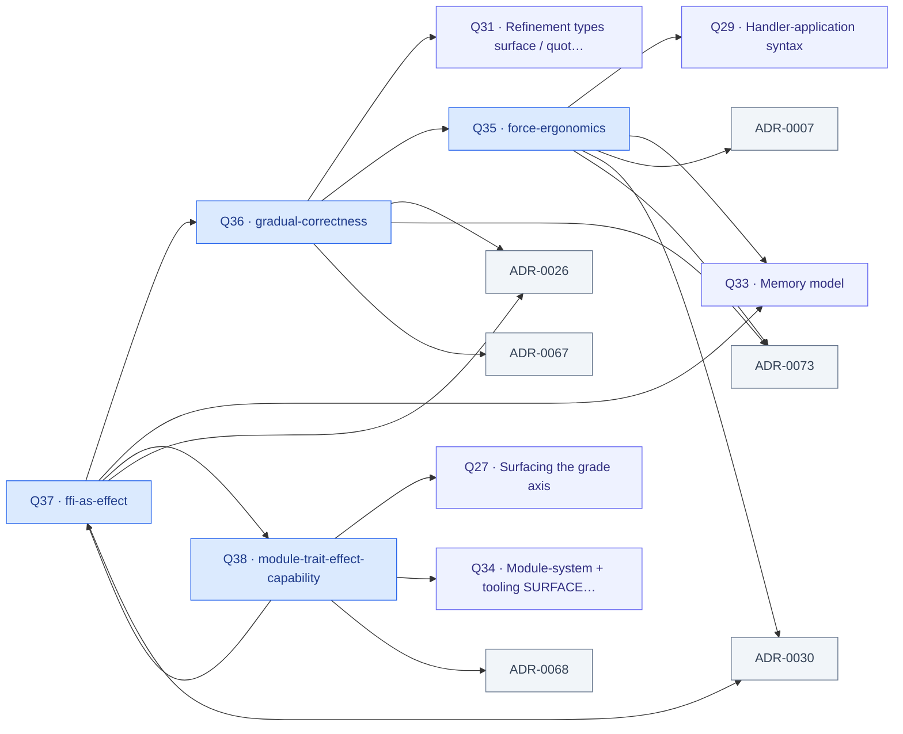

# Design-question ledger — INDEX

<!-- GENERATED by tools/gen-questions-index.py — do not hand-edit. Regenerate with `just questions-index`; `--check` gates it in `just fitness`. -->

> One file per question under `docs/notes/questions/` (OKF-shaped: `type`/`title`/
> `description` frontmatter + `status`/`area`/`ties`). This index and the tie-graph below
> are a pure function of those files — they cannot drift. `ties` edges are VALIDATED
> (a tie to a nonexistent question/ADR fails the generator); `see-also` is freeform.

## Index

### type-system (1)

**open**

- **[Q36 — Gradual correctness / prototyping mode: typed holes, run-with-warnings, the coarse-vs-fine escape-hatch gap](Q36-gradual-correctness.md)** — surface + tooling; the vague-spec / exploratory end of the gradient  
  ties: Q31, Q35, ADR-0026, ADR-0073, ADR-0067

### effects (2)

**open**

- **[Q37 — FFI as a typed EFFECT: the external-boundary seam (schema-declared contract · capability security · the road to OS/distributed)](Q37-ffi-as-effect.md)** — northstar direction — the first interactive-program capability  
  ties: Q36, Q33, Q38, ADR-0026, ADR-0030
- **[Q38 — module ≟ trait ≟ effect ≟ capability: one interface+implementation construct, dialed by resumption grade?](Q38-module-trait-effect-capability.md)** — deep unification; stress-test, don't decide a priori  
  ties: Q27, Q34, Q37, ADR-0068

### surface (1)

**open**

- **[Q35 — Force ergonomics: auto-force a thunk-of-function at the call site; reserve visible `$` for meaningful observation](Q35-force-ergonomics.md)** — surface ergonomics; sugar, no kernel change  
  ties: Q29, Q33, ADR-0007, ADR-0030, ADR-0073

## Tie graph

Nodes = questions (`Q<N> · slug`) + their tie targets (other questions, ADRs). An
edge `A --> B` reads "A ties B". Generated from the `ties:` frontmatter; a dangling
edge fails generation, so every arrow resolves to a real question or ADR.

