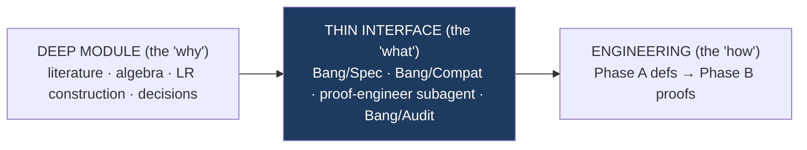

# Spec handover — research/engineering interface

> Distilled from the original `bang-lang-wasmfx/README.md` during the wasmfx
> merge (2026-06-21). Captures the framing that justifies why the wasmfx
> work is *ready to engineer against* rather than still in design phase.

## The thin-interface principle

The bang-lang verification (`Bang/Spec.lean` + `Bang/Meta/BinaryLR.lean` + `Bang/Audit.lean`)
is a **thin interface** over a deep research/design effort. Its job: let the
engineering phase build the Lean proof **without re-deriving any design**.
Everything contestable has already been argued and frozen; what remains is
mechanization.

## What to consume vs. what to consult

**Interface — engineering reads and discharges these:**

| File | Role |
|---|---|
| `Bang/Spec.lean` | The contract. Theorem **statements are frozen**; bodies are `sorry`. |
| `Bang/Meta/BinaryLR.lean` | `lr_fundamental` decomposed into one compatibility lemma per typing rule. |
| `docs/notes/spec-proof-discipline.md` | Hard invariants, scope, phase order, PROOF_ORDER, definition of done. |
| `Bang/Audit.lean` + `tools/audit.sh` | The ungameable gate: `#print axioms` + a grep CI. |
| `.claude/agents/proof-engineer.md` | The persistent role that carries this discipline across sessions. |

**Rationale — read only to understand a "why"; never required to proceed:**

| File | Answers |
|---|---|
| `references/README.md` | Every theorem mapped to its source paper (Pass A spine + Pass B extensions). |
| `docs/decisions/0018-effect-row-lacks-constraints.md` | Why idempotent set-rows + lacks-quantifiers (Route B). |
| `docs/decisions/0016-two-hop-architecture-calcvm-and-wasmfx.md` | Why graded-CBPV → CalcVM → WasmFX. |
| `Bang/Distribution.lean` | The semilattice / CALM asset — flagged conjecture, not spine. |

## The frozen surface (what engineering may NOT change)

1. **Theorem statements** in `Bang/Spec.lean`. Fill bodies; never weaken a statement.
2. **`≈` / `⊑`** = contextual approximation/equivalence via a **fuel-indexed
   biorthogonal ⊤⊤ logical relation** (Biernacki transcription; no coinduction).
3. **Effect rows = idempotent `Finset`s** + lacks-constrained quantifiers
   (`no_accidental_handling` is the invariant that licenses dropping ρ-maps).
4. **Two grades only**: effect `Eff` + multiplicity `Mult`. (See
   `docs/notes/spec-proof-discipline.md` SCOPE.)
5. **Definition of done = `#print axioms` clean** (⊆ propext / Choice / Quot.sound).

## How to proceed

1. **Phase A** — turn every `opaque` into a real definition; the `F e A` case
   of the LR is the crux (get it reviewed). Exit: `sorry` only in theorem bodies.
2. **Phase B** — discharge in `PROOF_ORDER`: `lr_sound` / `lr_fundamental` (via
   `Bang/Meta/BinaryLR.lean`, `compat_handle` last) → `group_recovers` →
   `compile_forward_sim` → `subst_value` → the `[STD]` block.
3. **Port targets** are **Coq**: Torczon (cbpv-effects-coeffects), Biernacki
   (aleff-logrel), Benton–Hur. Lexa / AARA are paper-proven **strategy** refs.

## Phase gate — is the contract viable to start engineering?

| Check | Verdict |
|---|---|
| Every theorem has a discharge path (template or flagged) | ✅ all mapped in `references/README.md` |
| Internally consistent (no contradictory invariants) | ✅ checked |
| Falsifiable / machine-checkable done-criterion | ✅ `Bang/Audit.lean` |
| Scope bounded (in / out explicit) | ✅ `docs/notes/spec-proof-discipline.md` SCOPE |
| Genuine-research risk isolated, non-blocking | ⚠️ **one item** (`group_recovers`) |

**Verdict: GO.** The contract is stable enough to build against. The design
questions are settled; the remaining work is mechanization, which is engineering.

## The one isolated risk

`group_recovers` rests on an unproven bridge — does `E` being a group make
graded `F e` dagger-Frobenius (Heunen–Karvonen)? It is **`Bang/Spec.lean §6`,
one theorem**; if it fails it costs a side-condition on `≈`, not the spine.
It is sequenced early (PROOF_ORDER #2) precisely so a failure surfaces *before*
the compiler work depends on it. Everything else is recipe-following.

## Honest non-blockers (recorded so they don't surprise later)

- `no_accidental_handling` is schematic until Phase A fixes the operational
  semantics — it's a placeholder for the obligation, not its final statement.
- The LR's inner-context / freeness detail is elided (trivial for set-rows);
  port from the Biernacki Coq if full generality is ever needed.
- Cost / potential, distribution, modal-rows, multi-shot: real directions, all
  **out of scope** (research layer). Do not let them grow the spine.
