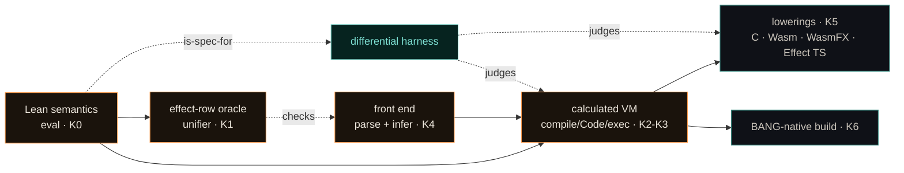
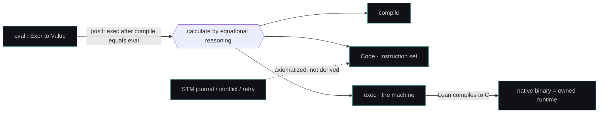

# BANG → v1 · North-Star Roadmap

> Keyframes are committed poses (states that must hold). Inbetweens are implementation, drawn later.
> Proof rides the **reference**; the shipping path is kept honest by the **harness**; performance is summoned only when it touches the user; **the machine is an output of the calculation, never hand-designed.**

Status: K0 locked · K1 done (effect-row oracle) · **playhead between K1→K2**.

---

## 0 · Locked v0 decisions

| # | decision | was | **now** | why |
|---|----------|-----|---------|-----|
| D1 | reactivity | `let sig` keyword | **`mut` + operator** | `:` introduces (silent), `=` updates (notifies subscribers); collapses declare/assign/create-signal/update → 2 operators |
| D2 | binding forms | let / mut / sig / tvar | **let / mut / tvar** | `sig` absorbed by D1 → kernel shrinks |
| D3 | capture | implicit lexical | **explicit & tracked** | thunks trivially serializable → distribution + durable exec; deps fully visible; simpler calculated closures |
| D4 | canonical target | Effect TS transpile (MVP) | **calculated VM (owned)** | own the runtime; correct-by-construction; ecosystem-independent |
| D5 | Effect TS / Koka-CPS / WasmFX | the backend | **optional K5 lowerings** | demoted: foundation → fast-path |
| D6 | STM | privileged kernel primitive | **unchanged** — axiomatized in VM, *not* derived | journal/retry/conflict needs runtime support; "everything is a handler" has exactly this one ceiling |

Force is **`$`** (prefix); parens group *without* forcing. Bare `name` = description; `$name` = value. `!` is freed for actor-send. *(Superseded the earlier `!`-as-force note — see **ADR-0007**, which is the source of truth.)*

---

## 1 · Keyframe arc

```mermaid
flowchart TD
    K0["K0 · semantics locked"]:::done
    K1["K1 · oracle speaks"]:::done
    PH(["&#9654; playhead — you are here"]):::head
    K2["K2 · machine falls out"]:::todo
    K3["K3 · effects on the machine"]:::todo
    K4["K4 · front end is real"]:::todo
    K5["K5 · fast path · optional"]:::todo
    K6["K6 · toolchain eats itself"]:::todo
    K7["K7 · v1 · NORTH STAR"]:::star

    K0 -. "make it judgeable" .-> K1
    K1 --> PH
    PH -. "let the equation hand you the machine" .-> K2
    K2 -. "swap the underlying monad" .-> K3
    K3 -. "give source a way in" .-> K4
    K4 -. "chase speed only where UX feels it" .-> K5
    K5 -. "build graph = thunk graph" .-> K6
    K6 -. "ship something real" .-> K7

    classDef done fill:#1a130c,stroke:#ff9d4d,stroke-width:2px,color:#ece6dc;
    classDef todo fill:#0f1117,stroke:#3d8f86,color:#cdc7bd;
    classDef head fill:#06231f,stroke:#7ee0d3,color:#7ee0d3;
    classDef star fill:#2a1d0a,stroke:#ffe9c7,stroke-width:2px,color:#ffe9c7;
```

| frame | pose | invariant that holds | proves | runs | status |
|-------|------|----------------------|--------|------|--------|
| **K0** | model sheet | core semantics in Lean: thunk · `$` force · rows-as-sets · 1-shot handlers · STM; D1–D6 baked in | model sheet typechecks | core programs, interpreted | ✅ locked |
| **K1** | oracle speaks | reference is executable; unifier verified (`Finset` semilattice); harness drives candidates | `unify_sound`; laws inherited | harness · 20k cases green | ✅ done |
| **K2** | machine falls out | Bahr–Hutton derives `(compile, Code, exec)` from `eval` for thunk+force+1st-order-effect core; Lean→C | `exec ∘ compile ≡ eval` | core BANG on owned machine | ⬜ next |
| **K3** | effects on the machine | monadic calculation: effect-row monad + partiality monad; handler stack → config; effect ops → instructions; STM axiomatized | correctness over the effect monad | effectful BANG end-to-end | ⬜ |
| **K4** | front end is real | parse → typed AST → effect-row inference (on the verified unifier) → core IR | inference soundness via oracle | real `.bang` files | ⬜ |
| **K5** | fast path *(optional)* | optimized bytecode interp (C/Rust/Zig) and/or calculated lowering → C·Wasm·WasmFX·Effect TS; diff-tested vs `exec` | lowering refines `exec` | UX-acceptable speed · portable | ⬜ |
| **K6** | toolchain eats itself | build = thunk graph (targets=thunks, deps=`R`, incremental=content-addressed memo); BANG-native | rebuild ⟺ inputs changed | BANG builds BANG | ⬜ |
| **K7** | **v1 / north star** | syntax + effect-typed front end + verified core runtime + fast path + native build; harness standing | the chain holds frame→frame | something worth running (HMS constraint-evaluator slice) | ⭐ |

---

## 2 · Architecture (what depends on what)

- **Reference (proven):** `eval` → oracle → calculated VM. Changes rarely; no per-session babysitting.
- **Shipping (tested, not proven against):** lowerings + front end, kept honest by the harness.
- **Invariant:** anything that runs is either `exec` itself or differential-tested against it.

---

## 3 · The calculation (K2–K3 mechanics)

Staging — each a calculated `(compiler, machine)` pair; composition gives end-to-end correctness:

1. **Pure core** → derive VM for thunk + `!` + application. (template: *Calculating Dependently-Typed Compilers*, Lean-shaped)
2. **+ Effects** → swap underlying monad to the effect-row monad. (*Monadic Compiler Calculation*)
3. **+ Divergence** → partiality monad + bisimilarity. ⚠ Lean's coinduction is the effortful spot.
4. **+ Concurrency/STM** → STM as machine primitives, not derived. (*Calculating Compilers for Concurrency*)
5. **Frontier (post-v1):** multi-shot handlers (machine must reify continuations) → defer.

> The VM is the **output** of step 1–4. Pre-committing to a VM design and justifying a compiler against it = CompCert mode = more work, none of the elegance.

---

## 4 · Kernel vs library = the VM contract

The design doc's kernel/library split *is* the machine's primitive/library boundary.

| layer | contents |
|-------|----------|
| **kernel** (VM must provide natively) | thunks · force · application · effect rows + handler dispatch · pattern matching + ADTs · STM (journal, conflict detection, retry) |
| **library** (ordinary BANG over the kernel) | `State`/`IO`/`Throws` · `Reactive`+signals · `Spawn`/`Send`/`Receive`+actors · async/await · logging/metrics/tracing · all runtimes (thread pools, event loops, green threads, deterministic schedulers) · all STM-built concurrency (channels, semaphores, futures, queues) |

→ K2/K3 acceptance test = "the kernel column is native; the library column compiles to ordinary code."

---

## 5 · Effect-row model (already formalized, K1)

| concept | model | Lean | law source |
|---------|-------|------|------------|
| label set | idempotent set | `Finset ℕ` | — |
| compose | union = join | `∪` (= `⊔`) | Mathlib `Lattice` |
| empty | bottom | `∅` (= `⊥`) | `OrderBot` |
| canonical ⟺ equal | extensional eq | `Finset.ext` | **free** (was the F* keystone) |
| open row `...e` | set + tail var | `{ labels, tail : Option RVar }` | `unify` |

Unification (sound, not principal — MGU deferred to differential test):

- closed ⋈ closed → equal sets, else fail
- open ⋈ closed → require `open ⊆ closed`; bind tail ← `closed \ open` (closed)
- open ⋈ open → fresh tail `f`; bind each tail ← other's `diff`, tail `f`

→ This *is* the answer to the spec's open question "row variables `with IO, ...e`". We're ahead of the spec on the semantics; only surface syntax + infer-vs-annotate policy remain.

---

## 6 · Open forks still live (post-collapse)

| fork | options | current lean |
|------|---------|--------------|
| capture syntax | C++ `[x,&y]` / Rust `move` / Swift `[weak]`-style lists | explicit list, TBD spelling |
| serializability | tracked effect · type-class constraint · content-address-derived | **content-address-derived** |
| module constants | explicit-pass vs free-to-reference | **free** (immutable, content-addressed, cheap to ship) |
| STM ⊂ reversibility? | STM beside vs STM = a built-in *reversible region* | **post-v1 seam** (could absorb D6's exception) |
| effect inference scope | infer-all vs infer-internal/annotate-boundaries | infer internal, annotate at module boundary |
| transaction + IO | forbid vs `unsafePerformIO`-style escape | forbid by default (retry ⇒ IO must be reversible) |

---

## 7 · Frontier (beyond v1)

- **Reversibility / groupoids.** Opt-in `reversible` effect/region; ops carry inverses. Buys time-travel debugging, undo-as-primitive, clean speculative rollback, bidirectional transforms.
  → **STM becomes a special case** of a reversible region with a conflict policy. Potentially *simplifies* the kernel (one privileged mechanism: reversible regions) rather than special-casing STM. Inverse likely lives in the **handler**, not the operation (different handlers compensate differently).
- **Distributed eval.** Ship bare `name` (description, small) not `$name` (value, big); force at the data. Enabled by D3 (no implicit capture → serializable thunks).
- **Native multi-shot handlers.** The hard machine extension; reify continuations.

---

## 8 · Reading canon — calculating correct compilers

PDFs: `cs.nott.ac.uk/~pszgmh/bib.html` · `bahr.io/pubs`. Read 2015 → 2017 → 2021 → 2022 → 2023.

| year | paper | why for BANG |
|------|-------|--------------|
| 1967 | McCarthy & Painter — *Correctness of a Compiler for Arithmetic Expressions* | the origin; everything is a reply to it |
| 2004 | Hutton & Wright — *Compiling Exceptions Correctly* · *Calculating an Exceptional Machine* | where **calculate ≠ verify** begins (defunctionalization) |
| **2015** | Bahr & Hutton — *Calculating Correct Compilers* (JFP 25) | **the method.** start here. Coq-formalized |
| 2016 | Hutton & Bahr — *Cutting Out Continuations* | the CPS intuition, in miniature |
| 2017 | Hutton & Bahr — *Compiling a 50-Year Journey* (JFP 27) | the map / retrospective |
| 2020 | Bahr & Hutton — *Calculating Correct Compilers II: Register Machines* (JFP 30) | generalizes off the stack |
| **2021** | Pickard & Hutton — *Calculating Dependently-Typed Compilers* (ICFP) | **your Lean blueprint** — intrinsically typed |
| **2022** | Bahr & Hutton — *Monadic Compiler Calculation* (ICFP) | **the hook for effects** — swap the monad; partiality for divergence |
| **2023** | Bahr & Hutton — *Calculating Compilers for Concurrency* (ICFP) | nearest BANG's fibers + STM |
| 2024 | Garby, Hutton & Bahr — *Calculating Compilers Effectively* (Haskell) | emit efficient, not tree-shaped, code |
| 2024 | Bahr & Hutton — *Beyond Trees: Graph-Based Compilers* (ICFP) | jumps / graph-structured code (HOAS) |
| 2024 | Tsuyama et al. — *An Intrinsically Typed Compiler for Algebraic Effect Handlers* (PEPM) | adjacent + vital — handlers → typed stack machine, in Agda; closest artifact to K3 |
| — | Geeson (Oxford MSc) — *Calculating Compilers and Algebraic Effects* | worked precedent: method × effects, CBPV+exceptions |

---

*keyframes committed · inbetweens to be drawn · next pose to lock: **K2***
